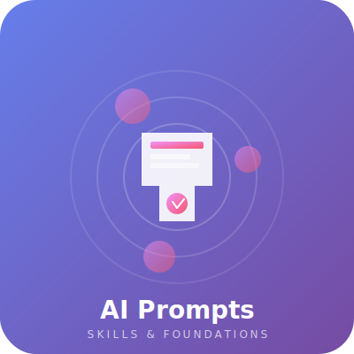
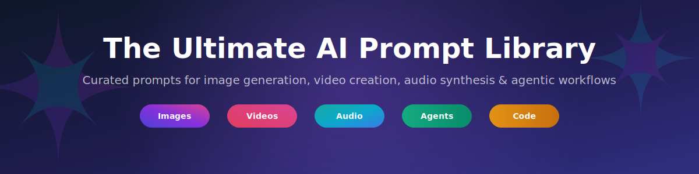
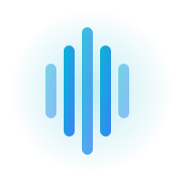
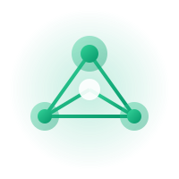

<div align="center">



# AI Prompts & Skills

**The Ultimate Foundation for AI-Powered Creativity**

*A curated collection of expertly crafted prompts and agent skills for every AI use case*



[](LICENSE)
[](CONTRIBUTING.md)
[](prompts/)
[](skills/)

</div>

---

## Why This Repository?

In the rapidly evolving world of AI, **the right prompt can unlock extraordinary results**. This repository serves as your definitive resource for:

- **High-quality prompts** tested across multiple AI platforms
- **Agent Skills** following the [Agent Skills specification](https://agentskills.io) and discoverable via [skills.sh](https://skills.sh)
- **Best practices** distilled from real-world usage
- **Foundation patterns** applicable to any AI use case

Whether you're generating stunning visuals, crafting compelling videos, synthesizing audio, or building intelligent agents — this is your toolkit.

---

## What's Inside

<table>
<tr>
<td width="50%" valign="top">

### Image Generation


Prompts optimized for:
- **Nano Banana** - Quick, playful image generation
- **DALL-E 3** - Photorealistic & artistic outputs
- **Midjourney** - Stylized creative imagery
- **Stable Diffusion** - Fine-tuned control

[`prompts/images/`](prompts/images/README.md)

</td>
<td width="50%" valign="top">

### Video Creation


Master prompts for:
- **Veo** - Google's video AI
- **Runway Gen-3** - Cinematic sequences
- **Pika Labs** - Dynamic motion
- **Sora** - Long-form narratives

[`prompts/videos/`](prompts/videos/)

</td>
</tr>
<tr>
<td width="50%" valign="top">

### Audio & Voice



Prompts for:
- **Music generation** - Original compositions
- **Voice synthesis** - Natural speech patterns
- **Sound effects** - Immersive audio design
- **Podcast content** - Engaging scripts

[`prompts/audio/`](prompts/audio/)

</td>
<td width="50%" valign="top">

### Text & Content


Expert prompts for:
- **Creative writing** - Stories, poetry, scripts
- **Technical documentation** - Clear, concise guides
- **Marketing copy** - Conversion-focused content
- **Research synthesis** - Academic excellence

[`prompts/text/`](prompts/text/)

</td>
</tr>
</table>

---

## Agentic Skills

<div align="center">

</div>

Skills in this repository follow the **[Agent Skills Specification](https://agentskills.io/specification)** — an open format for giving AI agents new capabilities and expertise. Skills are discoverable and installable via the [skills.sh](https://skills.sh) registry.

### What are Agent Skills?

Agent Skills are folders containing instructions, scripts, and resources that agents can discover and use to perform tasks more accurately and efficiently. Each skill is a self-contained directory with a `SKILL.md` file.

### Available Skills

| Skill | Description |
|-------|-------------|
| [`code-review`](skills/code-review/) | Structured code review process with actionable feedback |
| [`create-a-prd`](skills/create-a-prd/) | Create a Product Requirements Document from a feature idea |
| [`debug-and-fix`](skills/debug-and-fix/) | Systematic debugging and root-cause analysis |
| [`plan-retrospective`](skills/plan-retrospective/) | Reflect on completed work and capture learnings |
| [`prd-to-tasks`](skills/prd-to-tasks/) | Break a PRD into actionable engineering tasks |
| [`release-checklist`](skills/release-checklist/) | Pre-release verification and deployment checklist |
| [`tasks-to-code`](skills/tasks-to-code/) | Implement engineering tasks from a task list |
| [`ui-design-audit`](skills/ui-design-audit/) | Audit UI components for design consistency |

See the [Skills README](skills/README.md) for complete documentation, recommended order of operations, and workflow details.

### Skill Directory Structure

Each skill lives in its own directory inside `skills/`:

```
skills/
└── skill-name/
    ├── SKILL.md           # Required: main instructions + frontmatter
    ├── scripts/           # Optional: executable helper scripts
    ├── references/        # Optional: additional documentation
    └── assets/            # Optional: static resources
```

### SKILL.md Format

Every `SKILL.md` must include YAML frontmatter with at minimum `name` and `description`:

```yaml
---
name: skill-name
description: >
  What this skill does and when to use it. Include specific keywords
  that help agents identify when the skill is relevant.
license: MIT
metadata:
  author: pokanop
  version: "1.0"
---

# Skill Instructions

Detailed instructions and guidance for the agent...
```

#### Frontmatter Fields

| Field | Required | Description |
|-------|----------|-------------|
| `name` | ✅ Yes | Lowercase alphanumeric + hyphens only. Must match the directory name. |
| `description` | ✅ Yes | What the skill does and when to use it (1–1024 chars). |
| `license` | No | License name or reference (e.g. `MIT`, `Apache-2.0`). |
| `compatibility` | No | Environment requirements, target agent products, or required tools. |
| `metadata` | No | A map of arbitrary string keys/values (e.g. `author`, `version`). |
| `allowed-tools` | No | List of tools the skill is permitted to use. |

> **`name` rules:** 1–64 characters, lowercase `a-z` and `-` only, must not start or end with `-`, no consecutive `--`. Must match the parent directory name exactly.

### Adding a Skill

1. Create a directory in `skills/` using lowercase letters and hyphens (e.g. `skills/my-skill/`)
2. Add a `SKILL.md` with valid frontmatter and instructions
3. Optionally include `scripts/`, `references/`, or `assets/` subdirectories

**Install any skill from this repo via the CLI:**

```bash
bunx skills add pokanop/ai
```

Supported by: Claude Code, Cursor, Windsurf, OpenCode, GitHub Copilot, OpenHands, and more.

See the [Agent Skills Specification](https://agentskills.io/specification) for the complete format reference.

---

## Repository Structure

```
ai/
├── assets/                 # SVGs, images, and visual resources
│   ├── logo.svg
│   ├── hero-banner.svg
│   ├── features-icons.svg
│   ├── icon-video.svg
│   ├── icon-audio.svg
│   ├── icon-agents.svg
│   └── icon-code.svg
├── prompts/
│   ├── images/            # Image generation prompts
│   ├── videos/            # Video creation prompts
│   ├── audio/             # Audio generation prompts
│   └── text/              # Text & content prompts
├── skills/                # Agent Skills (agentskills.io format)
│   ├── code-review/
│   ├── create-a-prd/
│   ├── debug-and-fix/
│   ├── plan-retrospective/
│   ├── prd-to-tasks/
│   ├── release-checklist/
│   ├── tasks-to-code/
│   └── ui-design-audit/
└── README.md
```

---

## Quick Start

### Using Prompts

```bash
# Clone the repository
git clone https://github.com/pokanop/ai.git

# Navigate to your use case
cd ai/prompts/images
```

### Installing Skills

Install all skills in this repository directly into your project:

```bash
bunx skills add pokanop/ai
```

Or browse and install individual skills from the [skills.sh leaderboard](https://skills.sh).

---

## The Possibilities

This repository is designed to be the **foundation for all AI use cases**:

### For Creators
- Generate consistent brand imagery
- Create video content at scale
- Produce original music and soundtracks
- Write engaging content effortlessly

### For Developers
- Build intelligent agents with specialized skills
- Automate repetitive coding tasks
- Create AI-powered workflows
- Integrate prompts into applications

### For Businesses
- Standardize AI interactions across teams
- Maintain brand voice consistency
- Scale content production
- Reduce AI iteration time

### For Researchers
- Study prompt engineering patterns
- Benchmark AI model performance
- Contribute to collective knowledge
- Share reproducible experiments

---

## Prompt Engineering Best Practices

### Structure of a Great Prompt

```
[CONTEXT] - Who/what is involved
[TASK] - What needs to be done
[CONSTRAINTS] - Limitations and requirements
[STYLE] - Tone, format, aesthetic
[EXAMPLES] - Reference outputs (optional)
```

### Tips by Category

| Category | Key Tips |
|----------|----------|
| **Images** | Be specific about style, lighting, composition |
| **Videos** | Describe motion, transitions, timing |
| **Audio** | Specify mood, tempo, instruments |
| **Text** | Define audience, tone, length |
| **Agents** | Set clear goals, constraints, success criteria |

---

## Contributing

We welcome contributions! Here's how to help:

1. **Add prompts** - Share your best-performing prompts
2. **Create skills** - Build reusable agent capabilities following the [specification](https://agentskills.io/specification)
3. **Improve docs** - Enhance explanations and examples
4. **Report issues** - Found something that doesn't work? Let us know

See [CONTRIBUTING.md](CONTRIBUTING.md) for detailed guidelines.

---

## Roadmap

- [ ] Interactive prompt playground
- [ ] Prompt effectiveness ratings
- [ ] Multi-language support
- [ ] AI model compatibility matrix
- [ ] Community prompt sharing
- [ ] Video tutorials

---

## License

This project is licensed under the MIT License - see the [LICENSE](LICENSE) file for details.

---

<div align="center">

## Connect & Contribute

Made with care for the AI community

**Star this repo if you find it useful!**

[Report Bug](https://github.com/pokanop/ai/issues) · [Request Feature](https://github.com/pokanop/ai/issues) · [Join Discussion](https://github.com/pokanop/ai/discussions)


*Building the future of AI, one prompt at a time*

</div>
