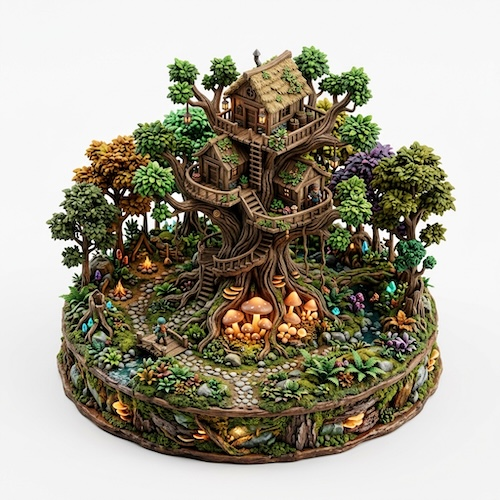

# 3D Isometric Resin Sculptures

[← Back to Image Prompts](../README.md)

Open, handcrafted miniature resin sculptures with richly textured surfaces and intricate sculpted details. Designed to look like artisan tabletop decorative pieces you can pick up, rotate, and display on a shelf. Perfect for app icons, thumbnails, and collectible-style renders.



> **Sample prompt used to generate the above image (Nano Banana 2):**
> ```text
> 3D isometric render of a miniature open-top handcrafted resin sculpture featuring an enchanted treehouse nestled in a tiny ancient forest, 1:1 square format. The sculpture is an open diorama with no glass enclosure — every element is exposed and touchable, like an artisan-made collectible figurine. Glowing mushrooms at the base emit warm amber light. Richly textured matte and satin resin finish with visible hand-sculpted details — tiny bark grooves on the tree, individually shaped leaves, moss textures on rocks. Soft studio lighting emphasizing surface texture and depth. Candy-bright greens, ambers, and purples against a pure white background.
> ```

**ChatGPT**
```text
Create a 3D isometric render of a miniature open-top resin sculpture featuring [SUBJECT] in a tiny [ENVIRONMENT]. The sculpture has no glass enclosure or transparent casing — it is an open, handcrafted decorative piece like an artisan collectible figurine you could pick up and examine. The surface has a richly textured matte and satin resin finish with visible hand-sculpted details — tiny grooves, individually shaped elements, and natural surface imperfections that convey craftsmanship. Soft studio lighting emphasizing surface texture and depth. Pure white background. Vibrant, candy-like color palette.
```

**Midjourney**
```text
3D isometric render of a miniature open-top handcrafted resin sculpture, [SUBJECT] in a tiny [ENVIRONMENT], exposed touchable surface with no glass enclosure, richly textured matte and satin resin finish, hand-sculpted details, artisan collectible figurine aesthetic, candy-bright colors, pure white background, tilt-shift perspective --ar 1:1
```

**Stable Diffusion**
- **Prompt:** `3D isometric render, open-top handcrafted resin sculpture of [SUBJECT] in miniature [ENVIRONMENT], exposed touchable surface, richly textured matte satin resin, hand-sculpted details, artisan collectible figurine, pure white background, candy-bright colors, octane render, 8k`
- **Negative Prompt:** `glass cube, enclosed, transparent casing, glossy, smooth featureless, illustration, noisy, messy background`

**Nano Banana 2**
```text
3D isometric render of a miniature open-top handcrafted resin sculpture featuring [SUBJECT] in a tiny [ENVIRONMENT], 1:1 square format. No glass enclosure or transparent casing — the sculpture is an open, exposed decorative piece like an artisan-made collectible figurine. Richly textured matte and satin resin finish with visible hand-sculpted details — tiny grooves, individually shaped elements, and natural surface texture. Soft studio lighting emphasizing surface texture and depth. Candy-bright vibrant color palette against a pure white background.
```
