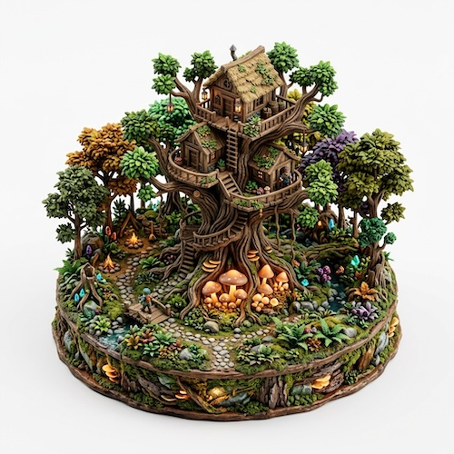

# 3D Isometric Resin Sculptures

[← Back to Image Prompts](../README.md)

Open, handcrafted miniature resin sculptures with richly textured surfaces and intricate sculpted details. Designed to look like artisan tabletop decorative pieces you can pick up, rotate, and display on a shelf — no glass enclosure, no transparent casing, just exposed, touchable craft. The isometric camera angle and candy-bright palette make these perfect for digital product imagery, app icons, or collectible-style renders.

**Best for:** App icons · Thumbnails · Social media posts · Collectible renders · NFT art · Product concept mockups · Desktop wallpapers



---

## Prompt

Replace the bracketed details with your subject and preferred format.

```text
3D isometric render of a miniature open-top handcrafted resin sculpture featuring [SCENE — e.g., a magical waterfall cascading into a tiny glowing pool surrounded by crystal formations], 1:1 square format. No glass enclosure or transparent casing — the sculpture is an open, exposed decorative piece. Richly textured matte and satin resin finish with visible hand-sculpted details — tiny rock textures, individual crystal facets, water effect in clear resin. Soft studio lighting emphasizing surface texture and depth. Candy-bright [COLORS — e.g., aquamarine, violet, and gold] against a pure white background.
```

## With a Reference Image

Attach your image and use this prompt to preserve its defining features while applying the style.

```text
Using the attached image as reference, reimagine this scene as a miniature 3D isometric open-top handcrafted resin sculpture. Preserve the key elements and composition but shrink everything into a tiny collectible piece with matte and satin resin finish and visible hand-sculpted details. No glass enclosure — open and exposed. Place on a pure white background with soft studio lighting. Candy-bright color palette. 1:1 square format.
```

---

## 💡 Tips & Best Practices

- **"No glass enclosure" is mandatory**: Without this, every AI model defaults to putting the scene inside a glass cube or snow globe. Always include it.
- **Resin texture language**: "Matte and satin resin finish with visible hand-sculpted details" is the key phrase. Without it, outputs look like smooth 3D renders rather than handcrafted objects.
- **Pure white background**: This is essential for the collectible/product photography look. Colored backgrounds undermine the figurine aesthetic.
- **Isometric camera angle**: The 3D isometric view (tilted ~30° from above) gives the best sense of the sculpture's depth and detail. Avoid flat orthographic or extreme angles.
- **Common pitfalls**: Avoid "diorama in a glass cube," "snow globe," or "terrarium" — these override the open-top instruction. Don't use "glossy" as the primary finish — it makes it look like injection-molded plastic rather than artisan resin.
- **Pairs well with:** [Landmark Dioramas](landmark-dioramas.md) (similar miniature world, different medium), [Claymation / Stop-Motion](claymation-stop-motion.md) (same handcrafted appeal)
