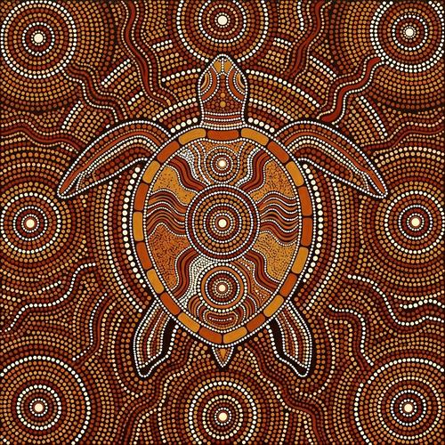

# Aboriginal Dot Painting

[← Back to Image Prompts](../README.md)

Australian Indigenous dot painting — stories told through carefully placed dots of earth pigments creating flowing, organic patterns on dark backgrounds. Dreamtime narratives, songlines, and country maps expressed through concentric circles, flowing dot-lines, and radial patterns in ochre, terracotta, white, black, and sunset gold. Each dot is individually placed, creating texture through density and color.

**Best for:** Art prints · Desktop wallpapers · Social media posts · Textile patterns · Home décor · Greeting cards



> **Sample prompt used to generate the above image (Nano Banana 2):**
> ```text
> Aboriginal dot painting of a sea turtle swimming through ocean currents, rendered in the traditional Australian Indigenous dot painting technique on a dark earth-brown background, 16:9 landscape format. The turtle and water are composed entirely from individually placed dots — the shell in concentric circle patterns of ochre yellow, burnt sienna, and white. Water currents flow as lines of dots in blues and teals. Earth pigment palette — ochre, terracotta, white, black, deep blue, sunset gold. Every dot individually visible and precisely placed. Flowing organic patterns. The composition tells a story through symbolic visual language.
> ```

---

## Prompt Variations

### 🔵 Nano Banana 2 _(Featured)_

**Variation 1 — Animal / Totem** _(Art Print)_
```text
Aboriginal dot painting of [ANIMAL], concentric circle patterns, earth pigments, individually placed dots, dark background, flowing patterns, [FORMAT].
```

**Variation 2 — Landscape / Country Map** _(Art Print)_
```text
Aboriginal dot painting aerial map of [LANDSCAPE — e.g., waterhole, river system, hills], symbolic representation, concentric circles for sacred sites, flow lines for water, earth pigments, [FORMAT].
```

**Variation 3 — Narrative / Story** _(Narrative Art)_
```text
Aboriginal dot painting telling a Dreamtime-style story, multiple symbolic elements connected by dot-pathways, earth pigments, dark background, [FORMAT].
```

**Variation 4 — Abstract / Geometric** _(Pattern Design)_
```text
Aboriginal-inspired geometric dot pattern, repeating motifs, concentric circles, radiating dot-lines, earth pigments, [FORMAT].
```

**Variation 5 — Celestial / Star Map** _(Home Décor)_
```text
Aboriginal dot painting of a night sky with constellation patterns, stars as white dots, Milky Way as flowing dot-river, symbolic celestial shapes, earth pigments on black, [FORMAT].
```

### ChatGPT

**Variation 1 — Animal / Totem** _(Art Print)_
```text
Create an Aboriginal dot painting of [ANIMAL] in the traditional Australian Indigenous technique. The animal is composed entirely of individually placed dots — concentric circle patterns for the body, flowing dot-lines for movement. Earth pigment palette: ochre, terracotta, white, black, sunset gold. Dark earth-brown background. Every dot individually visible. 1:1 square format.
```

**Variation 2 — Landscape / Country Map** _(Home Décor)_
```text
Create an Aboriginal dot painting styled as an aerial map of [LANDSCAPE — e.g., a river system with waterholes]. Concentric circles mark sacred sites, flowing dot-lines trace water paths. Earth pigments — ochre, terracotta, white, deep blue — on a dark background. Symbolic, story-telling composition. 16:9 landscape format.
```

**Variation 3 — Celestial / Star Map** _(Desktop Wallpaper)_
```text
Create an Aboriginal dot painting of a night sky — stars as individually placed white dots, the Milky Way flowing as a river of dots, symbolic constellation shapes in ochre and gold on black. Every dot precisely placed. 16:9 landscape format.
```

### Midjourney

**Variation 1 — Animal / Totem** _(Art Print)_
```text
Aboriginal dot painting of [ANIMAL], individually placed dots, concentric circle patterns, earth pigments, ochre terracotta white black, dark earth background, flowing organic dot-lines --ar 1:1 --s 200
```

**Variation 2 — Country Map** _(Home Décor)_
```text
Aboriginal dot painting aerial map of [LANDSCAPE], concentric circles for sacred sites, flowing dot-lines for rivers, earth pigment palette, dark background, symbolic composition --ar 16:9 --s 250
```

**Variation 3 — Star Map** _(Wallpaper)_
```text
Aboriginal dot painting night sky, stars as white dots, Milky Way as flowing dot-river, symbolic constellations, ochre and gold on black --ar 16:9 --s 200
```

### Stable Diffusion

**Variation 1 — Animal / Totem** _(Art Print)_
- **Prompt:** `Aboriginal dot painting, [ANIMAL], individually placed dots, concentric circle patterns, earth pigments, ochre terracotta white black, dark earth-brown background, flowing dot-lines`
- **Negative Prompt:** `smooth paint, gradients, photograph, neon colors, 3d render`

**Variation 2 — Country Map** _(Home Décor)_
- **Prompt:** `Aboriginal dot painting, aerial landscape map, [LANDSCAPE], concentric circles, flowing dot-line rivers, earth pigment palette, dark background, symbolic patterns`
- **Negative Prompt:** `photograph, realistic, smooth blending, neon, low quality`

---

## 🔄 Image-to-Image Transformations

**Nano Banana 2** _(Featured)_
```text
Using the attached photo, recreate it as an Aboriginal dot painting. Convert all forms to patterns of individually placed dots. Use earth pigments — ochre, terracotta, white, black, deep blue. Create concentric circle patterns for focal elements. Dark earth background. Flowing dot-lines for movement and connection. Symbolic visual language.
```

**ChatGPT**
```text
[Upload Photo] "Recreate this image as an Aboriginal dot painting. Convert every form into individually placed dots — concentric circles for focal points, flowing dot-lines for movement. Earth pigments only: ochre, terracotta, white, black. Dark earth-brown background."
```

**Midjourney**
```text
[IMAGE_URL] Aboriginal dot painting, individually placed dots, concentric circle patterns, earth pigments, dark earth background, flowing dot-lines --iw 1.0 --ar 1:1
```

**Stable Diffusion**
- **Pipeline:** Img2Img · Denoising Strength: `0.65–0.8` (heavy restyling — forms must dissolve into dots)
- **Prompt:** `Aboriginal dot painting, individually placed dots, concentric circles, earth pigments, ochre terracotta white, dark background`
- **Negative Prompt:** `photograph, smooth paint, gradients, neon colors`

---

## 💡 Tips & Best Practices
- **Individual dots**: "Every dot individually visible and precisely placed" — without this, AI produces smooth paint blends.
- **Earth pigments only**: Ochre, terracotta, white, black, deep blue, sunset gold — no neon or unnatural colors.
- **Concentric circles**: The primary compositional motif — used for meeting places, waterholes, sacred sites.
- **Dark backgrounds**: Most dot paintings use a dark earth-brown or black background.
- **Pairs well with:** [Kente / Ankara Portraits](kente-ankara-portraits.md) (cultural art traditions), [Byzantine Mosaic](byzantine-mosaic.md) (similar individual-element composition)
