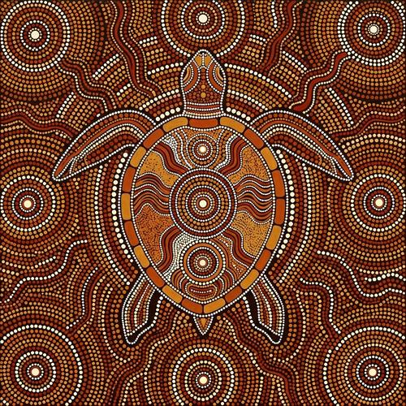

# Aboriginal Dot Painting

[← Back to Image Prompts](../README.md)

Australian Indigenous dot painting — stories told through carefully placed dots of earth pigments creating flowing, organic patterns on dark backgrounds. Dreamtime narratives, songlines, and country maps expressed through concentric circles, flowing dot-lines, and radial patterns in ochre, terracotta, white, black, and sunset gold. Each dot is individually placed, creating texture through density and color.

**Best for:** Art prints · Desktop wallpapers · Social media posts · Textile patterns · Home décor · Greeting cards



---

## Prompt

Replace the bracketed details with your subject and preferred format.

```text
Painting of [ANIMAL — e.g., a sea turtle swimming through ocean currents] composed entirely of individually placed dots on a dark earth-brown ground, [FORMAT]. Shape the animal with concentric dot patterns in ochre, burnt sienna, and white; let flowing bands of blue and teal dots trace the surrounding water. Use an earthy palette of ochre, terracotta, white, black, deep blue, and sunset gold. Keep every dot distinct, with rhythmic spacing and flowing organic contours. Create a thoughtful, cohesive composition rather than filling every space with pattern.
```

## With a Reference Image

Attach your image and use this prompt to preserve its defining features while applying the style.

```text
Using the attached photo, recreate it as an Aboriginal dot painting. Convert all forms to patterns of individually placed dots. Use earth pigments — ochre, terracotta, white, black, deep blue. Create concentric circle patterns for focal elements. Dark earth background. Flowing dot-lines for movement and connection. Symbolic visual language.
```

---

## 💡 Tips & Best Practices
- **Individual dots**: "Every dot individually visible and precisely placed" — without this, AI produces smooth paint blends.
- **Earth pigments only**: Ochre, terracotta, white, black, deep blue, sunset gold — no neon or unnatural colors.
- **Concentric circles**: The primary compositional motif — used for meeting places, waterholes, sacred sites.
- **Dark backgrounds**: Most dot paintings use a dark earth-brown or black background.
- **Pairs well with:** [Kente / Ankara Portraits](kente-ankara-portraits.md) (cultural art traditions), [Byzantine Mosaic](byzantine-mosaic.md) (similar individual-element composition)
