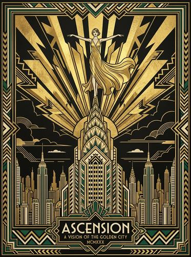

# Art Deco Illustration

[← Back to Image Prompts](../README.md)

Gatsby-era geometric elegance with metallic gold and black palettes, radiating sunburst patterns, streamlined stylized figures, and symmetrical compositions. The visual language of 1920s luxury — from the Chrysler Building to vintage Champagne posters.



> **Sample prompt used to generate the above image (Nano Banana 2):**
> ```text
> Art Deco poster illustration of a woman in a flowing golden gown standing atop the spire of a stylized skyscraper, arms outstretched, with radiating geometric sunburst beams behind her, 4:5 vertical format. Strict symmetrical composition. Color palette limited to gold leaf, matte black, cream, and a single accent of deep emerald green. Geometric patterns — chevrons, zigzags, and stepped pyramids — frame the border. Streamlined stylized figure with elongated proportions. Metallic gold foil texture on all gold elements. Bold sans-serif typography reading "[TITLE]" at the bottom in a decorative cartouche.
> ```

**ChatGPT**
```text
Create an Art Deco poster illustration of [SUBJECT] in a [ENVIRONMENT]. Use a strict symmetrical composition with radiating geometric sunburst beams behind the main subject. The color palette should be limited to gold leaf, matte black, cream, and a single accent of [COLOR]. Frame the scene with geometric Art Deco borders — chevrons, zigzags, and stepped pyramid motifs. The subject should have streamlined, stylized proportions with elongated elegant forms. Apply a metallic gold foil texture to all gold elements. Overall aesthetic should evoke 1920s luxury.
```

**Midjourney**
```text
Art Deco poster illustration of [SUBJECT] in [ENVIRONMENT], strict symmetrical composition, radiating geometric sunburst beams, gold leaf and matte black and cream palette with [COLOR] accent, chevron and zigzag border patterns, streamlined elongated figure, metallic gold foil texture, 1920s luxury aesthetic --ar 4:5 --s 250
```

**Stable Diffusion**
- **Prompt:** `Art Deco poster illustration, [SUBJECT] in [ENVIRONMENT], symmetrical composition, geometric sunburst rays, gold leaf matte black cream palette, chevron zigzag borders, streamlined stylized figure, metallic gold texture, 1920s luxury, masterpiece`
- **Negative Prompt:** `photograph, 3d, realistic, modern, asymmetrical, muted colors`

**Nano Banana 2**
```text
Art Deco poster illustration of [SUBJECT] in a [ENVIRONMENT], 4:5 vertical format. Strict symmetrical composition with radiating geometric sunburst beams behind the main subject. Color palette limited to gold leaf, matte black, cream, and a single accent of [COLOR]. Geometric Art Deco borders — chevrons, zigzags, and stepped pyramid motifs. Streamlined stylized figure with elongated proportions. Metallic gold foil texture on all gold elements. 1920s luxury aesthetic.
```
