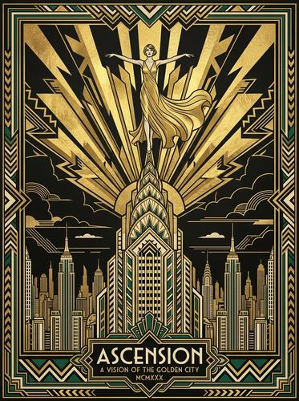

# Art Deco Illustration

[← Back to Image Prompts](../README.md)

Gatsby-era geometric elegance with metallic gold and black palettes, radiating sunburst patterns, streamlined stylized figures, and symmetrical compositions. The visual language of 1920s luxury — from the Chrysler Building's crown to vintage Champagne posters to Tamara de Lempicka's gleaming portraits. Art Deco celebrates machine-age optimism, opulence, and precision geometry. Every element follows strict symmetry, strong verticals, and repeating geometric motifs: chevrons, zigzags, stepped pyramids, and radiating sunbursts.

**Best for:** Poster prints · Event invitations · Brand assets · Social media posts · Book covers · Menu designs · Wedding stationery



---

## Prompt

Replace the bracketed details with your subject and preferred format.

```text
Art Deco poster illustration for [EVENT — e.g., a New Year's Eve gala], 3:4 vertical format. [CENTRAL IMAGE — e.g., a Champagne coupe fountain on a pedestal with cascading bubbles transformed into geometric diamond shapes]. Strict symmetrical composition. Color palette limited to gold leaf, matte black, cream, and [ACCENT — e.g., deep sapphire blue]. Geometric Art Deco borders — chevrons, zigzags, and stepped pyramid motifs. Metallic gold foil texture on all gold elements. Bold sans-serif typography reading "[EVENT NAME]" at the top and "[DATE / VENUE]" at the bottom in decorative cartouches.
```

## With a Reference Image

Attach your image and use this prompt to preserve its defining features while applying the style.

```text
Using the attached photo as reference, transform the subject into an Art Deco poster illustration. Apply strict symmetrical composition. Remap the color palette to gold leaf, matte black, cream, and a single accent of [COLOR]. Stylize all figures with elongated Deco proportions. Add geometric Deco borders — chevrons, zigzags, and stepped pyramids. Apply metallic gold foil texture to highlights. Replace the background with geometric sunburst beams. 1920s luxury aesthetic.
```

---

## 💡 Tips & Best Practices

- **Symmetry is sacred**: "Strict symmetrical composition" is non-negotiable. Art Deco without symmetry is just illustration.
- **Limit the palette**: 3-4 colors maximum. Gold + black + cream + one accent is the classic Deco formula.
- **Metallic gold texture**: "Metallic gold foil texture on all gold elements" is what makes Deco feel luxurious rather than flat.
- **Geometric borders frame everything**: "Chevrons, zigzags, and stepped pyramid motifs" in the border authenticate the style.
- **Common pitfalls**: "Art Deco" alone often produces Art Nouveau (organic, flowing) instead. Always include "geometric" and "symmetrical" to anchor it. Avoid organic curves — Deco is angular and mechanical.
- **Pairs well with:** [Soviet Constructivist](soviet-constructivist.md) (same era, different ideology and palette), [Wes Anderson Symmetry](wes-anderson-symmetry.md) (shares obsessive composition, warmer palette)
