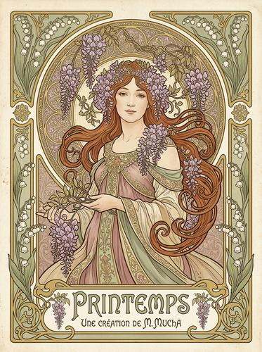

# Art Nouveau / Alphonse Mucha

[← Back to Image Prompts](../README.md)

Flowing organic lines, elaborate floral borders, ethereal female figures, and ornamental typography in the decorative poster style of Alphonse Mucha. Art Nouveau celebrates the beauty of natural curves — every line flows, every border blooms, and every figure is framed by ornate botanical arabesques. The palette is muted and earthy with metallic gold accents, and the composition follows a strict vertical format with the figure centered and encircled by decorative elements.

**Best for:** Poster prints · Social media posts · Art prints · Greeting cards · Book covers · Wedding stationery · Brand assets



> **Sample prompt used to generate the above image (Nano Banana 2):**
> ```text
> Art Nouveau poster illustration in the style of Alphonse Mucha — an ethereal woman with flowing auburn hair intertwined with lily flowers, standing within an ornate circular halo border of interlocking floral arabesques, 3:4 vertical format. Muted earth-tone palette — warm ochre, sage green, dusty rose, and cream with metallic gold accents on the border and hair ornaments. Flowing organic lines — no sharp angles anywhere. Elaborate floral border frame with lilies, vines, and geometric Art Nouveau motifs. Decorative typography reading "[TEXT]" in an organic Art Nouveau typeface at the bottom. Flat decorative style with minimal shading. Printed on cream paper.
> ```

---

## Prompt Variations

### 🔵 Nano Banana 2 _(Featured)_

**Variation 1 — Figure with Floral Frame** _(Poster, Print)_ — Mucha-style figure within ornate circular halo, flowing hair intertwined with [FLOWERS], muted palette with gold accents, floral border, decorative typography, [FORMAT].

**Variation 2 — Seasonal / Allegorical** _(Art Print, Social Media)_ — Art Nouveau personification of [SEASON/CONCEPT], surrounded by appropriate flora, circular halo, Mucha palette, ornate border, [FORMAT].

**Variation 3 — Product / Advertisement** _(Brand, Social Media)_ — Art Nouveau advertising poster for [PRODUCT], Mucha figure holding/presenting it, ornate border, decorative lettering, muted palette, [FORMAT].

**Variation 4 — Botanical Panel** _(Home Décor, Print)_ — Art Nouveau decorative panel of [FLOWERS/BOTANICAL], no figure, flowing organic lines, geometric Art Nouveau motifs, muted palette with gold, [FORMAT].

**Variation 5 — Portrait** _(Profile Picture, Gift)_ — Art Nouveau portrait of [SUBJECT], circular halo frame, flowing hair with botanical elements, Mucha flat decorative style, muted palette, [FORMAT].

### ChatGPT / Midjourney / Stable Diffusion — Standard templates with "Art Nouveau, Alphonse Mucha, flowing organic lines, ornate floral border, muted earth tones, gold accents" core keywords.

---

## 🔄 Image-to-Image Transformations

**Nano Banana 2** _(Featured)_
```text
Using the attached photo, transform it into an Art Nouveau poster in the style of Alphonse Mucha. Restyle the figure with flowing organic lines and flat decorative shading. Add an ornate circular halo border of interlocking floral arabesques. Remap colors to muted earth tones with metallic gold accents. Intertwine botanical elements with the hair/clothing. Add decorative typography. Cream paper background.
```

---

## 💡 Tips & Best Practices
- **"In the style of Alphonse Mucha"**: This single reference is the most effective anchor for Art Nouveau poster art.
- **Flowing lines, no sharp angles**: "Flowing organic lines — no sharp angles anywhere" is the compositional rule.
- **Circular halo border**: The ornate circular frame behind the figure is Mucha's signature compositional device.
- **Muted + gold**: Muted earth tones (ochre, sage, dusty rose) with metallic gold accents — NOT vivid primaries.
- **Common pitfalls**: "Art Nouveau" without "Mucha" often produces Art Deco (geometric, angular — the opposite). Always name the artist.
- **Pairs well with:** [Art Deco Illustration](art-deco-illustration.md) (successor movement, geometric vs. organic), [Botanical Illustration](botanical-illustration.md) (shares floral subject matter)
