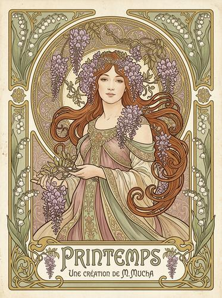

# Art Nouveau / Alphonse Mucha

[← Back to Image Prompts](../README.md)

Flowing organic lines, elaborate floral borders, ethereal female figures, and ornamental typography in the decorative poster style of Alphonse Mucha. Art Nouveau celebrates the beauty of natural curves — every line flows, every border blooms, and every figure is framed by ornate botanical arabesques. The palette is muted and earthy with metallic gold accents, and the composition follows a strict vertical format with the figure centered and encircled by decorative elements.

**Best for:** Poster prints · Social media posts · Art prints · Greeting cards · Book covers · Wedding stationery · Brand assets



---

## Prompt

Replace the bracketed details with your subject and preferred format.

```text
Art Nouveau poster illustration of [SUBJECT — e.g., a woman with flowing auburn hair] framed by an ornate circular halo of interlocking [FLOWERS — e.g., lilies] and vines, [FORMAT]. Let the hair and flowers weave into a continuous composition of flowing organic lines. Use flat decorative shading and a muted palette of warm ochre, sage green, dusty rose, and cream with restrained metallic gold accents. An elaborate floral border surrounds the central figure; print texture shows on cream paper. If lettering is wanted, place the exact words "[TEXT]" in an organic Art Nouveau typeface at the bottom.
```

## With a Reference Image

Attach your image and use this prompt to preserve its defining features while applying the style.

```text
Using the attached photo, transform it into an Art Nouveau poster in the style of Alphonse Mucha. Restyle the figure with flowing organic lines and flat decorative shading. Add an ornate circular halo border of interlocking floral arabesques. Remap colors to muted earth tones with metallic gold accents. Intertwine botanical elements with the hair/clothing. Add decorative typography. Cream paper background.
```

---

## 💡 Tips & Best Practices
- **"In the style of Alphonse Mucha"**: This single reference is the most effective anchor for Art Nouveau poster art.
- **Flowing lines, no sharp angles**: "Flowing organic lines — no sharp angles anywhere" is the compositional rule.
- **Circular halo border**: The ornate circular frame behind the figure is Mucha's signature compositional device.
- **Muted + gold**: Muted earth tones (ochre, sage, dusty rose) with metallic gold accents — NOT vivid primaries.
- **Common pitfalls**: "Art Nouveau" without "Mucha" often produces Art Deco (geometric, angular — the opposite). Always name the artist.
- **Pairs well with:** [Art Deco Illustration](art-deco-illustration.md) (successor movement, geometric vs. organic), [Botanical Illustration](botanical-illustration.md) (shares floral subject matter)
