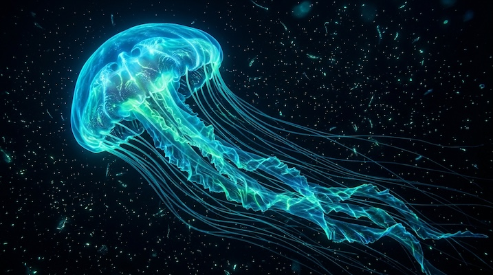

# Bioluminescent Underwater

[← Back to Image Prompts](../README.md)

Deep-sea scenes illuminated entirely by organic bioluminescent light — glowing creatures and particles against the absolute black of the abyss.



> **Sample prompt used to generate the above image (Nano Banana 2):**
> ```text
> Underwater photograph of an enormous jellyfish with a translucent bell and dozens of
> trailing tentacles, reimagined as a bioluminescent deep-sea organism, 16:9 landscape
> format. The jellyfish emits a vivid organic glow in neon blue, teal, and electric green, as
> if lit from within by millions of microscopic light-producing cells. Surrounding water is
> pitch black — the only illumination comes from the jellyfish itself and a cloud of tiny
> glowing plankton particles drifting through the current. Subtle aquatic caustic light
> patterns ripple across the tentacles.
> ```

**ChatGPT**
```text
Create an underwater photograph of [SUBJECT] reimagined as a bioluminescent deep-sea organism. The subject emits a vivid organic glow in neon blue, teal, and electric green, as if lit from within by millions of microscopic light-producing cells. The surrounding water is pitch black — the only illumination comes from the subject itself and a scattering of tiny glowing particles drifting through the current. Include subtle aquatic caustic light patterns.
```

**Midjourney**
```text
Bioluminescent underwater photograph of [SUBJECT] as a glowing deep-sea organism, vivid neon blue teal and electric green organic light, pitch-black abyssal background, scattered glowing particles, aquatic caustic light patterns, cinematic --ar 16:9
```

**Stable Diffusion**
- **Prompt:** `Bioluminescent [SUBJECT] as a deep-sea organism, underwater, pitch-black background, glowing neon blue teal and electric green organic light, scattered luminous particles, caustic light patterns, 8k photography`
- **Negative Prompt:** `daylight, surface water, bright background, illustration`

**Nano Banana 2**
```text
Underwater photograph of [SUBJECT] reimagined as a bioluminescent deep-sea organism, 16:9 landscape format. The subject emits a vivid organic glow in neon blue, teal, and electric green, as if lit from within by millions of microscopic light-producing cells. Surrounding water is pitch black — the only illumination comes from the subject itself and scattered tiny glowing particles drifting through the current. Subtle aquatic caustic light patterns.
```
