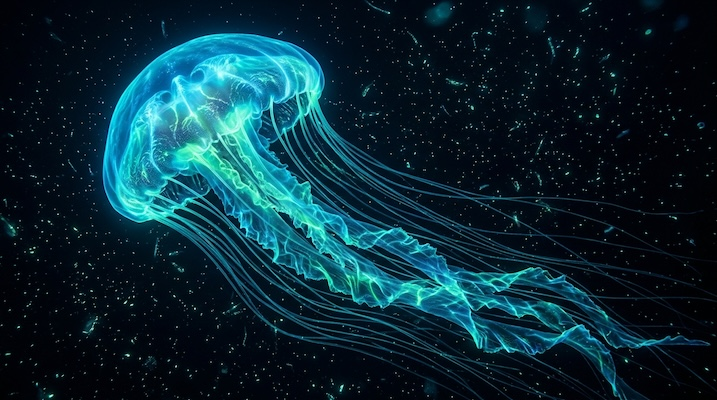

# Bioluminescent Underwater

[← Back to Image Prompts](../README.md)

The otherworldly glow of deep-sea bioluminescence — creatures and environments lit by their own internal light in the absolute darkness of the deep ocean. Jellyfish pulse with electric blue and violet, anglerfish lures glow in the void, and bioluminescent plankton turn ocean waves into liquid starlight. The palette is dominated by deep blacks and blues accented with vivid cyan, violet, green, and warm amber bioluminescent glows.

**Best for:** Desktop wallpapers · Phone wallpapers · Social media posts · Art prints · Album covers · Conceptual art



> **Sample prompt used to generate the above image (Nano Banana 2):**
> ```text
> Underwater photograph of a bioluminescent jellyfish in the deep ocean, 9:16 vertical phone wallpaper format. The jellyfish's bell pulses with electric blue and violet bioluminescent light, illuminating its own translucent tissues from within. Long trailing tentacles glow with dot-lines of cyan light. The surrounding water is absolute deep-ocean black except where the jellyfish's light scatters in a soft halo. Tiny bioluminescent plankton particles sparkle like stars in the water around it. The creature appears to float in infinite dark space — alien, beautiful, ethereal.
> ```

---

## Prompt Variations

### 🔵 Nano Banana 2 _(Featured)_

**Variation 1 — Jellyfish** _(Art Print)_
```text
Bioluminescent jellyfish in deep ocean darkness, internal glow in [COLORS], trailing tentacles, plankton particles, absolute dark water, ethereal, [FORMAT].
```

**Variation 2 — Deep Sea Scene** _(Art Print)_
```text
Deep-sea scene with multiple bioluminescent creatures — [CREATURES — e.g., anglerfish, comb jellies, siphonophore chains], each glowing different colors, absolute darkness, alien ecosystem, [FORMAT].
```

**Variation 3 — Bioluminescent Waves / Shore** _(Art Print)_
```text
Ocean shore at night with bioluminescent plankton — waves glow electric blue as they crash, wet sand sparkles with bioluminescent organisms, dark starry sky, long exposure, [FORMAT].
```

**Variation 4 — Fantasy Creature** _(Art Print)_
```text
Bioluminescent fantasy creature — [CREATURE — e.g., a sea dragon / celestial whale], glowing from within in [COLORS], deep ocean darkness, ethereal and majestic, [FORMAT].
```

**Variation 5 — Coral Reef at Night** _(Desktop Wallpaper)_
```text
Deep coral reef illuminated by bioluminescent creatures — fluorescent corals, glowing fish, bioluminescent shrimp, creating a galaxy of color in the darkness, [FORMAT].
```

### ChatGPT

**Variation 1 — Jellyfish** _(Phone Wallpaper)_
```text
Create an underwater photograph of a bioluminescent jellyfish in the deep ocean. Its bell pulses with [COLORS — e.g., electric blue and violet] light, illuminating its translucent tissues from within. Trailing tentacles glow with dot-lines of cyan. Absolute deep-ocean black water, tiny bioluminescent plankton sparkling like stars around it. 2:3 vertical format.
```

**Variation 2 — Deep Sea Scene** _(Desktop Wallpaper)_
```text
Create a deep-sea scene with multiple bioluminescent creatures — [CREATURES — e.g., an anglerfish, comb jellies, and a siphonophore chain] — each glowing a different color in absolute darkness. The creatures are the only light sources. Alien, ethereal ecosystem. 3:2 landscape format.
```

**Variation 3 — Bioluminescent Shore** _(Social Media)_
```text
Create a night photograph of an ocean shore where bioluminescent plankton make the waves glow electric blue as they crash. Wet sand sparkles with glowing organisms, dark starry sky above, long-exposure feel. 3:2 landscape format.
```

### Midjourney

**Variation 1 — Jellyfish** _(Phone Wallpaper)_
```text
bioluminescent jellyfish in deep ocean darkness, internal glow, electric blue and violet light, trailing tentacles with cyan dot-lines, plankton particles sparkling like stars, absolute black water, ethereal --ar 9:16 --s 300
```

**Variation 2 — Deep Sea Scene** _(Desktop Wallpaper)_
```text
deep-sea scene, multiple bioluminescent creatures, [CREATURES], each glowing different colors, absolute darkness, alien ecosystem, ethereal light --ar 16:9 --s 350 --chaos 20
```

**Variation 3 — Bioluminescent Waves** _(Social Media)_
```text
ocean shore at night, bioluminescent plankton, waves glowing electric blue, sparkling wet sand, dark starry sky, long exposure photography --ar 3:2 --s 250
```

### Stable Diffusion

**Variation 1 — Jellyfish** _(Phone Wallpaper)_
- **Prompt:** `bioluminescent jellyfish, deep ocean, translucent bell glowing electric blue and violet, trailing tentacles with cyan light, absolute black water, sparkling plankton particles, ethereal underwater photography`
- **Negative Prompt:** `daylight, surface water, bright background, oversaturated, low quality`

**Variation 2 — Bioluminescent Waves** _(Social Media)_
- **Prompt:** `night beach photography, bioluminescent plankton, glowing electric blue waves crashing, sparkling wet sand, dark starry sky, long exposure`
- **Negative Prompt:** `daylight, artificial lighting, people, blur, low quality`

---

## 🔄 Image-to-Image Transformations

**Nano Banana 2** _(Featured)_
```text
Using the attached photo, transform it into a bioluminescent deep-sea scene. Make the subject glow with internal bioluminescent light in [COLORS]. Replace the background with absolute deep-ocean darkness. Add tiny bioluminescent plankton particles sparkling in the water. The subject should illuminate itself from within — the only light source in the frame. Ethereal, alien, beautiful.
```

**ChatGPT**
```text
[Upload Photo] "Transform this subject into a bioluminescent deep-sea creature. Make it glow from within in electric blue and violet, set against absolute deep-ocean darkness with sparkling plankton particles. The subject is the only light source."
```

**Midjourney**
```text
[IMAGE_URL] bioluminescent deep-sea scene, subject glowing from within, electric blue and violet light, absolute darkness, sparkling plankton particles, ethereal --iw 1.2 --ar 9:16
```

**Stable Diffusion**
- **Pipeline:** Img2Img · Denoising Strength: `0.6–0.75` (rebuilds lighting while keeping subject silhouette)
- **Prompt:** `bioluminescent creature, internal glow, electric blue violet light, deep ocean darkness, sparkling plankton, ethereal underwater`
- **Negative Prompt:** `daylight, bright background, external lighting, oversaturated`

---

## 💡 Tips & Best Practices
- **Absolute darkness**: The background must be "deep-ocean black" for bioluminescence to work visually.
- **Internal light source**: Bioluminescent creatures light themselves — don't add external lighting.
- **Plankton particles**: "Tiny bioluminescent plankton sparkling like stars in the water" adds depth and magic.
- **Color specificity**: "Electric blue and violet" is the classic bioluminescent palette. Warm amber for anglerfish lures.
- **Pairs well with:** [Long Exposure / Light Painting](long-exposure-light-painting.md) (similar light-in-darkness), [Cloud / Smoke Sculpture](cloud-smoke-sculpture.md) (similar ethereal quality)
