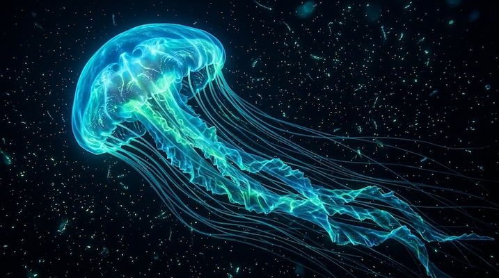

# Bioluminescent Underwater

[← Back to Image Prompts](../README.md)

The otherworldly glow of deep-sea bioluminescence — creatures and environments lit by their own internal light in the absolute darkness of the deep ocean. Jellyfish pulse with electric blue and violet, anglerfish lures glow in the void, and bioluminescent plankton turn ocean waves into liquid starlight. The palette is dominated by deep blacks and blues accented with vivid cyan, violet, green, and warm amber bioluminescent glows.

**Best for:** Desktop wallpapers · Phone wallpapers · Social media posts · Art prints · Album covers · Conceptual art



---

## Prompt

Replace the bracketed details with your subject and preferred format.

```text
Underwater photograph of [SUBJECT — e.g., a jellyfish] suspended in the deep ocean, [FORMAT]. Internal bioluminescence in [COLORS — e.g., electric blue and violet] shines through translucent tissue; delicate tentacles trail into darkness with tiny points of cyan light. The water is nearly black except for a soft halo of scattered light and a sparse field of glowing plankton. Let the light reveal the subject's anatomy while leaving generous dark negative space. Ethereal, quiet, and otherworldly.
```

## With a Reference Image

Attach your image and use this prompt to preserve its defining features while applying the style.

```text
Using the attached photo, transform it into a bioluminescent deep-sea scene. Make the subject glow with internal bioluminescent light in [COLORS]. Replace the background with absolute deep-ocean darkness. Add tiny bioluminescent plankton particles sparkling in the water. The subject should illuminate itself from within — the only light source in the frame. Ethereal, alien, beautiful.
```

---

## 💡 Tips & Best Practices
- **Absolute darkness**: The background must be "deep-ocean black" for bioluminescence to work visually.
- **Internal light source**: Bioluminescent creatures light themselves — don't add external lighting.
- **Plankton particles**: "Tiny bioluminescent plankton sparkling like stars in the water" adds depth and magic.
- **Color specificity**: "Electric blue and violet" is the classic bioluminescent palette. Warm amber for anglerfish lures.
- **Pairs well with:** [Long Exposure / Light Painting](long-exposure-light-painting.md) (similar light-in-darkness), [Cloud / Smoke Sculpture](cloud-smoke-sculpture.md) (similar ethereal quality)
