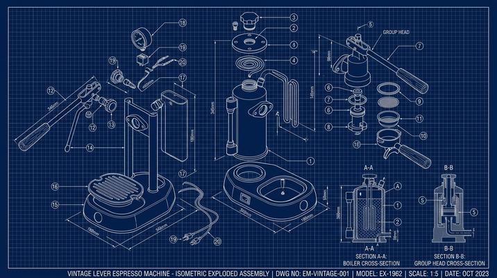

# Blueprint / Technical Drawing

[← Back to Image Prompts](../README.md)

White-on-blue (or dark-on-white) engineering schematic style with isometric exploded views, dimension lines, section callouts, and technical annotations. The visual language of architectural and mechanical engineering drawings — precise, systematic, and deeply satisfying.



> **Sample prompt used to generate the above image (Nano Banana 2):**
> ```text
> Engineering blueprint of a vintage espresso machine rendered as an isometric exploded-view
> technical drawing, 16:9 landscape format. White linework on a deep navy blueprint
> background with subtle grid lines. The machine is disassembled into its component parts —
> boiler, portafilter, group head, steam wand, pressure gauge — floating apart in an
> exploded isometric view with thin leader lines connecting each part to its assembly position.
> Dimension lines with measurements in millimeters. Section callout bubbles labeled A-A and
> B-B showing cross-sections of the boiler and group head. Part numbers in circles.
> Technical sans-serif annotation text. Precise, clean draftsmanship.
> ```

**ChatGPT**
```text
Create an engineering blueprint of [SUBJECT] rendered as an isometric exploded-view technical drawing. Use white linework on a deep navy blueprint background with subtle grid lines. Disassemble the subject into component parts floating apart with thin leader lines connecting each to its assembly position. Include dimension lines with measurements, section callout bubbles showing internal cross-sections, and circled part numbers. Technical sans-serif annotation text. Precise, clean draftsmanship with uniform line weight.
```

**Midjourney**
```text
Engineering blueprint of [SUBJECT], isometric exploded-view technical drawing, white linework on deep navy background, grid lines, disassembled component parts with leader lines, dimension measurements, section callout cross-sections, part numbers, technical annotations --ar 16:9
```

**Stable Diffusion**
- **Prompt:** `Engineering blueprint, [SUBJECT], isometric exploded view, white on navy, grid lines, component parts with leader lines, dimension lines, section callouts, part numbers, technical drawing, precise draftsmanship`
- **Negative Prompt:** `photograph, 3d render, color, artistic, sketch, messy`

**Nano Banana 2**
```text
Engineering blueprint of [SUBJECT] rendered as an isometric exploded-view technical drawing, 16:9 landscape format. White linework on a deep navy blueprint background with subtle grid lines. Subject disassembled into component parts floating apart with thin leader lines connecting each to its assembly position. Dimension lines with measurements. Section callout bubbles showing internal cross-sections. Circled part numbers and technical sans-serif annotation text. Precise clean draftsmanship.
```
