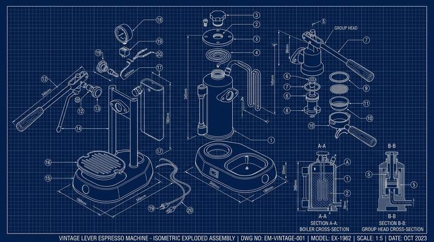

# Blueprint / Technical Drawing

[← Back to Image Prompts](../README.md)

White-line technical drawings on deep blue cyanotype paper — precise architectural blueprints, mechanical schematics, and engineering drawings with dimension lines, section markers, and notation. The visual language of engineering and architecture before CAD, where every line was drawn by hand with ruling pens and every measurement was annotated precisely. The result is simultaneously technical and aesthetically beautiful.

**Best for:** Desktop wallpapers · Social media posts · Art prints · Product concept art · Presentation backgrounds · T-shirt designs · Educational content



> **Sample prompt used to generate the above image (Nano Banana 2):**
> ```text
> Technical blueprint drawing of a detailed cross-section of a mechanical wristwatch movement, white lines on deep blue cyanotype paper, 16:9 landscape format. Every gear, spring, escapement, and jewel bearing is precisely rendered with thin white lines. Dimension lines with measurements in millimeters annotate key components. Section markers (A-A, B-B) indicate cut planes. A title block in the lower right corner with "CALIBER 3135 — MOVEMENT ASSEMBLY" and revision number. Drafting aesthetic — ruling-pen precision, lettering in engineering stencil font. Grid lines visible in the background. Folding crease marks on the paper.
> ```

---

## Prompt Variations

### 🔵 Nano Banana 2 _(Featured)_

**Variation 1 — Architectural** _(Desktop Wallpaper, Print)_
```text
Blueprint floor plan/elevation of [BUILDING], white on blue, dimension lines, section markers, title block, drafting aesthetic, grid, fold creases, [FORMAT].
```

**Variation 2 — Mechanical** _(Social Media, Educational)_
```text
Blueprint cross-section of [MECHANISM], exploded view, every component labeled, dimension lines, engineering stencil lettering, title block, [FORMAT].
```

**Variation 3 — Vehicle / Transport** _(Poster, Wallpaper)_
```text
Blueprint orthographic views (top/side/front) of [VEHICLE], white on blue, dimension annotations, title block, ruling-pen precision, [FORMAT].
```

**Variation 4 — Natural / Anatomical** _(Art Print, Social Media)_
```text
Blueprint-style anatomical diagram of [SUBJECT — e.g., a bird / flower / insect], treated as if it were an engineered mechanism, labeled components, dimension lines, title block, [FORMAT].
```

**Variation 5 — Fantasy / Fictional** _(Social Media, Fan Art)_
```text
Blueprint schematic of [FICTIONAL OBJECT — e.g., a lightsaber / time machine], treated with complete engineering seriousness, labeled components, section views, title block, [FORMAT].
```

### ChatGPT

**Variation 1 — Mechanical Cross-Section** _(Educational, Social Media)_
```text
Create a technical blueprint drawing of [MECHANISM] as a detailed cross-section — white lines on deep blue cyanotype paper. Every component rendered with ruling-pen precision, dimension lines with measurements, section markers (A-A, B-B), and component labels in engineering stencil font. Title block in the lower right reading "[TITLE]". Grid background and fold crease marks. 3:2 landscape format.
```

**Variation 2 — Vehicle Orthographic Views** _(Poster, Wallpaper)_
```text
Create a blueprint with orthographic views (top, side, and front) of [VEHICLE] — white lines on deep blue cyanotype paper. Dimension annotations on each view, title block with the vehicle name, engineering stencil lettering, background grid, fold creases. 3:2 landscape format.
```

**Variation 3 — Fictional Schematic** _(Fan Art, Social Media)_
```text
Create a blueprint schematic of [FICTIONAL OBJECT — e.g., a time machine] treated with complete engineering seriousness — white lines on blue cyanotype paper, labeled components, section views, dimension lines, and an official-looking title block. 3:2 landscape format.
```

### Midjourney

**Variation 1 — Mechanical Cross-Section** _(Educational)_
```text
technical blueprint drawing, cross-section of [MECHANISM], white lines on deep blue cyanotype paper, dimension lines, section markers, engineering stencil lettering, title block, grid background, fold creases --ar 16:9 --s 100
```

**Variation 2 — Vehicle Orthographic Views** _(Poster)_
```text
blueprint orthographic views of [VEHICLE], top side front, white on deep blue, dimension annotations, title block, ruling-pen precision, drafting aesthetic --ar 16:9 --s 100
```

**Variation 3 — Anatomical Diagram** _(Art Print)_
```text
blueprint-style anatomical diagram of [SUBJECT], treated as engineered mechanism, white lines on cyanotype blue, labeled components, dimension lines, title block --ar 4:5 --s 150
```

### Stable Diffusion

**Variation 1 — Mechanical Cross-Section** _(Educational)_
- **Prompt:** `technical blueprint drawing, cross-section of [MECHANISM], white line art on deep blue cyanotype paper, dimension lines, section markers, engineering stencil lettering, title block, grid background`
- **Negative Prompt:** `photograph, color, 3d render, sketchy lines, watercolor`

**Variation 2 — Vehicle Orthographic Views** _(Poster)_
- **Prompt:** `engineering blueprint, orthographic views of [VEHICLE], white lines on blue cyanotype, dimension annotations, title block, drafting precision, fold creases`
- **Negative Prompt:** `photograph, realistic rendering, color fill, messy lines, low quality`

---

## 🔄 Image-to-Image Transformations

**Nano Banana 2** _(Featured)_
```text
Using the attached photo, recreate the subject as a technical blueprint drawing. Convert all forms to precise white line drawings on deep blue cyanotype paper. Add dimension lines with measurements. Include section markers and component labels. Add a title block with "[TITLE]" in the lower right. Engineering stencil font for all text. Grid background. Fold crease marks.
```

**ChatGPT**
```text
[Upload Photo] "Recreate this subject as a technical blueprint — precise white line drawing on deep blue cyanotype paper with dimension lines, component labels, section markers, and a title block in the lower right. Engineering stencil lettering and a grid background."
```

**Midjourney**
```text
[IMAGE_URL] technical blueprint drawing, white lines on deep blue cyanotype paper, dimension lines, component labels, title block, drafting aesthetic --iw 1.0 --ar 16:9
```

**Stable Diffusion**
- **Pipeline:** Img2Img · Denoising Strength: `0.65–0.8` (heavy restyling into line art; ControlNet canny preserves structure)
- **Prompt:** `technical blueprint, white line drawing on deep blue cyanotype paper, dimension lines, labels, title block, engineering drafting`
- **Negative Prompt:** `photograph, color, realistic shading, 3d render`

---

## 💡 Tips & Best Practices
- **White on blue is the signature**: "White lines on deep blue cyanotype paper" — this is what makes it a blueprint vs. a technical drawing.
- **Dimension lines and labels**: Engineering annotations (measurements, section markers, component labels) authenticate the technical feel.
- **Title block**: Every professional blueprint has a title block in the lower right with drawing name, number, and revision.
- **Fold crease marks**: "Folding crease marks on the paper" adds the physical feel of a real blueprint pulled from a drawer.
- **Pairs well with:** [Holographic UI / Sci-Fi](holographic-ui-sci-fi.md) (both visualize technical data), [Steampunk Contraptions](steampunk-contraptions.md) (both celebrate mechanical engineering)
