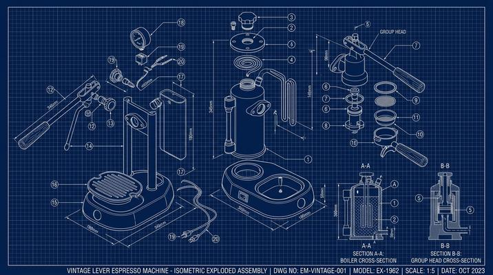

# Blueprint / Technical Drawing

[← Back to Image Prompts](../README.md)

White-line technical drawings on deep blue cyanotype paper — precise architectural blueprints, mechanical schematics, and engineering drawings with dimension lines, section markers, and notation. The visual language of engineering and architecture before CAD, where every line was drawn by hand with ruling pens and every measurement was annotated precisely. The result is simultaneously technical and aesthetically beautiful.

**Best for:** Desktop wallpapers · Social media posts · Art prints · Product concept art · Presentation backgrounds · T-shirt designs · Educational content



---

## Prompt

Replace the bracketed details with your subject and preferred format.

```text
Technical blueprint of [SUBJECT — e.g., a mechanical wristwatch movement in cross-section], [FORMAT]. Draw the subject in precise thin white lines on deep blue cyanotype paper, with visible component geometry, carefully placed dimension lines, section markers such as A–A, and a few legible labels. Include a measured grid and a lower-right title block reading "[TITLE]" with a revision number. Use engineering stencil lettering and ruling-pen precision; add subtle folding creases and paper grain. Keep the technical views consistent with the chosen subject rather than inventing arbitrary measurements.
```

## With a Reference Image

Attach your image and use this prompt to preserve its defining features while applying the style.

```text
Using the attached photo, recreate the subject as a technical blueprint drawing. Convert all forms to precise white line drawings on deep blue cyanotype paper. Add dimension lines with measurements. Include section markers and component labels. Add a title block with "[TITLE]" in the lower right. Engineering stencil font for all text. Grid background. Fold crease marks.
```

---

## 💡 Tips & Best Practices
- **White on blue is the signature**: "White lines on deep blue cyanotype paper" — this is what makes it a blueprint vs. a technical drawing.
- **Dimension lines and labels**: Engineering annotations (measurements, section markers, component labels) authenticate the technical feel.
- **Title block**: Every professional blueprint has a title block in the lower right with drawing name, number, and revision.
- **Fold crease marks**: "Folding crease marks on the paper" adds the physical feel of a real blueprint pulled from a drawer.
- **Pairs well with:** [Holographic UI / Sci-Fi](holographic-ui-sci-fi.md) (both visualize technical data), [Steampunk Contraptions](steampunk-contraptions.md) (both celebrate mechanical engineering)
