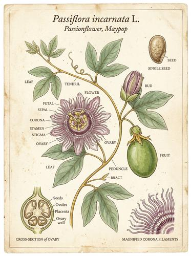

# Botanical Illustration

[← Back to Image Prompts](../README.md)

Scientific botanical art in the tradition of Maria Sibylla Merian and Pierre-Joseph Redouté — every petal, stamen, and leaf vein rendered with obsessive accuracy on cream cotton rag paper. The illustrations serve both science and art: they are taxonomically precise enough for a field guide yet aesthetically beautiful enough for a gallery wall. Fine watercolor washes build up delicate color layers, while hairline ink details define venation patterns and cellular structures.

**Best for:** Art prints · Home décor · Greeting cards · Social media posts · Journal illustrations · Phone wallpapers · Stationery designs



> **Sample prompt used to generate the above image (Nano Banana 2):**
> ```text
> Botanical illustration of a Rosa damascena (Damask rose) in full bloom with one bud and three leaves on a thorned stem, scientific illustration style on cream cotton rag paper, 4:5 vertical format. Rendered in fine watercolor — delicate transparent washes building up the petal colors from pale blush to deep pink at the edges. Every stamen, pistil, and petal vein is individually rendered with hairline detail. Two small anatomical details in the lower corner: a cross-section of the hip and a magnified view of the leaf edge showing serration. Latin name in italic copperplate below. Soft natural daylight. Museum-quality scientific illustration.
> ```

---

## Prompt Variations

### 🔵 Nano Banana 2 _(Featured)_

**Variation 1 — Single Specimen** _(Art Print, Greeting Card)_
```text
Botanical illustration of [SPECIES — e.g., Papaver somniferum (opium poppy)] in [STAGE — e.g., full bloom with seed pods], scientific illustration on cream cotton rag paper, [FORMAT]. Fine watercolor — transparent washes building color. Every [DETAILS — e.g., petal vein, stamen, pollen grain] individually rendered. [ANATOMICAL DETAILS — e.g., cross-section of seed pod in lower corner]. Latin name in italic below. Museum-quality.
```

**Variation 2 — Composition / Bouquet** _(Home Décor, Print)_
```text
Botanical illustration of an arranged composition of [SPECIES LIST — e.g., Sweet pea, Nigella, Scabiosa, and Astrantia] on cream cotton rag paper, [FORMAT]. Arranged as a naturalistic bouquet — stems crossing, flowers at different angles and stages of bloom. Fine watercolor with transparent layered washes. Individual vein and stamen detail on every flower. Subtle shadowing where stems overlap. Botanical accuracy maintained despite the artistic arrangement. Museum-quality.
```

**Variation 3 — Life Cycle / Growth Stages** _(Educational, Art Print)_
```text
Botanical illustration showing the complete life cycle of [SPECIES — e.g., Helianthus annuus (sunflower)] on cream cotton rag paper, [FORMAT]. Five stages arranged left to right: seed, seedling, vegetative growth, flower bud, full bloom. Each stage rendered in fine watercolor with scientific accuracy. Hairline ink root structures visible below soil line. Anatomical callout: cross-section of the composite flower head showing individual florets. Latin name and stage labels in italic copperplate.
```

**Variation 4 — Fruit / Edible** _(Kitchen Art, Social Media)_
```text
Botanical illustration of [SUBJECT — e.g., Citrus sinensis (blood orange) — whole fruit, halved cross-section showing ruby-red segments, a single separated segment, and a flowering branch with blossoms], on cream cotton rag paper, [FORMAT]. Fine watercolor — the cross-section shows translucent juice vesicles catching the light. Seeds detailed separately in the margin. Leaf showing glossy surface and oil glands. Latin name below. Museum-quality scientific illustration.
```

**Variation 5 — Entomological / Insect + Plant** _(Art Print, Nature Content)_
```text
Botanical illustration in the style of Maria Sibylla Merian showing [PLANT] with associated [INSECT — e.g., Danaus plexippus (Monarch butterfly) in all life stages — egg, caterpillar, chrysalis, adult — arranged on the host milkweed plant], on cream cotton rag paper, [FORMAT]. Fine watercolor. Both plant and insect rendered with equal scientific precision. The insect interacts naturally with the plant — caterpillar feeding, butterfly resting. Anatomical details in the margins. Latin names for both species. Natural history museum aesthetic.
```

### ChatGPT / Midjourney / Stable Diffusion — Standard templates.

### ChatGPT
```text
Var 1: Create a botanical illustration of [SPECIES] on cream paper. Fine watercolor, every detail rendered. Anatomical callout. Latin name in italic. Museum-quality. [FORMAT].
Var 2: Create a botanical composition of [SPECIES LIST]. Naturalistic arrangement. Fine watercolor. Vein detail. Cream paper. [FORMAT].
Var 3: Create a botanical life cycle of [SPECIES]. Five stages. Fine watercolor. Anatomical callouts. Latin names. Cream paper. [FORMAT].
```

### Midjourney
```text
Var 1: Botanical illustration, [SPECIES], cream paper, fine watercolor, scientific detail, anatomical callout, Latin name, museum quality --ar 4:5
Var 2: Botanical composition, [SPECIES LIST], arranged bouquet, fine watercolor, cream paper, museum quality --ar 4:5
Var 3: Botanical life cycle, [SPECIES], five stages, cream paper, watercolor, anatomical detail --ar 16:9
```

### Stable Diffusion
- **Var 1:** `Botanical scientific illustration, [SPECIES], cream paper, fine watercolor, detailed veins stamens, Latin name, museum quality, 8k` / Neg: `photograph, dark, modern, abstract, cartoon`

---

## 🔄 Image-to-Image Transformations

**Nano Banana 2** _(Featured)_
```text
Using the attached photo of this plant/flower, recreate it as a scientific botanical illustration on cream cotton rag paper. Render every petal, leaf, and stem with fine watercolor washes and hairline ink detail. Add anatomical callouts — a cross-section or magnified detail in the corner. Include the Latin species name in italic copperplate below the specimen. Museum-quality scientific illustration aesthetic.
```
> 💡 **Refinements:** "Add more anatomical detail" · "Include the root system" · "Add an insect on the plant" · "Show multiple growth stages"

---

## 💡 Tips & Best Practices

- **Latin names add authenticity**: Including the binomial (e.g., "Rosa damascena") makes it feel like a real scientific illustration.
- **Cream paper is the substrate**: "Cream cotton rag paper" is the traditional substrate for botanical art. White paper looks too clinical.
- **Watercolor washes build up**: Describe "transparent washes building color" — this is the technique that creates the characteristic botanical delicacy.
- **Anatomical callouts**: Cross-sections, magnified details, and seed diagrams in the margins are what distinguish botanical illustration from flower painting.
- **Common pitfalls**: "Flower painting" produces decorative art. "Botanical illustration" produces scientific art. They're different.
- **Pairs well with:** [Illuminated Manuscript](illuminated-manuscript.md) (similar hand-crafted aesthetic), [Ukiyo-e Woodblock](ukiyo-e-woodblock.md) (similar nature focus, different culture)
