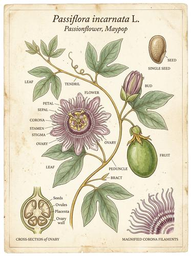

# Botanical Illustration

[← Back to Image Prompts](../README.md)

Scientific botanical art in the tradition of Maria Sibylla Merian and Pierre-Joseph Redouté — every petal, stamen, and leaf vein rendered with obsessive accuracy on cream cotton rag paper. The illustrations serve both science and art: they are taxonomically precise enough for a field guide yet aesthetically beautiful enough for a gallery wall. Fine watercolor washes build up delicate color layers, while hairline ink details define venation patterns and cellular structures.

**Best for:** Art prints · Home décor · Greeting cards · Social media posts · Journal illustrations · Phone wallpapers · Stationery designs



---

## Prompt

Replace the bracketed details with your subject and preferred format.

```text
Botanical illustration of [SPECIES — e.g., Papaver somniferum (opium poppy)] in [STAGE — e.g., full bloom with seed pods], scientific illustration on cream cotton rag paper, [FORMAT]. Fine watercolor — transparent washes building color. Every [DETAILS — e.g., petal vein, stamen, pollen grain] individually rendered. [ANATOMICAL DETAILS — e.g., cross-section of seed pod in lower corner]. Latin name in italic below. Museum-quality.
```

## With a Reference Image

Attach your image and use this prompt to preserve its defining features while applying the style.

```text
Using the attached photo of this plant/flower, recreate it as a scientific botanical illustration on cream cotton rag paper. Render every petal, leaf, and stem with fine watercolor washes and hairline ink detail. Add anatomical callouts — a cross-section or magnified detail in the corner. Include the Latin species name in italic copperplate below the specimen. Museum-quality scientific illustration aesthetic.
```

---

## 💡 Tips & Best Practices

- **Latin names add authenticity**: Including the binomial (e.g., "Rosa damascena") makes it feel like a real scientific illustration.
- **Cream paper is the substrate**: "Cream cotton rag paper" is the traditional substrate for botanical art. White paper looks too clinical.
- **Watercolor washes build up**: Describe "transparent washes building color" — this is the technique that creates the characteristic botanical delicacy.
- **Anatomical callouts**: Cross-sections, magnified details, and seed diagrams in the margins are what distinguish botanical illustration from flower painting.
- **Common pitfalls**: "Flower painting" produces decorative art. "Botanical illustration" produces scientific art. They're different.
- **Pairs well with:** [Illuminated Manuscript](illuminated-manuscript.md) (similar hand-crafted aesthetic), [Ukiyo-e Woodblock](ukiyo-e-woodblock.md) (similar nature focus, different culture)
