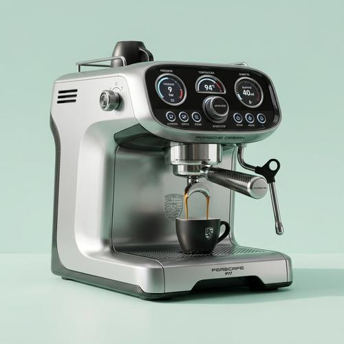

# Brand Concept Renders

[← Back to Image Prompts](../README.md)

High-end, glossy concept art product renders imagining unexpected collaborations — "What if [LUXURY BRAND] designed a [PRODUCT]?" A Ferrari toaster, a Hermès power tool, a Nike teapot. Each render is photographed against a pristine studio cyclorama in ultra-light pastel tones, with magazine editorial precision. The style turns outlandish brand mashups into objects that look genuinely desirable, blending the design language, materials, and branding of real companies into products they'd never actually make.

**Best for:** Social media posts · Design portfolios · Creative exercises · Trend content · Presentation slides · Brand exploration · Editorial layouts



> **Sample prompt used to generate the above image (Nano Banana 2):**
> ```text
> Create a high-end, glossy concept art magazine editorial photograph of a unique, unexpected functional espresso machine conceptualized and designed by Porsche, 1:1 square format. The product displays Porsche's signature design DNA — aerodynamic curves, carbon fiber accents, the Porsche crest subtly embossed, instrument-cluster-inspired controls, and a finish in GT Silver Metallic. Premium studio product photography with a seamless, impeccably clean studio cyclorama background in a pure, ultra-light desaturated mint tone, free of shadows. Soft, directional lighting. 8k resolution.
> ```

---

## Prompt Variations

### 🔵 Nano Banana 2 _(Featured)_

> NB2's search grounding is critical here — it can reference real brand design languages, color palettes, and material signatures. Name specific brands and products; the model will draw on accurate brand DNA to produce convincing renders.

**Variation 1 — Luxury Brand × Everyday Object** _(Social Media, Portfolio)_
```text
Create a high-end, glossy concept art magazine editorial photograph of a unique, unexpected functional [PRODUCT — e.g., toaster] conceptualized and designed by [BRAND — e.g., Ferrari], 1:1 square format. The product displays the brand's signature design DNA — [DESIGN ELEMENTS — e.g., aggressive ventilation slats, Rosso Corsa red with a racing stripe, prancing horse badge, carbon fiber trim, and aerodynamic silhouette]. Premium studio product photography. A seamless, impeccably clean studio cyclorama background in a pure, ultra-light pastel tone (e.g., desaturated mint), free of shadows. Soft, directional lighting. 8k resolution.
```

**Variation 2 — Tech Brand × Analog Object** _(Creative Content, Design Exercise)_
```text
Create a high-end, glossy concept art photograph of a [ANALOG PRODUCT — e.g., mechanical typewriter] reimagined and designed by [TECH BRAND — e.g., Apple], 1:1 square format. The product seamlessly integrates the brand's design philosophy — [DESIGN ELEMENTS — e.g., unibody aluminum construction, minimal bezels, rounded corners with precise radii, Space Gray finish, subtle Apple logo etched on the back panel]. Magazine editorial photography quality. Ultra-light pastel cyclorama background. Clean, shadow-free studio lighting. 8k resolution.
```

**Variation 3 — Fashion Brand × Tech Product** _(Social Media, Trend Content)_
```text
Create a high-end, glossy concept art photograph of a [TECH PRODUCT — e.g., gaming controller] conceptualized and designed by [FASHION BRAND — e.g., Louis Vuitton], 3:4 vertical format. The product features the brand's signature aesthetic — [DESIGN ELEMENTS — e.g., Damier Ebene canvas wrapped surfaces, gold brass hardware accents, leather grip panels with LV monogram embossing, premium stitched seams]. Ultra-light pale blush cyclorama background. Editorial studio lighting. 8k resolution.
```

**Variation 4 — Automotive Brand × Home Appliance** _(Desktop Wallpaper, Presentation)_
```text
Create a high-end, glossy concept art photograph of a [HOME APPLIANCE — e.g., vacuum cleaner] designed by [AUTOMOTIVE BRAND — e.g., Lamborghini], 16:9 landscape format. The product incorporates the brand's design language — [DESIGN ELEMENTS — e.g., aggressive hexagonal air intakes, Giallo Orion yellow body panels, exposed carbon fiber chassis, scissor-opening dustbin, active aerodynamic vents]. Premium studio cyclorama in ultra-light off-white. Dramatic directional lighting. 8k resolution.
```

**Variation 5 — Crossover Collection** _(Presentation, Social Media Series)_
```text
Create a high-end photograph showing three concept products displayed side by side, each designed by a different luxury brand for the same product category: [PRODUCT — e.g., water bottle] × [BRAND 1 — e.g., Chanel], [BRAND 2 — e.g., Nike], [BRAND 3 — e.g., Bang & Olufsen], 16:9 landscape format. Each bottle reflects its brand's design DNA — materials, colors, logos, and signature design elements. Consistent studio cyclorama in ultra-light grey. Matched lighting across all three. Premium editorial product photography. 8k resolution.
```

### ChatGPT

**Variation 1 — Luxury Brand × Everyday Object**
```text
Create a high-end concept art photograph of a [PRODUCT] designed by [BRAND]. The product displays the brand's signature design DNA — [KEY DESIGN ELEMENTS]. Ultra-light pastel studio cyclorama, shadow-free. Editorial product photography quality. 1:1 square format.
```

**Variation 2 — Tech Brand × Analog Object**
```text
Create a glossy concept art photograph of a [ANALOG PRODUCT] reimagined by [TECH BRAND]. Integrate the brand's design philosophy — [DESIGN ELEMENTS]. Magazine editorial quality. Clean studio background in a pale pastel tone. 1:1 square format.
```

**Variation 3 — Fashion Brand × Tech Product**
```text
Create a concept art photograph of a [TECH PRODUCT] designed by [FASHION BRAND]. Apply the brand's signature materials and patterns — [DESIGN ELEMENTS]. Ultra-light blush cyclorama background. Studio lighting. 2:3 vertical format.
```

### Midjourney

**Variation 1 — Luxury Brand × Everyday Object**
```text
High-end glossy concept art photograph, [PRODUCT] designed by [BRAND], brand signature design DNA, [DESIGN ELEMENTS], ultra-light pastel studio cyclorama, editorial product photography, shadow-free, 8k --ar 1:1
```

**Variation 2 — Crossover Collection**
```text
Three concept products side by side, [PRODUCT] designed by [BRAND 1] and [BRAND 2] and [BRAND 3], each reflecting brand DNA, matched studio lighting, ultra-light grey cyclorama, editorial photography --ar 16:9 --s 200
```

**Variation 3 — Automotive × Appliance**
```text
High-end concept art photograph, [APPLIANCE] designed by [AUTOMOTIVE BRAND], aggressive design language, [DESIGN ELEMENTS], premium studio cyclorama, dramatic directional lighting --ar 16:9
```

### Stable Diffusion

**Variation 1 — Luxury Brand × Everyday Object**
- **Prompt:** `High-end glossy concept art photograph, [PRODUCT] designed by [BRAND], brand design DNA, [DESIGN ELEMENTS], ultra-light pastel studio cyclorama, editorial product photography, 8k, octane render`
- **Negative Prompt:** `cheap, low quality, cluttered background, shadows, messy, cartoon, illustration`

**Variation 2 — Fashion Brand × Tech Product**
- **Prompt:** `Concept art product photograph, [TECH PRODUCT] designed by [FASHION BRAND], signature materials and patterns, [DESIGN ELEMENTS], pale blush cyclorama background, studio lighting, 8k`
- **Negative Prompt:** `cheap plastic, generic, cluttered, dark background, illustration, cartoon`

---

## 🔄 Image-to-Image Transformations

Transform existing product photos into brand concept renders:

**Nano Banana 2** _(Featured)_
```text
Using the attached product photo as reference, reimagine this [PRODUCT] as if it were designed by [BRAND]. Apply the brand's signature design DNA — materials, colors, logos, proportions, and design language. Keep the product's basic function and form but transform every surface detail to reflect the brand identity. Place against a seamless ultra-light pastel studio cyclorama. Premium editorial photography quality.
```
> 💡 **Follow-up refinements:**
> - "Push the brand identity further — more [SPECIFIC BRAND ELEMENT]"
> - "Try a different brand — reimagine it as [NEW BRAND]"
> - "Add the brand logo/badge in a subtle, tasteful position"
> - "Change the cyclorama color to [NEW PASTEL TONE]"

**ChatGPT**
```text
[Upload Photo] "Reimagine this product as if designed by [BRAND]. Apply their signature design DNA — materials, colors, and design language. Keep the basic form but transform all surfaces. Ultra-light pastel studio background. Editorial photography."
```

**Midjourney**
```text
[IMAGE_URL] Concept art, product redesigned by [BRAND], brand design DNA applied, ultra-light pastel studio cyclorama, editorial photography --iw 1.0 --ar 1:1
```

**Stable Diffusion**
- **Pipeline:** Img2Img · Denoising Strength: `0.60–0.75` (moderate — preserve form while changing surface details)
- **Prompt:** `Concept art product photograph, redesigned by [BRAND], brand design DNA, [DESIGN ELEMENTS], ultra-light pastel cyclorama, editorial lighting, 8k`
- **Negative Prompt:** `cheap, generic, dark background, cluttered, cartoon`

---

## 💡 Tips & Best Practices

- **Name real brands**: NB2 and ChatGPT draw on their knowledge of specific brand design languages. "Designed by Braun" produces very different results than "designed by Supreme" — both accurate to the brand.
- **Specify design DNA elements**: Don't just name the brand — describe 3-5 specific design elements (materials, signature colors, iconic patterns, hardware details). This prevents the model from adding a logo to a generic product.
- **Ultra-light pastel cyclorama**: The clean, desaturated pastel background is essential to the editorial feel. Specify the exact tone (desaturated mint, pale blush, off-white) for consistency.
- **Product plausibility**: The most compelling renders feel like products the brand *could* make — improbable but not impossible. A Porsche espresso machine works; a Porsche banana doesn't.
- **Common pitfalls**: "Product with [BRAND] logo" just slaps a logo on a generic object. You need to describe the design language transformation, not just branding.
- **Pairs well with:** [Glass Embossed 3D](glass-embossed-3d.md) (complementary premium product visualization), [Exploded Product View](exploded-product-view.md) (deconstruct the concept render to reveal the imagined internals)
