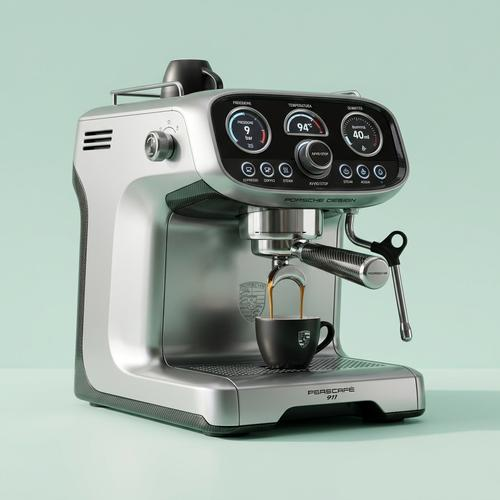

# Brand Concept Renders

[← Back to Image Prompts](../README.md)

High-end, glossy concept art product renders imagining unexpected collaborations — "What if [LUXURY BRAND] designed a [PRODUCT]?" A Ferrari toaster, a Hermès power tool, a Nike teapot. Each render is photographed against a pristine studio cyclorama in ultra-light pastel tones, with magazine editorial precision. The style turns outlandish brand mashups into objects that look genuinely desirable, blending the design language, materials, and branding of real companies into products they'd never actually make.

**Best for:** Social media posts · Design portfolios · Creative exercises · Trend content · Presentation slides · Brand exploration · Editorial layouts



---

## Prompt

Replace the bracketed details with your subject and preferred format.

```text
Create a high-end, glossy concept art magazine editorial photograph of a unique, unexpected functional [PRODUCT — e.g., toaster] conceptualized and designed by [BRAND — e.g., Ferrari], 1:1 square format. The product displays the brand's signature design DNA — [DESIGN ELEMENTS — e.g., aggressive ventilation slats, Rosso Corsa red with a racing stripe, prancing horse badge, carbon fiber trim, and aerodynamic silhouette]. Premium studio product photography. A seamless, impeccably clean studio cyclorama background in a pure, ultra-light pastel tone (e.g., desaturated mint), free of shadows. Soft, directional lighting. 8k resolution.
```

## With a Reference Image

Attach your image and use this prompt to preserve its defining features while applying the style.

```text
Using the attached product photo as reference, reimagine this [PRODUCT] as if it were designed by [BRAND]. Apply the brand's signature design DNA — materials, colors, logos, proportions, and design language. Keep the product's basic function and form but transform every surface detail to reflect the brand identity. Place against a seamless ultra-light pastel studio cyclorama. Premium editorial photography quality.
```

---

## 💡 Tips & Best Practices

- **Specify the brand language**: Describe the materials, typography, colors, and product shapes you want instead of relying on a brand name alone.
- **Specify design DNA elements**: Don't just name the brand — describe 3-5 specific design elements (materials, signature colors, iconic patterns, hardware details). This prevents the model from adding a logo to a generic product.
- **Ultra-light pastel cyclorama**: The clean, desaturated pastel background is essential to the editorial feel. Specify the exact tone (desaturated mint, pale blush, off-white) for consistency.
- **Product plausibility**: The most compelling renders feel like products the brand *could* make — improbable but not impossible. A Porsche espresso machine works; a Porsche banana doesn't.
- **Common pitfalls**: "Product with [BRAND] logo" just slaps a logo on a generic object. You need to describe the design language transformation, not just branding.
- **Pairs well with:** [Glass Embossed 3D](glass-embossed-3d.md) (complementary premium product visualization), [Exploded Product View](exploded-product-view.md) (deconstruct the concept render to reveal the imagined internals)
