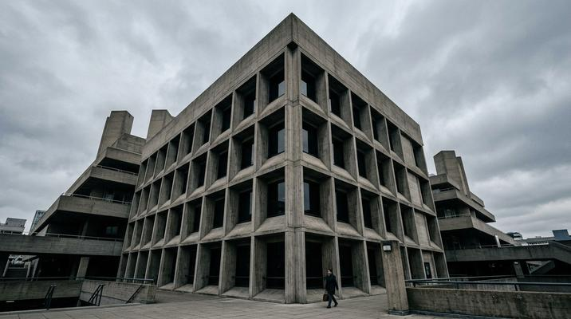

# Brutalist Architecture

[← Back to Image Prompts](../README.md)

Monolithic raw concrete forms with dramatic shadows, geometric repetition, and overcast skies. The imposing, sculptural aesthetic of mid-century Brutalist buildings — Le Corbusier's Unité d'Habitation, the Barbican, and Tadao Ando's minimalist concrete temples.



> **Sample prompt used to generate the above image (Nano Banana 2):**
> ```text
> Architectural photograph of a massive Brutalist concrete building with a repeating grid of deep-set rectangular windows casting dramatic geometric shadows, 16:9 landscape format. Raw béton brut concrete surface with visible board-formed texture — the wood grain of the formwork is imprinted into the concrete. Overcast grey sky creating flat diffused lighting that emphasizes the geometric forms and shadow patterns. A single small human figure stands at the base for scale, dwarfed by the monolithic structure. Desaturated color palette — concrete grey, charcoal shadows, and a cold steel-blue sky. Shot from a low angle looking upward to emphasize the building's imposing mass.
> ```

**ChatGPT**
```text
Create an architectural photograph of a massive Brutalist building — [SUBJECT/BUILDING DESCRIPTION] — with raw béton brut concrete surfaces showing visible board-formed wood grain texture. Emphasize geometric repetition: deep-set windows, cantilevers, or exposed structural elements casting dramatic shadow patterns. Overcast grey sky with flat, diffused lighting. Include a single small human figure for scale. Desaturated color palette — concrete grey, charcoal, and cold steel-blue. Low camera angle looking upward to emphasize the imposing monolithic mass.
```

**Midjourney**
```text
Architectural photograph of a massive Brutalist building, [SUBJECT/BUILDING DESCRIPTION], raw béton brut concrete with board-formed texture, geometric repetition, deep shadow patterns, overcast grey sky, single human figure for scale, desaturated palette, low upward angle --ar 16:9 --s 150
```

**Stable Diffusion**
- **Prompt:** `Architectural photograph, massive Brutalist building, [SUBJECT/BUILDING DESCRIPTION], raw concrete béton brut, board-formed texture, geometric repetition, dramatic shadows, overcast sky, desaturated palette, low angle, 8k`
- **Negative Prompt:** `colorful, sunny, modern glass, ornate decoration, illustration`

**Nano Banana 2**
```text
Architectural photograph of a massive Brutalist building — [SUBJECT/BUILDING DESCRIPTION] — 16:9 landscape format. Raw béton brut concrete surfaces with visible board-formed wood grain texture. Geometric repetition: deep-set windows or exposed structural elements casting dramatic shadow patterns. Overcast grey sky creating flat diffused lighting. A single small human figure at the base for scale. Desaturated color palette — concrete grey, charcoal shadows, and cold steel-blue sky. Low camera angle looking upward to emphasize the imposing monolithic mass.
```
