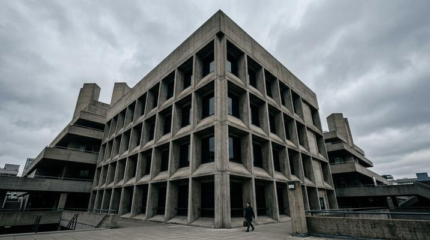

# Brutalist Architecture

[← Back to Image Prompts](../README.md)

Monolithic raw concrete forms with dramatic shadows, geometric repetition, and uncompromising structural honesty. Brutalism finds beauty in the exposed material — béton brut (raw concrete) — where massive geometric volumes create dramatic interplays of light and shadow. The style celebrates structural honesty over decoration, producing images that feel simultaneously oppressive and awe-inspiring, ancient and futuristic.

**Best for:** Desktop wallpapers · Art prints · Social media posts · Architecture concept art · Editorial illustrations · Album covers



---

## Prompt

Replace the bracketed details with your subject and preferred format.

```text
Photograph of a monolithic brutalist [BUILDING TYPE — e.g., library / church / government building] against a clear sky, 16:9 landscape format. Massive geometric volumes — [FORM — e.g., cantilevered horizontal slabs stacked with staggered offsets]. Raw béton brut concrete surface with visible formwork lines, board marks, and aggregate texture. Dramatic angular shadows cast by deep overhangs. Harsh [TIME — e.g., late afternoon] sun creating maximum tonal contrast. A small human figure at the base for scale. Monochromatic concrete grey palette.
```

## With a Reference Image

Attach your image and use this prompt to preserve its defining features while applying the style.

```text
Using the attached architectural photo as reference, reimagine the building in a brutalist style. Replace all surface materials with raw béton brut concrete showing visible formwork lines and aggregate texture. Simplify decorative elements into pure geometric volumes. Deepen the shadows to create dramatic tonal contrast. Remove color — monochromatic concrete grey palette. Preserve the building's overall proportions and massing.
```

---

## 💡 Tips & Best Practices

- **"Raw béton brut concrete"**: This is the specific material name. "Concrete" alone might produce smooth modern concrete. Béton brut has formwork lines and aggregate texture.
- **Shadows are the art**: Brutalist buildings become interesting through shadow play. Always specify sun angle and shadow intensity.
- **Scale reference**: Include "a human figure at the base for scale" — brutalism's power is in its monumental scale, which only reads when there's a size reference.
- **Geometric repetition**: The rhythmic repetition of identical structural elements (windows, balconies, columns) is a core Brutalist motif.
- **Common pitfalls**: Don't over-decorate — brutalism is anti-decoration. Avoid "beautiful" or "elegant" — the aesthetic is intentionally severe. Don't add color — the power is in the monochromatic concrete.
- **Pairs well with:** [Solarpunk](solarpunk.md) (nature + architecture, opposite ideology), [Cyberpunk Noir](cyberpunk-noir.md) (similar dystopian monumental scale)
