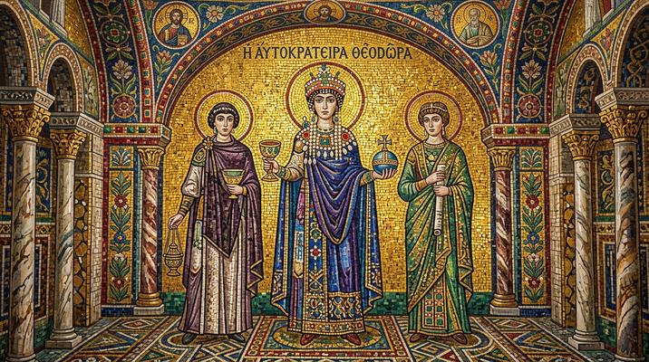

# Byzantine Mosaic

[← Back to Image Prompts](../README.md)

Scenes composed entirely from small square tesserae (tiles) set in plaster — gold leaf tesserae for backgrounds, colored glass smalti for figures, and stone pieces for details. The visual language of Ravenna's churches, Hagia Sophia, and Eastern Orthodox iconography. Figures are frontal, hieratic, and adorned with halos of gold mosaic. The slight angular variation of each tessera catches light differently, creating a shimmering, living surface.

**Best for:** Art prints · Social media posts · Desktop wallpapers · Greeting cards · Religious art · Home décor



> **Sample prompt used to generate the above image (Nano Banana 2):**
> ```text
> Byzantine mosaic depicting a regal peacock with tail feathers fully displayed, composed entirely from small square tesserae tiles set in pale plaster, 1:1 square format. Gold leaf tesserae create a shimmering background. The peacock's body is rendered in deep blue and green glass smalti tesserae, with eye-spots on each tail feather in gold, emerald, and sapphire. Each individual tessera is visible — small square tiles approximately 1cm, set at slightly varying angles to catch light. Visible grout lines between every tile. The overall effect is luminous and shimmering. Warm museum lighting.
> ```

---

## Prompt Variations

### 🔵 Nano Banana 2 _(Featured)_

**Variation 1 — Sacred / Icon** — Byzantine mosaic icon of [SAINT/FIGURE] with gold halo, frontal pose, gold tesserae background, glass smalti for robes, visible tiles and grout, Ravenna aesthetic, [FORMAT].

**Variation 2 — Animal / Nature** — Byzantine mosaic of [ANIMAL], gold leaf background, colored smalti, visible square tesserae, grout lines, shimmering, [FORMAT].

**Variation 3 — Portrait / Modern Subject** — Byzantine mosaic portrait of [MODERN SUBJECT], frontal pose, gold tesserae background, smalti features, visible tiles, hieratic formal style, [FORMAT].

**Variation 4 — Decorative Pattern** — Byzantine geometric mosaic floor pattern, [MOTIF], stone and marble tesserae, visible grout, warm tones, top-down view, [FORMAT].

**Variation 5 — Narrative Scene** — Byzantine mosaic narrative scene of [SCENE], gold background, multiple figures, smalti colors, visible tesserae, Ravenna church aesthetic, [FORMAT].

### ChatGPT / Midjourney / Stable Diffusion — Standard templates with "Byzantine mosaic, square tesserae, gold leaf background, glass smalti, visible grout lines, shimmering" core keywords.

---

## 🔄 Image-to-Image Transformations

**Nano Banana 2** _(Featured)_
```text
Using the attached photo, recreate the subject as a Byzantine mosaic. Convert all surfaces to small square tesserae tiles set in plaster. Use gold leaf tesserae for the background. Use colored glass smalti for the subject. Each tile visible and set at slightly varying angles. Visible grout lines. Frontal, formal composition. Ravenna church mosaic aesthetic.
```

---

## 💡 Tips & Best Practices
- **Individual tesserae must be visible**: "Small square tesserae approximately 1cm" prevents the AI from producing smooth, un-tiled surfaces.
- **Gold background is canonical**: "Gold leaf tesserae background" is the defining feature of Byzantine mosaic.
- **Visible grout lines**: Without grout, it's stained glass. Grout between every tile defines mosaic.
- **Pairs well with:** [Illuminated Manuscript](illuminated-manuscript.md) (same era, different medium), [Stained Glass Windows](stained-glass-windows.md) (similar translucent beauty)
