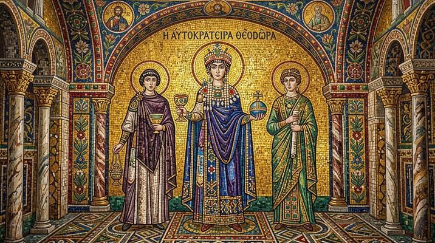

# Byzantine Mosaic

[← Back to Image Prompts](../README.md)

Scenes composed entirely from small square tesserae (tiles) set in plaster — gold leaf tesserae for backgrounds, colored glass smalti for figures, and stone pieces for details. The visual language of Ravenna's churches, Hagia Sophia, and Eastern Orthodox iconography. Figures are frontal, hieratic, and adorned with halos of gold mosaic. The slight angular variation of each tessera catches light differently, creating a shimmering, living surface.

**Best for:** Art prints · Social media posts · Desktop wallpapers · Greeting cards · Religious art · Home décor



> **Sample prompt used to generate the above image (Nano Banana 2):**
> ```text
> Byzantine mosaic depicting a regal peacock with tail feathers fully displayed, composed entirely from small square tesserae tiles set in pale plaster, 1:1 square format. Gold leaf tesserae create a shimmering background. The peacock's body is rendered in deep blue and green glass smalti tesserae, with eye-spots on each tail feather in gold, emerald, and sapphire. Each individual tessera is visible — small square tiles approximately 1cm, set at slightly varying angles to catch light. Visible grout lines between every tile. The overall effect is luminous and shimmering. Warm museum lighting.
> ```

---

## Prompt Variations

### 🔵 Nano Banana 2 _(Featured)_

**Variation 1 — Sacred / Icon** _(Art Print)_
```text
Byzantine mosaic icon of [SAINT/FIGURE] with gold halo, frontal pose, gold tesserae background, glass smalti for robes, visible tiles and grout, Ravenna aesthetic, [FORMAT].
```

**Variation 2 — Animal / Nature** _(Nature Content)_
```text
Byzantine mosaic of [ANIMAL], gold leaf background, colored smalti, visible square tesserae, grout lines, shimmering, [FORMAT].
```

**Variation 3 — Portrait / Modern Subject** _(Profile Picture)_
```text
Byzantine mosaic portrait of [MODERN SUBJECT], frontal pose, gold tesserae background, smalti features, visible tiles, hieratic formal style, [FORMAT].
```

**Variation 4 — Decorative Pattern** _(Pattern Design)_
```text
Byzantine geometric mosaic floor pattern, [MOTIF], stone and marble tesserae, visible grout, warm tones, top-down view, [FORMAT].
```

**Variation 5 — Narrative Scene** _(Art Print)_
```text
Byzantine mosaic narrative scene of [SCENE], gold background, multiple figures, smalti colors, visible tesserae, Ravenna church aesthetic, [FORMAT].
```

### ChatGPT

**Variation 1 — Sacred / Icon** _(Religious Art, Print)_
```text
Create a Byzantine mosaic icon of [SAINT/FIGURE] in a frontal, hieratic pose with a gold halo. The image is composed entirely of small square tesserae tiles — gold leaf tesserae for the background, colored glass smalti for the robes and face. Each tile visible with grout lines between them, set at slightly varying angles to shimmer. Ravenna church aesthetic. 2:3 vertical format.
```

**Variation 2 — Animal / Nature** _(Art Print)_
```text
Create a Byzantine mosaic of [ANIMAL] composed from small square tesserae — a shimmering gold leaf background with the animal rendered in deep blue, green, and emerald glass smalti. Every 1cm tile individually visible with grout lines. Luminous, warm museum lighting. 1:1 square format.
```

**Variation 3 — Modern Portrait** _(Profile Picture, Gift)_
```text
Create a Byzantine mosaic portrait of [MODERN SUBJECT] in a formal frontal pose — gold tesserae background, features built from colored glass smalti tiles, visible grout lines, hieratic Eastern Orthodox icon composition. 1:1 square format.
```

### Midjourney

**Variation 1 — Sacred / Icon** _(Religious Art)_
```text
Byzantine mosaic icon of [SAINT/FIGURE], frontal hieratic pose, gold halo, gold leaf tesserae background, glass smalti robes, visible square tiles and grout lines, Ravenna church aesthetic, shimmering --ar 2:3 --s 200
```

**Variation 2 — Animal / Nature** _(Art Print)_
```text
Byzantine mosaic of [ANIMAL], small square tesserae, gold leaf background, blue green emerald glass smalti, visible grout lines, shimmering luminous surface --ar 1:1 --s 250
```

**Variation 3 — Decorative Pattern** _(Home Décor)_
```text
Byzantine geometric mosaic floor pattern, [MOTIF], stone and marble tesserae, visible grout, warm earth tones, top-down view --ar 1:1 --s 150
```

### Stable Diffusion

**Variation 1 — Sacred / Icon** _(Religious Art)_
- **Prompt:** `Byzantine mosaic icon, [SAINT/FIGURE], frontal pose, gold halo, gold leaf tesserae background, glass smalti, visible square tiles, grout lines, Ravenna aesthetic, shimmering`
- **Negative Prompt:** `smooth painting, photograph, 3d render, modern style, blurry tiles`

**Variation 2 — Animal / Nature** _(Art Print)_
- **Prompt:** `Byzantine mosaic, [ANIMAL], small square tesserae, gold background, colored glass smalti, visible grout lines, luminous shimmering surface, warm lighting`
- **Negative Prompt:** `smooth surfaces, painting, photograph, stained glass, low quality`

---

## 🔄 Image-to-Image Transformations

**Nano Banana 2** _(Featured)_
```text
Using the attached photo, recreate the subject as a Byzantine mosaic. Convert all surfaces to small square tesserae tiles set in plaster. Use gold leaf tesserae for the background. Use colored glass smalti for the subject. Each tile visible and set at slightly varying angles. Visible grout lines. Frontal, formal composition. Ravenna church mosaic aesthetic.
```

**ChatGPT**
```text
[Upload Photo] "Recreate this image as a Byzantine mosaic — every surface converted to small square tesserae tiles with visible grout lines, a gold leaf background, and the subject in colored glass smalti. Formal, frontal Ravenna church composition."
```

**Midjourney**
```text
[IMAGE_URL] Byzantine mosaic, small square tesserae, gold leaf background, glass smalti, visible grout lines, shimmering surface, Ravenna aesthetic --iw 1.0 --ar 1:1
```

**Stable Diffusion**
- **Pipeline:** Img2Img · Denoising Strength: `0.65–0.8` (surfaces must fully convert to tiles)
- **Prompt:** `Byzantine mosaic, square tesserae, gold leaf background, glass smalti, visible grout lines, shimmering, formal composition`
- **Negative Prompt:** `smooth surfaces, photograph, painting, blurry`

---

## 💡 Tips & Best Practices
- **Individual tesserae must be visible**: "Small square tesserae approximately 1cm" prevents the AI from producing smooth, un-tiled surfaces.
- **Gold background is canonical**: "Gold leaf tesserae background" is the defining feature of Byzantine mosaic.
- **Visible grout lines**: Without grout, it's stained glass. Grout between every tile defines mosaic.
- **Pairs well with:** [Illuminated Manuscript](illuminated-manuscript.md) (same era, different medium), [Stained Glass Windows](stained-glass-windows.md) (similar translucent beauty)
