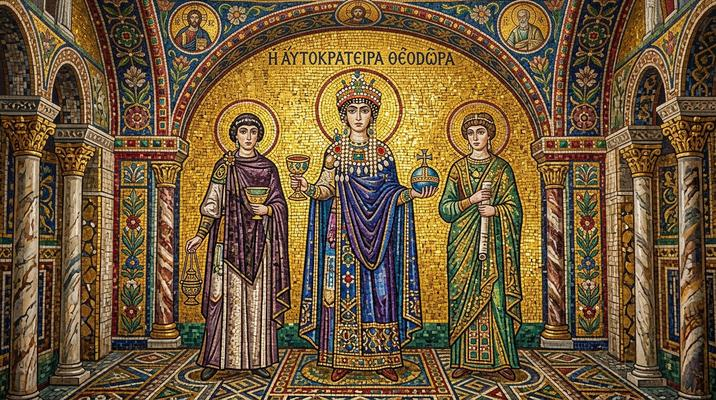

# Byzantine Mosaic

[← Back to Image Prompts](../README.md)

Scenes composed entirely from small square tesserae (tiles) set in plaster — gold leaf tesserae for backgrounds, colored glass smalti for figures, and stone pieces for details. The visual language of Ravenna's churches, Hagia Sophia, and Eastern Orthodox iconography. Figures are frontal, hieratic, and adorned with halos of gold mosaic. The slight angular variation of each tessera catches light differently, creating a shimmering, living surface.

**Best for:** Art prints · Social media posts · Desktop wallpapers · Greeting cards · Religious art · Home décor



---

## Prompt

Replace the bracketed details with your subject and preferred format.

```text
Byzantine mosaic of [SUBJECT — e.g., a peacock with its tail displayed or a haloed figure], [FORMAT]. Build the entire scene from individually visible square tesserae set at slightly varied angles in pale plaster. Use shimmering gold leaf tesserae for the ground, saturated blue and green glass smalti for the subject, and fine contrasting pieces to define the contours. Show irregular grout lines and the changing reflections of each tile under warm museum light. Compose the subject in a formal frontal arrangement with luminous, handcrafted detail.
```

## With a Reference Image

Attach your image and use this prompt to preserve its defining features while applying the style.

```text
Using the attached photo, recreate the subject as a Byzantine mosaic. Convert all surfaces to small square tesserae tiles set in plaster. Use gold leaf tesserae for the background. Use colored glass smalti for the subject. Each tile visible and set at slightly varying angles. Visible grout lines. Frontal, formal composition. Ravenna church mosaic aesthetic.
```

---

## 💡 Tips & Best Practices
- **Individual tesserae must be visible**: "Small square tesserae approximately 1cm" prevents the AI from producing smooth, un-tiled surfaces.
- **Gold background is canonical**: "Gold leaf tesserae background" is the defining feature of Byzantine mosaic.
- **Visible grout lines**: Without grout, it's stained glass. Grout between every tile defines mosaic.
- **Pairs well with:** [Illuminated Manuscript](illuminated-manuscript.md) (same era, different medium), [Stained Glass Windows](stained-glass-windows.md) (similar translucent beauty)
