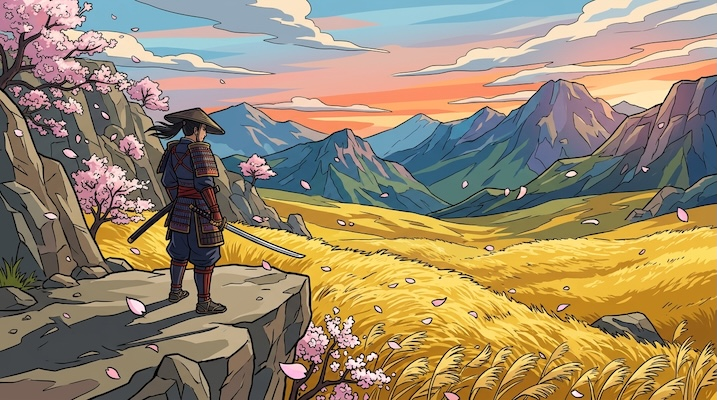

# Cell Shaded Art

[← Back to Image Prompts](../README.md)

Flat-shaded, stylized 3D art with thick outlines and hard shadow edges, inspired by games like *Borderlands*, *Breath of the Wild*, and *Jet Set Radio*.



> **Sample prompt used to generate the above image (Nano Banana 2):**
> ```text
> Cell-shaded 3D video game scene of a lone samurai standing on a windswept cliff edge,
> overlooking a vast valley of swaying golden grass, 16:9 landscape format. Cherry blossom
> petals drifting on the wind. Thick black outlines around every form, flat vibrant color fills
> with no soft gradients, hard-edged shadow shapes that snap between exactly two tones. Art
> style evokes The Legend of Zelda: Breath of the Wild — painterly, bold, and serene.
> ```

**ChatGPT**
```text
Create a cell-shaded 3D video game scene of [SUBJECT] in a [ENVIRONMENT]. Use thick black outlines around every form, flat vibrant color fills with no soft gradients, and hard-edged shadow shapes that snap between two tones. The art style should evoke games like Borderlands or The Legend of Zelda: Breath of the Wild — stylized, bold, and graphic.
```

**Midjourney**
```text
Cell-shaded 3D art of [SUBJECT] in [ENVIRONMENT], thick black outlines on every form, flat vibrant color fills, hard-edged two-tone shadows, Borderlands and Breath of the Wild aesthetic, video game concept art --ar 16:9 --niji
```

**Stable Diffusion**
- **Prompt:** `Cell-shaded 3D art, [SUBJECT] in [ENVIRONMENT], thick black outlines, flat vibrant colors, hard-edged two-tone shadows, video game concept art, stylized bold aesthetic`
- **Negative Prompt:** `soft gradients, realistic shading, photograph, complex textures`

**Nano Banana 2**
```text
Cell-shaded 3D video game scene of [SUBJECT] in a [ENVIRONMENT], 16:9 landscape format. Thick black outlines around every form, flat vibrant color fills with no soft gradients, hard-edged shadow shapes that snap between exactly two tones. Art style evokes Borderlands and The Legend of Zelda: Breath of the Wild — stylized, bold, and graphic.
```
