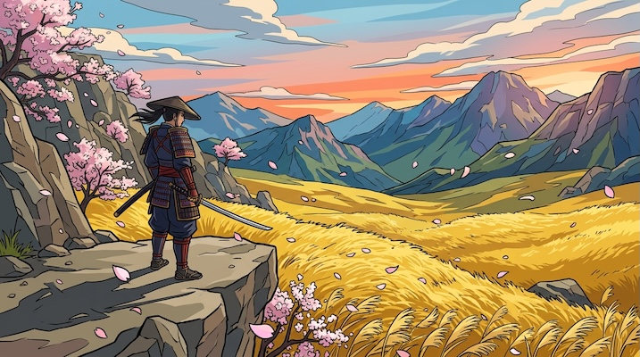

# Cell Shaded Art

[← Back to Image Prompts](../README.md)

Flat-shaded stylized 3D with thick black outlines and bold, clearly defined color zones — the visual language of *Borderlands*, *The Legend of Zelda: Breath of the Wild / Tears of the Kingdom*, *Jet Set Radio*, and *XIII*. Cell shading simulates hand-drawn animation applied to 3D geometry — shadows are hard-edged bands rather than smooth gradients, and every form is rimmed with a clean ink outline. The result feels simultaneously hand-drawn and three-dimensional, graphic-novel-meets-video-game.

**Best for:** Character designs · Game concept art · YouTube thumbnails · Social media posts · Desktop wallpapers · Twitch banners



---

## Prompt

Replace the bracketed details with your subject and preferred format.

```text
Cell-shaded 3D illustration of [SUBJECT — e.g., a rogue mechanic with goggles and grease-stained overalls] in [SETTING — e.g., a dusty desert outpost], [FORMAT]. Frame the subject as the focal point with foreground and background shapes that give the scene depth. Draw thick, confident ink outlines around the subject and environment; use flat planes of [COLOR PALETTE — e.g., warm rust and ochre with a bright cyan accent] and hard-edged two-tone shadow bands instead of smooth gradients. Directional side lighting defines the forms. Crisp, graphic video-game concept art with readable silhouettes and selective detail.
```

## With a Reference Image

Attach your image and use this prompt to preserve its defining features while applying the style.

```text
Using the attached photo as reference, transform the entire image into a cell-shaded 3D render. Apply thick black ink outlines on every form — people, objects, and background. Replace all smooth shading with flat color zones and hard-edged shadow bands. Preserve the composition, poses, and overall scene layout. Use a bold, saturated version of the original colors. Borderlands / Breath of the Wild art style.
```

---

## 💡 Tips & Best Practices

- **The two non-negotiables**: "Thick black ink outlines on every form" + "flat color zones with hard-edged shadow bands — no smooth gradients." If you skip either, you get standard 3D.
- **Name the reference**: "Borderlands" for gritty sci-fi, "Breath of the Wild" for natural landscapes, "Jet Set Radio" for urban, "Wind Waker" for whimsical. The game reference calibrates the AI.
- **Cross-hatching adds depth**: For the deepest shadow areas, adding "hand-drawn cross-hatching" gives a layered, graphic-novel quality.
- **Accent colors pop**: Because cell shading uses flat colors, a single vivid accent color (cyan, magenta, orange) stands out dramatically against muted backgrounds.
- **Common pitfalls**: Don't say "cartoon" (too generic). Don't mix "smooth lighting" with cell shading — they conflict. Avoid "photorealistic" — it overrides the flat shading.
- **Pairs well with:** [Superhero Comic Book](superhero-comic-book.md) (similar ink emphasis, 2D vs 3D), [Pixelated / 16-bit](pixelated-16-bit.md) (different retro gaming aesthetic)
