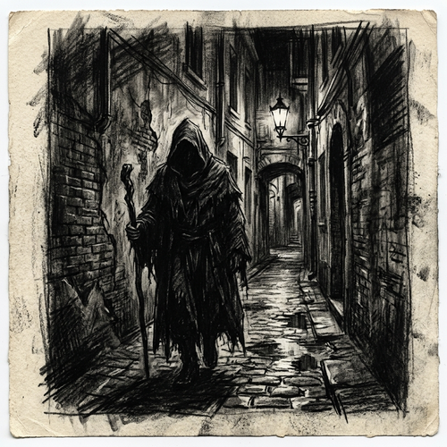

# Charcoal Drawing

[← Back to Image Prompts](../README.md)

Dramatic, high-contrast drawings utilizing charcoal and conté crayons. This style is defined by its deep, velvety blacks, expressive smudged strokes, and moody atmosphere. It excels at capturing intense lighting (chiaroscuro) and raw emotion, leaving rough, textured marks on the paper.

**Best for:** Dramatic portraits · Moody cityscapes · Noir concepts · Expressive figure studies · Atmospheric scenes



> **Sample prompt used to generate the above image (Nano Banana 2):**
> ```text
> A dramatic, high-contrast charcoal drawing of a mysterious hooded figure in an alleyway, with deep shadows, expressive smudged strokes, and a moody atmosphere on textured paper.
> ```

---

## Prompt Variations

### 🔵 Nano Banana 2 _(Featured)_

**Variation 1 — Chiaroscuro Portrait** _(Character Art)_ — Dramatic charcoal drawing portrait of [SUBJECT], chiaroscuro lighting, deep velvety black shadows, expressive smudged strokes, rough paper texture.

**Variation 2 — Moody Cityscape** _(Environment Art)_ — Atmospheric charcoal sketch of [CITY/STREET], rainy night, high contrast black and white, loose energetic strokes, hazy smudged areas.

**Variation 3 — Expressive Figure** _(Fine Art)_ — Expressive charcoal figure study of [SUBJECT], dynamic pose, raw textured marks, unfinished edges, dramatic lighting.

**Variation 4 — Dark Fantasy** _(Concept Art)_ — Dark fantasy charcoal drawing of [SUBJECT/SCENE], gothic atmosphere, heavy shading, deep blacks, rough aggressive strokes.

### ChatGPT / Midjourney / Stable Diffusion — Standard templates with "charcoal drawing, high contrast, deep velvety blacks, smudged strokes, moody atmosphere, rough paper texture" core keywords.

---

## 🔄 Image-to-Image Transformations

**Nano Banana 2** _(Featured)_
```text
Using the attached photo, transform it into a dramatic charcoal drawing. Convert it to high-contrast black and white. Replace smooth photographic gradients with rough, textured charcoal strokes and smudged areas. Deepen the shadows to velvety blacks and emphasize dramatic chiaroscuro lighting. Set on a rough sketch paper texture.
```
> 💡 **Follow-up refinements:**
> - "Make it more smudged and hazy"
> - "Increase the contrast and make the shadows darker"

---

## 💡 Tips & Best Practices
- **"High contrast" and "Deep blacks"**: Charcoal relies on pushing the dark values to the extreme.
- **"Smudged strokes"**: Mentioning smudging or blending separates charcoal from the precise lines of graphite pencil.
- **"Chiaroscuro lighting"**: A great keyword to force dramatic, single-source lighting that works perfectly with charcoal.
- **Pairs well with:** [Cyberpunk Noir](cyberpunk-noir.md), [Pencil Sketch](pencil-sketch.md)
