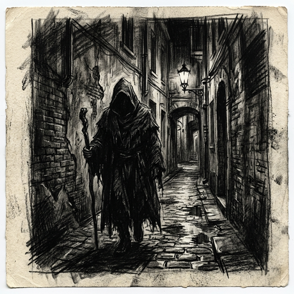

# Charcoal Drawing

[← Back to Image Prompts](../README.md)

Dramatic, high-contrast drawings utilizing charcoal and conté crayons. This style is defined by its deep, velvety blacks, expressive smudged strokes, and moody atmosphere. It excels at capturing intense lighting (chiaroscuro) and raw emotion, leaving rough, textured marks on the paper.

**Best for:** Dramatic portraits · Moody cityscapes · Noir concepts · Expressive figure studies · Atmospheric scenes



> **Sample prompt used to generate the above image (Nano Banana 2):**
> ```text
> A dramatic, high-contrast charcoal drawing of a mysterious hooded figure in an alleyway, with deep shadows, expressive smudged strokes, and a moody atmosphere on textured paper.
> ```

---

## Prompt Variations

### 🔵 Nano Banana 2 _(Featured)_

**Variation 1 — Chiaroscuro Portrait** _(Character Art)_
```text
Dramatic charcoal drawing portrait of [SUBJECT], chiaroscuro lighting, deep velvety black shadows, expressive smudged strokes, rough paper texture.
```

**Variation 2 — Moody Cityscape** _(Environment Art)_
```text
Atmospheric charcoal sketch of [CITY/STREET], rainy night, high contrast black and white, loose energetic strokes, hazy smudged areas.
```

**Variation 3 — Expressive Figure** _(Fine Art)_
```text
Expressive charcoal figure study of [SUBJECT], dynamic pose, raw textured marks, unfinished edges, dramatic lighting.
```

**Variation 4 — Dark Fantasy** _(Concept Art)_
```text
Dark fantasy charcoal drawing of [SUBJECT/SCENE], gothic atmosphere, heavy shading, deep blacks, rough aggressive strokes.
```

### ChatGPT

**Variation 1 — Chiaroscuro Portrait** _(Character Art)_
```text
Create a dramatic charcoal drawing portrait of [SUBJECT] with chiaroscuro lighting — a single strong light source carving the face out of deep velvety black shadows. Expressive smudged strokes, rough paper texture, raw unfinished edges. 2:3 vertical format.
```

**Variation 2 — Moody Cityscape** _(Environment Art)_
```text
Create an atmospheric charcoal sketch of [CITY/STREET] on a rainy night — high-contrast black and white, loose energetic strokes, hazy smudged areas for fog and reflections, deep blacks in the shadows. Rough sketch paper texture. 3:2 landscape format.
```

**Variation 3 — Expressive Figure** _(Fine Art)_
```text
Create an expressive charcoal figure study of [SUBJECT] in a dynamic pose — raw textured marks, aggressive gestural strokes, unfinished edges fading into blank paper, dramatic single-source lighting. 2:3 vertical format.
```

### Midjourney

**Variation 1 — Chiaroscuro Portrait** _(Character Art)_
```text
dramatic charcoal drawing portrait of [SUBJECT], chiaroscuro lighting, deep velvety black shadows, expressive smudged strokes, rough paper texture --ar 2:3 --s 200
```

**Variation 2 — Moody Cityscape** _(Environment Art)_
```text
atmospheric charcoal sketch of [CITY/STREET], rainy night, high contrast black and white, loose energetic strokes, hazy smudged areas --ar 3:2 --s 250
```

**Variation 3 — Dark Fantasy** _(Concept Art)_
```text
dark fantasy charcoal drawing of [SUBJECT/SCENE], gothic atmosphere, heavy shading, deep blacks, rough aggressive strokes --ar 2:3 --s 300 --chaos 15
```

### Stable Diffusion

**Variation 1 — Chiaroscuro Portrait** _(Character Art)_
- **Prompt:** `charcoal drawing portrait, [SUBJECT], chiaroscuro lighting, deep velvety blacks, expressive smudged strokes, rough paper texture, high contrast monochrome`
- **Negative Prompt:** `color, photograph, digital painting, smooth gradients, clean lines`

**Variation 2 — Moody Cityscape** _(Environment Art)_
- **Prompt:** `charcoal sketch, [CITY/STREET] at night, rain, high contrast black and white, loose energetic strokes, smudged haze, textured paper`
- **Negative Prompt:** `color, photograph, 3d render, precise linework, low quality`

---

## 🔄 Image-to-Image Transformations

**Nano Banana 2** _(Featured)_
```text
Using the attached photo, transform it into a dramatic charcoal drawing. Convert it to high-contrast black and white. Replace smooth photographic gradients with rough, textured charcoal strokes and smudged areas. Deepen the shadows to velvety blacks and emphasize dramatic chiaroscuro lighting. Set on a rough sketch paper texture.
```
> 💡 **Follow-up refinements:**
> - "Make it more smudged and hazy"
> - "Increase the contrast and make the shadows darker"

**ChatGPT**
```text
[Upload Photo] "Transform this photo into a dramatic charcoal drawing — high-contrast black and white, rough smudged charcoal strokes, deep velvety shadows with chiaroscuro lighting, on rough sketch paper."
```

**Midjourney**
```text
[IMAGE_URL] dramatic charcoal drawing, high contrast, deep velvety blacks, smudged expressive strokes, chiaroscuro lighting, rough paper texture --iw 1.2 --ar 2:3
```

**Stable Diffusion**
- **Pipeline:** Img2Img · Denoising Strength: `0.55–0.7` (keeps likeness while converting to charcoal marks)
- **Prompt:** `charcoal drawing, high contrast monochrome, deep blacks, smudged strokes, chiaroscuro, rough paper texture`
- **Negative Prompt:** `color, photograph, smooth gradients, digital art`

---

## 💡 Tips & Best Practices
- **"High contrast" and "Deep blacks"**: Charcoal relies on pushing the dark values to the extreme.
- **"Smudged strokes"**: Mentioning smudging or blending separates charcoal from the precise lines of graphite pencil.
- **"Chiaroscuro lighting"**: A great keyword to force dramatic, single-source lighting that works perfectly with charcoal.
- **Pairs well with:** [Cyberpunk Noir](cyberpunk-noir.md), [Pencil Sketch](pencil-sketch.md)
