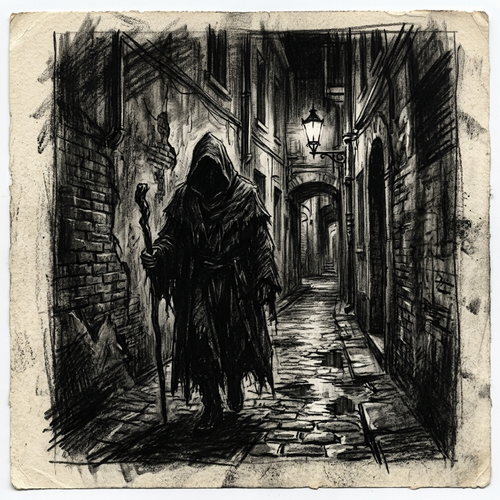

# Charcoal Drawing

[← Back to Image Prompts](../README.md)

Dramatic, high-contrast drawings utilizing charcoal and conté crayons. This style is defined by its deep, velvety blacks, expressive smudged strokes, and moody atmosphere. It excels at capturing intense lighting (chiaroscuro) and raw emotion, leaving rough, textured marks on the paper.

**Best for:** Dramatic portraits · Moody cityscapes · Noir concepts · Expressive figure studies · Atmospheric scenes



---

## Prompt

Replace the bracketed details with your subject and preferred format.

```text
Dramatic charcoal drawing of [SUBJECT — e.g., a hooded figure standing in a narrow alley], [FORMAT]. A single directional light cuts across the subject, leaving deep velvety blacks and a few untouched paper-white highlights. Build form with broad compressed-charcoal marks, smudged midtones, and precise vine-charcoal edges at the focal point. Let rough paper grain show through the shadows and leave expressive unfinished marks around the edges. Tense chiaroscuro composition, with the subject clearly readable at a glance.
```

## With a Reference Image

Attach your image and use this prompt to preserve its defining features while applying the style.

```text
Using the attached photo, transform it into a dramatic charcoal drawing. Convert it to high-contrast black and white. Replace smooth photographic gradients with rough, textured charcoal strokes and smudged areas. Deepen the shadows to velvety blacks and emphasize dramatic chiaroscuro lighting. Set on a rough sketch paper texture.
```

---

## 💡 Tips & Best Practices
- **"High contrast" and "Deep blacks"**: Charcoal relies on pushing the dark values to the extreme.
- **"Smudged strokes"**: Mentioning smudging or blending separates charcoal from the precise lines of graphite pencil.
- **"Chiaroscuro lighting"**: A great keyword to force dramatic, single-source lighting that works perfectly with charcoal.
- **Pairs well with:** [Cyberpunk Noir](cyberpunk-noir.md), [Pencil Sketch](pencil-sketch.md)
