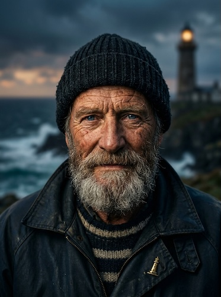

# Cinematic Headshots

[← Back to Image Prompts](../README.md)

Dramatic, studio-quality portrait photography with professional lighting and shallow depth of field. These prompts reproduce the look of a high-end portrait session — Rembrandt lighting, creamy bokeh, and hyper-realistic skin texture. The style conveys authority, warmth, and polish, making it the go-to choice for any context where a person needs to look their absolute best.

**Best for:** LinkedIn profiles · Author bios · Speaker cards · Team pages · Acting headshots · Professional branding



> **Sample prompt used to generate the above image (Nano Banana 2):**
> ```text
> Photorealistic cinematic headshot photograph of an elderly lighthouse keeper with deep-set blue eyes and a salt-and-pepper beard, 4:5 vertical portrait format. 85mm lens with f/1.8 aperture. Rembrandt lighting — single key light at 45 degrees casting a triangular highlight on the shadowed cheek. Background is a softly blurred stormy coastline at dusk. Weathered skin texture with sun spots and smile lines, sharp focus locked on the eyes.
> ```

---

## Prompt Variations

### 🔵 Nano Banana 2 _(Featured)_

> NB2 excels at photorealistic portraits. Specify exact lens, aperture, and lighting names for maximum fidelity. Use "sharp focus locked on the eyes" to ensure the focal point lands correctly.

**Variation 1 — Front-Facing Professional Headshot** _(LinkedIn, Team Page)_
```text
Photorealistic cinematic headshot photograph of [SUBJECT], front-facing composition looking directly into camera, 4:5 vertical portrait format. 85mm lens with f/1.8 aperture creating a creamy shallow depth of field. Rembrandt lighting — single key light at 45 degrees casting a triangular highlight on the shadowed cheek. Background is a softly blurred [ENVIRONMENT]. Natural skin texture with visible pores, sharp focus locked on the eyes. Professional, approachable expression.
```

**Variation 2 — Three-Quarter Profile** _(Author Bio, Speaker Card)_
```text
Photorealistic cinematic headshot photograph of [SUBJECT], three-quarter profile view with the subject turned slightly away from camera, chin angled toward the key light, 4:5 vertical portrait format. 85mm lens with f/2.0 aperture. Split lighting — one side of the face illuminated, the other falling into rich shadow. Background is a softly blurred [ENVIRONMENT]. Natural skin texture with fine detail, sharp focus on the near eye. Contemplative, confident expression.
```

**Variation 3 — Side Profile / Silhouette** _(Editorial, Creative Branding)_
```text
Photorealistic cinematic side profile photograph of [SUBJECT], looking into the distance, 4:5 vertical portrait format. 100mm lens with f/2.8 aperture. Backlit with a strong rim light creating a glowing edge along the jawline, nose, and forehead. The face is in partial shadow with just enough fill to reveal expression. Background is a softly blurred [ENVIRONMENT] with warm golden tones. Sharp focus on the profile edge.
```

**Variation 4 — Environmental Portrait** _(Personal Brand, About Page)_
```text
Photorealistic cinematic environmental portrait of [SUBJECT] in their natural workspace — [ENVIRONMENT], 16:9 landscape format. 35mm lens with f/2.8 aperture showing the subject in context with their surroundings. Subject positioned at a natural rule-of-thirds intersection. Ambient window light mixed with practical light sources in the environment. Natural skin texture, sharp focus on the eyes, background with meaningful detail rendered in gentle bokeh.
```

**Variation 5 — Dramatic Low-Key Portrait** _(Acting Headshot, Creative Portfolio)_
```text
Photorealistic low-key cinematic headshot of [SUBJECT] emerging from a near-black background, 4:5 vertical portrait format. 85mm lens with f/1.4 aperture. Single hard light source from a 45-degree angle creating deep, sculpted shadows across the face. Only the key features — eyes, bridge of nose, cheekbone — catch the light. Skin texture is hyper-realistic with visible pores and fine hairs. The mood is intense and introspective.
```

### ChatGPT

**Variation 1 — Front-Facing Professional**
```text
Create a cinematic headshot photograph of [SUBJECT] looking directly into the camera. Use an 85mm portrait lens with an f/1.8 aperture to produce a creamy, shallow depth of field. The background is a softly blurred [ENVIRONMENT]. Light the face with Rembrandt lighting — a single key light at 45 degrees creating the signature triangular highlight on the shadowed cheek. Skin texture should be hyper-realistic with natural pores and fine detail. Sharp focus on the eyes. 4:5 vertical crop. 8K resolution.
```

**Variation 2 — Three-Quarter Profile**
```text
Create a cinematic three-quarter profile headshot of [SUBJECT], turned slightly away from camera with the chin angled toward the light. 85mm portrait lens, f/2.0, split lighting with one side illuminated and the other in rich shadow. Background is a softly blurred [ENVIRONMENT]. Natural skin texture, sharp focus on the near eye. The expression is contemplative and confident. 4:5 vertical crop.
```

**Variation 3 — Environmental Portrait**
```text
Create a cinematic environmental portrait of [SUBJECT] in a [ENVIRONMENT], positioned at a rule-of-thirds intersection with their workspace visible in the background. 35mm lens, f/2.8, natural window light. The subject is in sharp focus while the meaningful background details fall into gentle bokeh. 16:9 landscape format. Warm, professional tone.
```

### Midjourney

**Variation 1 — Front-Facing Professional**
```text
Cinematic headshot photograph of [SUBJECT], front-facing, looking into camera, softly blurred [ENVIRONMENT] background, 85mm portrait lens at f/1.8, Rembrandt lighting with triangular cheek highlight, shallow depth of field with sharp focus on the eyes, natural skin texture --ar 4:5 --s 100
```

**Variation 2 — Three-Quarter Profile**
```text
Cinematic three-quarter profile headshot of [SUBJECT], split lighting, one side illuminated, chin angled toward key light, blurred [ENVIRONMENT] background, 85mm f/2.0, sharp focus on near eye, confident contemplative expression --ar 4:5 --s 100
```

**Variation 3 — Dramatic Low-Key**
```text
Low-key cinematic headshot of [SUBJECT], near-black background, single hard light from 45 degrees, deep sculpted shadows, only eyes and cheekbone catching light, hyper-realistic skin texture, intense introspective mood --ar 4:5 --s 50
```

### Stable Diffusion

**Variation 1 — Front-Facing Professional**
- **Prompt:** `Cinematic headshot photograph of [SUBJECT], front-facing, 85mm portrait lens, f/1.8 aperture, Rembrandt lighting, bokeh [ENVIRONMENT] background, natural skin texture with visible pores, sharp focus on eyes, professional studio photography, 8k`
- **Negative Prompt:** `cartoon, 3d render, painting, text, watermark`

**Variation 2 — Three-Quarter Profile**
- **Prompt:** `Cinematic three-quarter profile headshot of [SUBJECT], 85mm lens f/2.0, split lighting, rich shadows, blurred [ENVIRONMENT] background, natural skin, sharp focus near eye, confident expression, 8k`
- **Negative Prompt:** `cartoon, 3d render, flat lighting, full body, watermark`

**Variation 3 — Low-Key Dramatic**
- **Prompt:** `Low-key cinematic headshot, [SUBJECT], near-black background, hard single light, deep sculpted shadows, hyper-realistic skin, sharp focus on eyes, dramatic portrait, 8k`
- **Negative Prompt:** `bright, high-key, flat, cartoon, cheerful, overexposed`

---

## 🔄 Image-to-Image Transformations

Transform existing photos into cinematic headshots:

**Nano Banana 2** _(Featured)_
```text
Using the attached photo as reference, create a cinematic headshot with dramatic Rembrandt lighting. Soften the background into a blurred [ENVIRONMENT] while preserving the subject's exact likeness, expression, and features. Enhance skin texture to be hyper-realistic. Sharp focus on the eyes. 4:5 vertical portrait format.
```
> 💡 **Follow-up refinements:**
> - "Shift to split lighting — put half the face in shadow"
> - "Warm up the color grade — more golden tones"
> - "Try a three-quarter profile angle instead"
> - "Make the background darker and more dramatic"

**ChatGPT**
```text
[Upload Photo] "Enhance this portrait with dramatic cinematic Rembrandt lighting. Soften the background into a blurred [ENVIRONMENT] while preserving the subject's likeness exactly. Boost skin texture detail. Sharp focus on the eyes. 4:5 crop."
```

**Midjourney**
```text
[IMAGE_URL] Cinematic headshot, Rembrandt lighting, blurred [ENVIRONMENT] background, 85mm lens, f/1.8, hyper-realistic skin, sharp focus on eyes --iw 1.5 --ar 4:5
```

**Stable Diffusion**
- **Pipeline:** Img2Img · Denoising Strength: `0.35–0.50` (preserves likeness while adding cinematic lighting)
- **Prompt:** `Cinematic headshot, Rembrandt lighting, bokeh [ENVIRONMENT] background, natural skin texture, sharp focus on eyes, professional portrait, 8k`
- **Negative Prompt:** `cartoon, painting, distorted face, extra fingers`

---

## 💡 Tips & Best Practices

- **Lens choice matters**: 85mm and 100mm lenses naturally compress facial features for the most flattering result. 35mm shows more environment but can distort features up close.
- **Name your lighting**: "Rembrandt," "split," "butterfly," "broad," "short" — each term gives the AI a precise blueprint. Generic "good lighting" produces generic results.
- **Eyes are everything**: Always include "sharp focus on the eyes" or "focus locked on the eyes." This is the single highest-impact phrase for portrait quality.
- **Skin texture realism**: Include "visible pores," "fine hairs," or "natural skin imperfections" to avoid the waxy, airbrushed look.
- **Common pitfalls**: Avoid "beautiful" or "attractive" as descriptors — they produce generic, over-smoothed results. Describe *specific* features instead.
- **Pairs well with:** [Modern Avatars](modern-avatars.md) (for a stylized version of the same subject), [Double Exposure](double-exposure.md) (for artistic composites)
