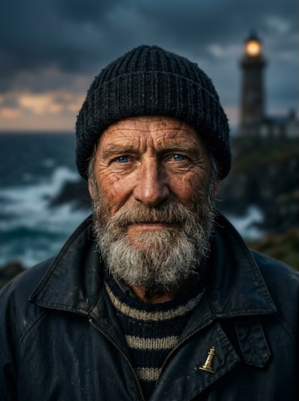

# Cinematic Headshots

[← Back to Image Prompts](../README.md)

Dramatic, studio-quality portrait photography with professional lighting and shallow depth of field. These prompts reproduce the look of a high-end portrait session — Rembrandt lighting, creamy bokeh, and hyper-realistic skin texture. The style conveys authority, warmth, and polish, making it the go-to choice for any context where a person needs to look their absolute best.

**Best for:** LinkedIn profiles · Author bios · Speaker cards · Team pages · Acting headshots · Professional branding



---

## Prompt

Replace the bracketed details with your subject and preferred format.

```text
Photorealistic cinematic headshot photograph of [SUBJECT], front-facing composition looking directly into camera, 3:4 vertical portrait format. 85mm lens with f/1.8 aperture creating a creamy shallow depth of field. Rembrandt lighting — single key light at 45 degrees casting a triangular highlight on the shadowed cheek. Background is a softly blurred [ENVIRONMENT]. Natural skin texture with visible pores, sharp focus locked on the eyes. Professional, approachable expression.
```

## With a Reference Image

Attach your image and use this prompt to preserve its defining features while applying the style.

```text
Using the attached photo as reference, create a cinematic headshot with dramatic Rembrandt lighting. Soften the background into a blurred [ENVIRONMENT] while preserving the subject's exact likeness, expression, and features. Enhance skin texture to be hyper-realistic. Sharp focus on the eyes. 3:4 vertical portrait format.
```

---

## 💡 Tips & Best Practices

- **Lens choice matters**: 85mm and 100mm lenses naturally compress facial features for the most flattering result. 35mm shows more environment but can distort features up close.
- **Name your lighting**: "Rembrandt," "split," "butterfly," "broad," "short" — each term gives the AI a precise blueprint. Generic "good lighting" produces generic results.
- **Eyes are everything**: Always include "sharp focus on the eyes" or "focus locked on the eyes." This is the single highest-impact phrase for portrait quality.
- **Skin texture realism**: Include "visible pores," "fine hairs," or "natural skin imperfections" to avoid the waxy, airbrushed look.
- **Common pitfalls**: Avoid "beautiful" or "attractive" as descriptors — they produce generic, over-smoothed results. Describe *specific* features instead.
- **Pairs well with:** [Modern Avatars](modern-avatars.md) (for a stylized version of the same subject), [Double Exposure](double-exposure.md) (for artistic composites)
