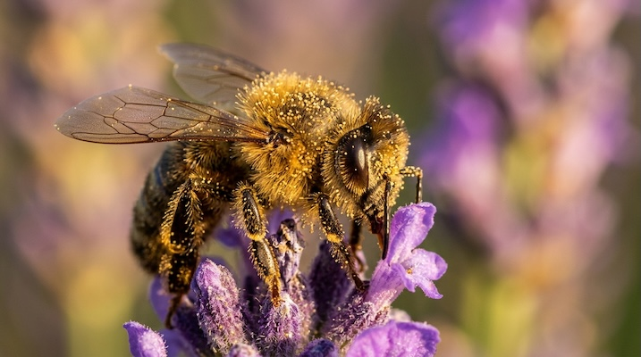

# Cinematic Macro Photography

[← Back to Image Prompts](../README.md)

Extreme close-up photography revealing microscopic details invisible to the naked eye, with dramatic lighting and creamy bokeh backgrounds.



> **Sample prompt used to generate the above image (Nano Banana 2):**
> ```text
> Extreme cinematic macro photograph of a single honeybee covered in golden pollen grains, perched on a lavender flower, 16:9 landscape format. Shot with a 100mm macro lens at f/2.8. Reveal microscopic details invisible to the naked eye — individual pollen grains clinging to the bee's fuzzy thorax, the iridescent facets of its compound eye, translucent veins in the wings. The lavender field background is transformed into a smooth creamy purple bokeh wash. Dramatic side-lighting from the left, golden hour warmth, creating strong highlights on the pollen and deep shadows between the wing segments.
> ```

**ChatGPT**
```text
Create an extreme cinematic macro photograph of [SUBJECT], shot with a 100mm macro lens at f/2.8. Reveal microscopic details that are invisible to the naked eye — [SPECIFIC DETAIL, e.g., "individual water droplets on a petal," "the compound facets of an insect's eye," "the grain structure of weathered wood"]. The [ENVIRONMENT] background is transformed into a smooth, creamy bokeh wash of color. Use dramatic side-lighting to create strong highlights and deep shadows that sculpt every micro-surface.
```

**Midjourney**
```text
Extreme cinematic macro photograph of [SUBJECT], 100mm macro lens at f/2.8, revealing microscopic details like [SPECIFIC DETAIL], creamy bokeh [ENVIRONMENT] background, dramatic side-lighting sculpting micro-surfaces --ar 16:9
```

**Stable Diffusion**
- **Prompt:** `Extreme cinematic macro photograph, [SUBJECT], 100mm macro lens, f/2.8, microscopic detail, creamy bokeh [ENVIRONMENT] background, dramatic side-lighting, 8k UHD, highly detailed close-up`
- **Negative Prompt:** `wide shot, landscape, blurry subject, out of focus, low detail`

**Nano Banana 2**
```text
Extreme cinematic macro photograph of [SUBJECT] shot with a 100mm macro lens at f/2.8, 16:9 landscape format. Reveal microscopic details invisible to the naked eye — [SPECIFIC DETAIL, e.g., "individual water droplets on a petal," "compound facets of an insect's eye," "grain structure of weathered wood"]. The [ENVIRONMENT] background is transformed into a smooth creamy bokeh wash of color. Dramatic side-lighting creating strong highlights and deep shadows sculpting every micro-surface.
```
