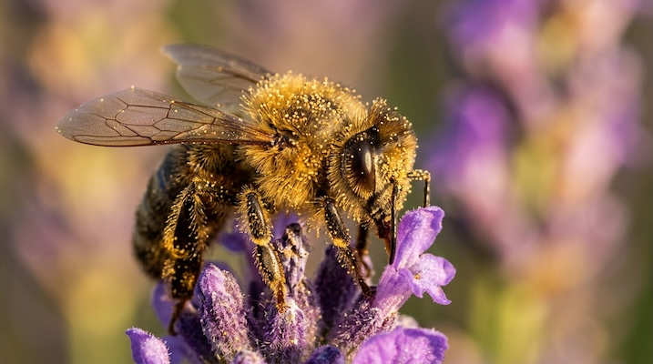

# Cinematic Macro Photography

[← Back to Image Prompts](../README.md)

Extreme close-up photography revealing the hidden worlds within everyday objects — dewdrops on petals, insect compound eyes, crystal structures, textile fibers. The macro lens transforms the familiar into the alien, revealing textures and structures invisible to the naked eye. Combined with cinematic lighting and shallow depth of field, the result is simultaneously scientific and dramatically beautiful.

**Best for:** Desktop wallpapers · Social media posts · Art prints · Product photography · Educational content · Phone wallpapers · Nature content



> **Sample prompt used to generate the above image (Nano Banana 2):**
> ```text
> Cinematic macro photograph of a single dewdrop balanced on the tip of a spider web strand, 16:9 landscape format. Inside the dewdrop, the entire garden behind is refracted and inverted — a tiny world within a sphere. The web strand is sharp silk fiber with visible structure. Background is a heavily blurred garden in warm golden-hour tones. Razor-thin depth of field — only the dewdrop and its web anchor are sharp. Dramatic backlight from the golden sun creating a bright halo around the drop. Visible light caustics from the refraction.
> ```

---

## Prompt Variations

### 🔵 Nano Banana 2 _(Featured)_

**Variation 1 — Nature / Botanical** _(Desktop Wallpaper)_
```text
Cinematic macro photograph of [SUBJECT — e.g., the unfurling spiral of a young fern fiddlehead], [FORMAT]. Extreme close-up revealing [TEXTURE — e.g., tiny silver hairs, spiral geometry, the tight coil of the developing frond]. Razor-thin depth of field — only the [FOCUS POINT] is tack-sharp. [LIGHTING — e.g., soft backlight creating a translucent glow through the thin frond edges]. Background is a [BOKEH — e.g., soft blur of emerald forest floor]. Dramatic, intimate, revealing a hidden world.
```

**Variation 2 — Insect / Creature** _(Art Print, Educational)_
```text
Cinematic macro photograph of [CREATURE — e.g., a jumping spider on a leaf, facing the camera], [FORMAT]. Extreme detail — [FEATURES — e.g., four front-facing iridescent green eyes with visible reflections, furry pedipalps, individual leg hairs]. Razor-thin depth of field focused on the eyes. [LIGHTING — e.g., ring light creating uniform illumination with catch lights in each eye]. Background is [BOKEH]. The creature fills the frame. Simultaneously cute and alien.
```

**Variation 3 — Water / Liquid** _(Phone Wallpaper, Print)_
```text
Cinematic macro photograph of [SUBJECT — e.g., a splash crown formed by a single drop hitting a pool of blue liquid], frozen at 1/10000th of a second, [FORMAT]. Every tiny satellite droplet is sharp and spherical. The crown rim shows perfect symmetry with evenly spaced prongs. [LIGHTING — e.g., dramatic side-strobe creating sharp highlights on the water surfaces]. [BACKGROUND]. The frozen motion reveals physics invisible to the eye.
```

**Variation 4 — Texture / Material** _(Product Photography, Art)_
```text
Cinematic macro photograph of [MATERIAL — e.g., a vinyl record groove at extreme magnification, showing the microscopic V-shaped groove walls with undulating audio waveforms etched into the surface], [FORMAT]. Extreme close-up revealing texture invisible to naked eye. [LIGHTING — e.g., dramatic side-raking light casting deep shadows in the grooves]. Razor-thin depth of field. [BACKGROUND]. The familiar object becomes an alien landscape.
```

**Variation 5 — Crystal / Mineral** _(Desktop Wallpaper, Print)_
```text
Cinematic macro photograph of [MINERAL — e.g., amethyst crystal cluster with individual hexagonal crystal terminations], [FORMAT]. Extreme close-up revealing [DETAILS — e.g., internal phantoms, color zoning from deep purple to clear quartz, tiny rainbow inclusions]. [LIGHTING — e.g., transmitted backlight making the crystal glow with internal color]. Razor-thin depth of field on the foremost crystal point. [BACKGROUND vibrant bokeh from deeper crystals]. Gemological beauty.
```

### ChatGPT

**Variation 1 — Hidden Textures** _(Desktop Wallpaper)_
```text
Create a cinematic macro photograph of [SUBJECT] — an extreme close-up with razor-thin depth of field revealing hidden textures and structures invisible at normal scale. [LIGHTING — e.g., dramatic backlight making thin structures translucent]. 16:9 landscape format.
```

**Variation 2 — Creature Close-Up** _(Social Media)_
```text
Create a cinematic macro photograph of [CREATURE] facing the camera — extreme detail on [FEATURES — e.g., compound eyes and individual leg hairs], ring light catch lights in the eyes, shallow focus melting the background to bokeh. 1:1 square format.
```

### Midjourney

**Variation 1 — Hidden Textures** _(Desktop Wallpaper)_
```text
cinematic macro photograph, [SUBJECT], extreme close-up, razor-thin depth of field, [LIGHTING], hidden textures revealed, [BOKEH] background --ar 16:9 --s 200
```

**Variation 2 — Creature Close-Up** _(Social Media)_
```text
cinematic macro, [CREATURE] facing camera, extreme detail on [FEATURES], ring light catch lights, shallow focus, [BACKGROUND] bokeh --ar 1:1 --s 200
```

### Stable Diffusion

**Variation 1 — Hidden Textures** _(Desktop Wallpaper)_
- **Prompt:** `cinematic macro photograph, [SUBJECT], extreme close-up, razor-thin depth of field, [LIGHTING], detailed texture, bokeh background`
- **Negative Prompt:** `wide angle, full body, illustration, cartoon, far away, low quality`

**Variation 2 — Creature Close-Up** _(Social Media)_
- **Prompt:** `cinematic macro photograph, [CREATURE], face close-up, extreme detail, [FEATURES], ring light catch lights, shallow focus, bokeh`
- **Negative Prompt:** `wide shot, blurry subject, illustration, cartoon, distant view`

---

## 🔄 Image-to-Image Transformations

**Nano Banana 2** _(Featured)_
```text
Using the attached photo, reimagine it as extreme cinematic macro photography. Zoom in dramatically on [AREA] to reveal hidden textures and structures invisible at normal scale. Apply razor-thin depth of field. Add dramatic [LIGHTING]. Transform the familiar subject into an alien landscape through extreme magnification.
```
> 💡 **Refinements:** "Zoom in tighter" · "Add water droplets on the surface" · "Change lighting to backlit/sidelit" · "Focus on a different area"

**ChatGPT**
```text
[Upload Photo] "Reimagine this photo as extreme cinematic macro photography — zoom in dramatically on [AREA] to reveal hidden textures, apply razor-thin depth of field, and add dramatic [LIGHTING]."
```

**Midjourney**
```text
[IMAGE_URL] cinematic macro photograph, extreme close-up, razor-thin depth of field, dramatic lighting, hidden textures revealed --iw 1 --ar 16:9
```

**Stable Diffusion**
- **Pipeline:** Img2Img · Denoising Strength: `0.6–0.75` (re-frames subject at macro scale)
- **Prompt:** `cinematic macro photograph, extreme close-up, razor-thin depth of field, dramatic lighting, detailed texture, bokeh`
- **Negative Prompt:** `wide angle, full scene, illustration, low quality`

---

## 💡 Tips & Best Practices

- **Razor-thin DOF is mandatory**: "Razor-thin depth of field" is what sells macro. Without it, the image lacks the characteristic scale cue.
- **Describe textures at macro scale**: "Individual leg hairs," "visible cell patterns," "groove walls with waveforms" — describe what the macro lens reveals.
- **Backlight creates magic**: Many of the most stunning macro shots use backlight that makes thin structures translucent.
- **Common pitfalls**: "Close-up" isn't close enough for macro. Specify "extreme close-up" or name the scale (1:1 macro, 5:1 super-macro).
- **Pairs well with:** [Electron Microscope](electron-microscope.md) (next level of magnification), [Miniature People](miniature-people.md) (similar scale shift)
