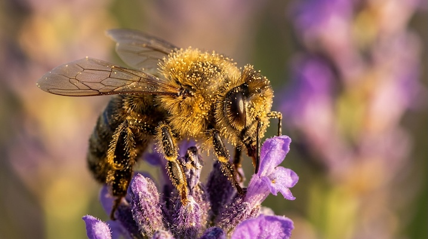

# Cinematic Macro Photography

[← Back to Image Prompts](../README.md)

Extreme close-up photography revealing the hidden worlds within everyday objects — dewdrops on petals, insect compound eyes, crystal structures, textile fibers. The macro lens transforms the familiar into the alien, revealing textures and structures invisible to the naked eye. Combined with cinematic lighting and shallow depth of field, the result is simultaneously scientific and dramatically beautiful.

**Best for:** Desktop wallpapers · Social media posts · Art prints · Product photography · Educational content · Phone wallpapers · Nature content



---

## Prompt

Replace the bracketed details with your subject and preferred format.

```text
Cinematic macro photograph of [SUBJECT — e.g., the unfurling spiral of a young fern fiddlehead], [FORMAT]. Extreme close-up revealing [TEXTURE — e.g., tiny silver hairs, spiral geometry, the tight coil of the developing frond]. Razor-thin depth of field — only the [FOCUS POINT] is tack-sharp. [LIGHTING — e.g., soft backlight creating a translucent glow through the thin frond edges]. Background is a [BOKEH — e.g., soft blur of emerald forest floor]. Dramatic, intimate, revealing a hidden world.
```

## With a Reference Image

Attach your image and use this prompt to preserve its defining features while applying the style.

```text
Using the attached photo, reimagine it as extreme cinematic macro photography. Zoom in dramatically on [AREA] to reveal hidden textures and structures invisible at normal scale. Apply razor-thin depth of field. Add dramatic [LIGHTING]. Transform the familiar subject into an alien landscape through extreme magnification.
```

---

## 💡 Tips & Best Practices

- **Razor-thin DOF is mandatory**: "Razor-thin depth of field" is what sells macro. Without it, the image lacks the characteristic scale cue.
- **Describe textures at macro scale**: "Individual leg hairs," "visible cell patterns," "groove walls with waveforms" — describe what the macro lens reveals.
- **Backlight creates magic**: Many of the most stunning macro shots use backlight that makes thin structures translucent.
- **Common pitfalls**: "Close-up" isn't close enough for macro. Specify "extreme close-up" or name the scale (1:1 macro, 5:1 super-macro).
- **Pairs well with:** [Electron Microscope](electron-microscope.md) (next level of magnification), [Miniature People](miniature-people.md) (similar scale shift)
