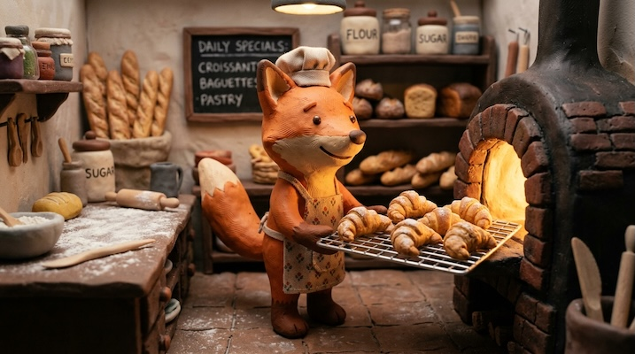

# Claymation / Stop-Motion

[← Back to Image Prompts](../README.md)

Handcrafted clay characters and miniature sets with visible fingerprint impressions, slightly imperfect posing, and warm tungsten lighting. Evokes the tactile charm of Wallace & Gromit, Coraline, and Laika Studios productions.



> **Sample prompt used to generate the above image (Nano Banana 2):**
> ```text
> Stop-motion claymation still of a cheerful fox baker pulling a tray of tiny clay croissants
> from a miniature clay oven, 16:9 landscape format. The fox is sculpted from orange and
> cream-colored modeling clay with visible fingerprint impressions and tool marks on every
> surface. The bakery interior is a handbuilt miniature set — clay shelves lined with clay
> baguettes, a tiny chalkboard menu, and flour dust (fine white powder) on the clay counter.
> Warm tungsten key light from inside the oven casting a golden glow, with soft fill light
> from above. Shallow depth of field emphasizing the handmade imperfections.
> ```

**ChatGPT**
```text
Create a stop-motion claymation still of [SUBJECT] in a miniature [ENVIRONMENT]. Everything is sculpted from modeling clay with visible fingerprint impressions and sculpting tool marks on every surface. The set is a handbuilt miniature with charming imperfections — slightly uneven surfaces, visible seams where clay pieces join, and subtle tool textures. Warm tungsten lighting with a golden key light and soft fill. Shallow depth of field. The overall feel should evoke Aardman Animations or Laika Studios — tactile, handcrafted, and full of personality.
```

**Midjourney**
```text
Stop-motion claymation still of [SUBJECT] in a miniature [ENVIRONMENT], sculpted modeling clay with visible fingerprint impressions and tool marks, handbuilt miniature set, warm tungsten lighting, golden glow, shallow depth of field, Aardman and Laika Studios aesthetic --ar 16:9
```

**Stable Diffusion**
- **Prompt:** `Stop-motion claymation still, [SUBJECT] in miniature [ENVIRONMENT], sculpted modeling clay, visible fingerprint impressions, tool marks, handbuilt miniature set, warm tungsten lighting, shallow depth of field, 8k`
- **Negative Prompt:** `smooth, digital, 2d, realistic photograph, clean surfaces, plastic`

**Nano Banana 2**
```text
Stop-motion claymation still of [SUBJECT] in a miniature [ENVIRONMENT], 16:9 landscape format. Everything sculpted from modeling clay with visible fingerprint impressions and sculpting tool marks on every surface. Handbuilt miniature set with charming imperfections — slightly uneven surfaces, visible seams where clay pieces join. Warm tungsten key light casting a golden glow with soft fill from above. Shallow depth of field emphasizing the handmade quality. Aardman Animations and Laika Studios aesthetic.
```

> 🔄 **Image-to-Image Variations:**
> * **ChatGPT:** *[Upload Photo]* "Transform this scene into a stop-motion claymation still. Convert every element — people, objects, and background — into sculpted modeling clay with visible fingerprint impressions. Add warm tungsten lighting."
> * **Midjourney:** `[IMAGE_URL] Stop-motion claymation style, sculpted clay, visible fingerprints, miniature set, warm tungsten lighting, Aardman aesthetic --iw 1.5 --ar 16:9`
