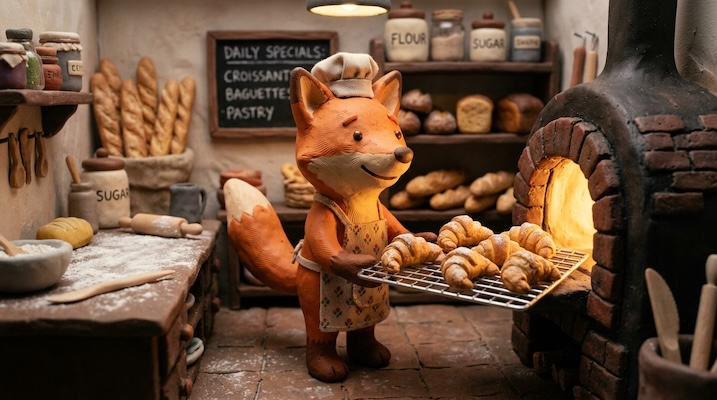

# Claymation / Stop-Motion

[← Back to Image Prompts](../README.md)

Handcrafted clay characters and miniature sets with visible fingerprint impressions, slightly imperfect posing, and warm tungsten lighting. Evokes the tactile charm of Wallace & Gromit, Coraline, and Laika Studios productions — where every surface tells you a human hand shaped it. The style's magic is in the imperfections: fingerprints in the clay, seams where pieces join, slightly uneven surfaces, and the warm, intimate scale of miniature sets.

**Best for:** Social media posts · Character designs · Children's content · Desktop wallpapers · Greeting cards · Product mockups · Animated series concepts



---

## Prompt

Replace the bracketed details with your subject and preferred format.

```text
Stop-motion claymation still of [SUBJECT AND ACTION — e.g., a fox baker lifting a tray of tiny croissants] in [SETTING — e.g., a miniature kitchen], [FORMAT]. Sculpt the characters, props, and set from colored modeling clay, with visible fingerprints, tool marks, and subtly imperfect handmade forms. Give the characters expressive bead eyes and readable poses; arrange the props to support the action. Warm tungsten light from above-left casts soft shadows across the tiny set, while a shallow depth of field reinforces its physical scale. Tactile, playful frame from a handcrafted animated film.
```

## With a Reference Image

Attach your image and use this prompt to preserve its defining features while applying the style.

```text
Using the attached photo as reference, transform the entire scene into a stop-motion claymation still. Convert every person into a sculpted modeling clay figure with visible fingerprint impressions and tool marks. Rebuild every object and the background as a handbuilt miniature set made from clay. Preserve the original poses, composition, and clothing colors. Add warm tungsten lighting. Shallow depth of field emphasizing the handmade quality.
```

---

## 💡 Tips & Best Practices

- **Fingerprints are the signature**: "Visible fingerprint impressions and sculpting tool marks" is non-negotiable. Without it, you get smooth 3D that looks nothing like real clay.
- **Imperfections = charm**: "Slightly uneven surfaces, visible seams where clay pieces join" communicates handmade authenticity. Perfection is the enemy of claymation.
- **Tungsten = clay world lighting**: "Warm tungsten lighting" is the canonical light source for clay animation. Cool or neutral lighting makes clay look medical.
- **Shallow depth of field**: Real stop-motion always has dramatic shallow focus because the subjects are tiny. Never skip this.
- **Reference the right studio**: "Aardman" produces cheerful, comedic clay (Wallace & Gromit). "Laika" produces darker, more detailed clay (Coraline, Kubo). Choose based on mood.
- **Common pitfalls**: Avoid "plasticine" as the only descriptor — include "fingerprints" and "tool marks." Don't mix with "smooth" or "polished" — they override the clay imperfections.
- **Pairs well with:** [Made of Yarn / Amigurumi](yarn-amigurumi.md) (same handcrafted warmth, different material), [Miniature People](miniature-people.md) (similar miniature-set photography)
