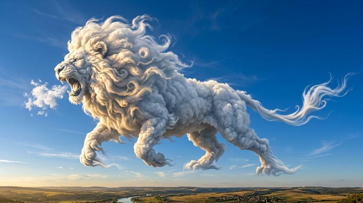

# Cloud / Smoke Sculpture

[← Back to Image Prompts](../README.md)

Subjects formed entirely from volumetric clouds or swirling smoke, with dramatic lighting revealing form in the vapor. Ethereal, dreamlike, and dissolving at the edges — as if the subject could disperse into the atmosphere at any moment. The dense core defines the recognizable form while the extremities trail off into wisps and tendrils, creating a poetic tension between solidity and impermanence.

**Best for:** Desktop wallpapers · Social media posts · Art prints · Phone wallpapers · Album covers · Conceptual art · Brand imagery



> **Sample prompt used to generate the above image (Nano Banana 2):**
> ```text
> Photograph of a majestic lion formed entirely from dense white cumulus clouds against a vivid deep blue sky, 16:9 landscape format. The lion's mane is a turbulent mass of billowing cloud wisps, with individual vapor tendrils curling outward and catching golden sunlight. The body is denser, more defined cloud mass, while the tail and paws dissolve into thin wisps that trail off into the open sky. Dramatic golden-hour side-lighting from the left creates strong highlights on the cloud surfaces and deep blue shadows in the recesses. The lion appears to be mid-roar, mouth open, with a small burst of cloud "breath" escaping.
> ```

---

## Prompt Variations

### 🔵 Nano Banana 2 _(Featured)_

> NB2 handles volumetric cloud rendering beautifully. The key principle is the dense-to-wisp gradient: "the core defines the form clearly while the extremities dissolve into thin wisps." Always specify "individual vapor tendrils curling outward" — this prevents the AI from making a solid white shape.

**Variation 1 — Animal / Creature** _(Desktop Wallpaper, Art Print)_
```text
Photograph of [ANIMAL — e.g., a galloping horse] formed entirely from dense white cumulus clouds against a vivid deep blue sky, 16:9 landscape format. The densest cloud mass defines the core body and head clearly. The mane and tail are turbulent streams of billowing wisps trailing behind with individual vapor tendrils curling in the wind. The hooves dissolve into thin wisps as they contact the sky. Dramatic golden-hour side-lighting from the left creating strong highlights on the cloud surfaces and deep blue shadows in the recesses.
```

**Variation 2 — Human Figure / Portrait** _(Social Media, Conceptual Art)_
```text
Photograph of a human figure — [SUBJECT — e.g., a woman with flowing hair reaching upward] — formed entirely from swirling white smoke against a pure black background, 3:4 vertical portrait format. The face and torso are dense enough to show recognizable features and expression. The hair is a dynamic stream of smoke flowing upward and dispersing. The fingers and lower body dissolve into thin tendrils that trail off into the darkness. A single dramatic spotlight from above creates bright highlights on the smoke surfaces while the rest falls into blackness. The smoke has subtle internal turbulence patterns — curling, folding, swirling.
```

**Variation 3 — Object / Symbol** _(Logo Concept, Brand Imagery)_
```text
Photograph of [OBJECT — e.g., a grand piano] formed entirely from dense white smoke against a deep black background, 16:9 landscape format. The main body is solid enough cloud mass to define the recognizable shape — keys, lid, legs. Smoke tendrils rise from the keys as if the music itself is becoming visible. The edges of the piano dissolve into swirling wisps. Dramatic side-lighting from the right creating sharp contrast between bright smoke surfaces and deep shadows.
```

**Variation 4 — Dual / Interacting Forms** _(Art Print, Social Media)_
```text
Photograph of two forms made from clouds interacting — [SCENE — e.g., two hands reaching toward each other, the fingertips almost touching, with wisps of cloud connecting across the gap like static electricity], against a vivid deep blue sky, 16:9 landscape format. Each hand is formed from dense cumulus cloud with visible internal turbulence. The gap between the hands is bridged by thin, delicate cloud tendrils stretching between the fingertips. Golden-hour lighting from the side. The connection point glows with warm light. Emotionally resonant, dreamlike.
```

**Variation 5 — Smoke with Color** _(Phone Wallpaper, Album Cover)_
```text
Photograph of [SUBJECT — e.g., a phoenix] formed from swirling colored smoke against a pure black background, 9:16 vertical phone wallpaper format. The smoke transitions through a gradient — [COLORS — e.g., deep crimson at the dense core, transitioning to bright orange and gold in the wisps and trailing tendrils]. The core form is dense enough to define the shape clearly while the extremities dissolve into vivid colored wisps. Dramatic backlighting making the thinner smoke sections glow with light passing through. Dynamic, energetic, magical.
```

### ChatGPT

**Variation 1 — Animal**
```text
Create a photograph of [ANIMAL] formed entirely from dense white cumulus clouds against a deep blue sky. Core body clearly defined, extremities dissolving into thin wisps. Individual vapor tendrils curling outward. Golden-hour side-lighting with strong highlights and deep blue shadows. 3:2 landscape format.
```

**Variation 2 — Figure on Black**
```text
Create a photograph of [FIGURE] formed from swirling white smoke against a pure black background. Recognizable features in the dense core, dissolving into tendrils at the edges. Single dramatic spotlight from above. Internal smoke turbulence patterns visible. 2:3 vertical format.
```

**Variation 3 — Colored Smoke**
```text
Create a photograph of [SUBJECT] formed from swirling colored smoke — [COLOR GRADIENT]. Dense core defines the shape, thin wisps dissolve at edges. Pure black background. Dramatic backlighting making thin smoke glow. 2:3 vertical format.
```

### Midjourney

**Variation 1 — Animal vs. Sky**
```text
[ANIMAL] formed from dense white cumulus clouds, vivid deep blue sky, dense body dissolving into wisps, golden-hour side-lighting, deep blue shadows, individual vapor tendrils --ar 16:9 --s 300
```

**Variation 2 — Figure on Black**
```text
[FIGURE] formed from white smoke, pure black background, recognizable features in dense core, dissolving tendrils, dramatic spotlight, internal turbulence patterns --ar 4:5 --s 300
```

**Variation 3 — Dual Forms**
```text
Two cloud forms reaching toward each other, [SCENE], thin tendrils bridging the gap, deep blue sky, golden-hour lighting, emotionally resonant, dreamlike --ar 16:9 --s 300
```

### Stable Diffusion

**Variation 1 — Animal vs. Sky**
- **Prompt:** `[ANIMAL] formed from volumetric cumulus clouds, deep blue sky, dense body dissolving into wisps, golden-hour side-lighting, dramatic highlights and shadows, cloud sculpture, 8k`
- **Negative Prompt:** `solid, opaque, illustration, cartoon, flat, indoor`

**Variation 2 — Figure on Black**
- **Prompt:** `[FIGURE] formed from white smoke, black background, dense core with features, dissolving tendrils, dramatic spotlight, internal turbulence, 8k`
- **Negative Prompt:** `solid, clear, illustration, cartoon, flat, bright background`

**Variation 3 — Colored Smoke**
- **Prompt:** `[SUBJECT] formed from colored smoke, [COLORS], black background, dense core thin wisps, backlighting, glowing, dynamic, 8k`
- **Negative Prompt:** `solid, opaque, white smoke only, illustration, flat`

---

## 🔄 Image-to-Image Transformations

Transform photos into cloud/smoke sculptures:

**Nano Banana 2** _(Featured)_
```text
Using the attached photo as reference, transform the subject into a form made entirely from volumetric clouds or smoke. Preserve the recognizable shape, pose, and proportions, but replace all solid material with dense cloud mass that dissolves into wisps at the edges. Replace the background with [CHOICE — e.g., a vivid deep blue sky / pure black]. Apply dramatic golden-hour side-lighting creating strong highlights on the cloud surfaces. The subject's details should be defined by density variations in the cloud, not by color or texture.
```
> 💡 **Follow-up refinements:**
> - "Make the dissolving edges more dramatic — more wispy tendrils trailing off"
> - "Switch from white clouds to colored smoke — [COLORS]"
> - "Add a second cloud figure interacting with the first"
> - "Make only the subject cloud/smoke — keep the background photorealistic"

**ChatGPT**
```text
[Upload Photo] "Transform the subject into a form made entirely from volumetric clouds against a [blue sky / black background]. Preserve the shape and pose but replace all material with dense cloud dissolving into wisps. Golden-hour side-lighting."
```

**Midjourney**
```text
[IMAGE_URL] Formed from volumetric clouds, dense core dissolving into wisps, vivid deep blue sky, golden-hour side-lighting, individual vapor tendrils --iw 1.5 --ar 16:9 --s 300
```

**Stable Diffusion**
- **Pipeline:** Img2Img · Denoising Strength: `0.65–0.80`
- **Prompt:** `Subject formed from volumetric clouds, dense body dissolving into wisps, deep blue sky, golden-hour lighting, dramatic, cloud sculpture, 8k`
- **Negative Prompt:** `solid, opaque, illustration, cartoon, flat`

---

## 💡 Tips & Best Practices

- **Density gradient is everything**: "Dense core clearly defines the form while extremities dissolve into thin wisps" — this single concept IS the style. Without the gradient, you get a white solid shape instead of an ethereal cloud.
- **Choose your background carefully**: Deep blue sky = optimistic, natural, daytime. Pure black = dramatic, mysterious, fine art. The mood changes entirely.
- **Individual tendrils add magic**: "Individual vapor tendrils curling outward" prevents the AI from creating smooth, blob-like edges. You want detailed, organic wisps.
- **Color smoke is an option**: Moving beyond white opens up stunning possibilities — "smoke transitioning from crimson to gold" creates a phoenix-like intensity.
- **Common pitfalls**: Don't say "cloud-shaped" (implies a cloud that happens to look like something). Say "formed entirely from clouds" (the subject IS clouds). Don't skip lighting direction — without it, clouds look flat.
- **Pairs well with:** [Frosted Glass / Ice Sculpture](frosted-glass-ice-sculpture.md) (similar ephemeral, translucent quality), [Double Exposure](double-exposure.md) (similar surreal composite aesthetic)
