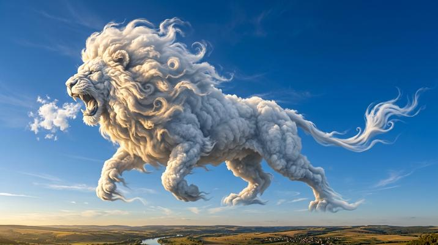

# Cloud / Smoke Sculpture

[← Back to Image Prompts](../README.md)

Subjects formed entirely from volumetric clouds or swirling smoke, with dramatic lighting revealing form in the vapor. Ethereal, dreamlike, and dissolving at the edges — as if the subject could disperse into the atmosphere at any moment. The dense core defines the recognizable form while the extremities trail off into wisps and tendrils, creating a poetic tension between solidity and impermanence.

**Best for:** Desktop wallpapers · Social media posts · Art prints · Phone wallpapers · Album covers · Conceptual art · Brand imagery



---

## Prompt

Replace the bracketed details with your subject and preferred format.

```text
Photograph of [ANIMAL — e.g., a galloping horse] formed entirely from dense white cumulus clouds against a vivid deep blue sky, 16:9 landscape format. The densest cloud mass defines the core body and head clearly. The mane and tail are turbulent streams of billowing wisps trailing behind with individual vapor tendrils curling in the wind. The hooves dissolve into thin wisps as they contact the sky. Dramatic golden-hour side-lighting from the left creating strong highlights on the cloud surfaces and deep blue shadows in the recesses.
```

## With a Reference Image

Attach your image and use this prompt to preserve its defining features while applying the style.

```text
Using the attached photo as reference, transform the subject into a form made entirely from volumetric clouds or smoke. Preserve the recognizable shape, pose, and proportions, but replace all solid material with dense cloud mass that dissolves into wisps at the edges. Replace the background with [CHOICE — e.g., a vivid deep blue sky / pure black]. Apply dramatic golden-hour side-lighting creating strong highlights on the cloud surfaces. The subject's details should be defined by density variations in the cloud, not by color or texture.
```

---

## 💡 Tips & Best Practices

- **Density gradient is everything**: "Dense core clearly defines the form while extremities dissolve into thin wisps" — this single concept IS the style. Without the gradient, you get a white solid shape instead of an ethereal cloud.
- **Choose your background carefully**: Deep blue sky = optimistic, natural, daytime. Pure black = dramatic, mysterious, fine art. The mood changes entirely.
- **Individual tendrils add magic**: "Individual vapor tendrils curling outward" prevents the AI from creating smooth, blob-like edges. You want detailed, organic wisps.
- **Color smoke is an option**: Moving beyond white opens up stunning possibilities — "smoke transitioning from crimson to gold" creates a phoenix-like intensity.
- **Common pitfalls**: Don't say "cloud-shaped" (implies a cloud that happens to look like something). Say "formed entirely from clouds" (the subject IS clouds). Don't skip lighting direction — without it, clouds look flat.
- **Pairs well with:** [Frosted Glass / Ice Sculpture](frosted-glass-ice-sculpture.md) (similar ephemeral, translucent quality), [Double Exposure](double-exposure.md) (similar surreal composite aesthetic)
