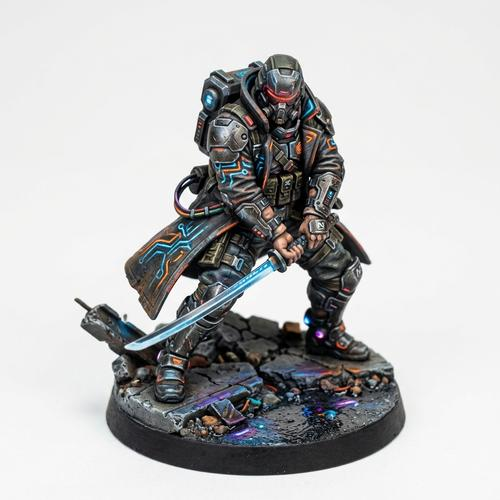

# Collectible Figurines

[← Back to Image Prompts](../README.md)

Photorealistic miniature collectible figurines with a hand-painted resin prototype finish — the kind of premium character figures displayed in glass cases at Comic-Con or sold as limited-edition art toys. Every figure is mounted on a sculpted base, photographed against a clean studio backdrop with directional lighting that emphasizes form, texture, and the subtle sheen of hand-applied paint. The style bridges the gap between action figures and fine-art sculptures.

**Best for:** Character design · Social media posts · Profile pictures · Fan art · Concept art · Product mockups · Gift ideas · Desktop wallpapers



> **Sample prompt used to generate the above image (Nano Banana 2):**
> ```text
> A highly detailed, photorealistic miniature collectible figurine of a cyberpunk street samurai in a high-angle three-quarter isometric view, 1:1 square format. The figure is depicted in a ready combat stance, wearing a neon-trimmed trench coat with glowing circuit patterns. The figurine has a hand-painted, resin prototype finish, showing realistic textures — visible brush strokes on the coat, metallic dry-brushing on the armor plates, matte skin tones. It is mounted on a small, sculpted urban rubble base with tiny neon puddle reflections. The scene is set against a seamless, movie-quality matte white studio backdrop with soft, directional studio lighting that emphasizes form and texture. 4K resolution.
> ```

---

## Prompt Variations

### 🔵 Nano Banana 2 _(Featured)_

> NB2's rendering precision makes it ideal for the fine details of collectible figurines — stitching on clothing, metallic dry-brushing, and translucent resin effects. Use real character names for fan-art figurines; NB2's search grounding will reference accurate character designs.

**Variation 1 — Character Portrait Figurine** _(Fan Art, Social Media)_
```text
A highly detailed, photorealistic miniature collectible figurine of [CHARACTER — e.g., a battle-worn Viking warrior] in a high-angle three-quarter isometric view, 1:1 square format. The figure is depicted in a [POSE — e.g., mid-swing with a battle axe], wearing [CLOTHING — e.g., fur-lined leather armor with chain mail visible underneath]. The figurine has a hand-painted, resin prototype finish, showing realistic textures — visible brush strokes, metallic dry-brushing on weapons, matte skin tones. It is mounted on a small, sculpted [BASE — e.g., rocky terrain with scattered autumn leaves]. The scene is set against a seamless, movie-quality matte white studio backdrop with soft, directional studio lighting that emphasizes form and texture. 4K resolution.
```

**Variation 2 — Real Person Figurine** _(Gift Idea, Social Media)_
```text
A highly detailed, photorealistic miniature collectible figurine of [PERSON — e.g., a person wearing business casual attire holding a coffee cup] in a high-angle three-quarter isometric view, 1:1 square format. The figurine captures a [POSE — e.g., confident standing pose with one hand in pocket]. Hand-painted resin prototype finish with realistic fabric textures — visible weave pattern on the blazer, subtle skin tone gradients, painted hair with individual strand suggestion. Mounted on a simple circular black display base with a small brass nameplate. Seamless matte white studio backdrop with soft directional lighting. 4K resolution.
```

**Variation 3 — Fantasy / Sci-Fi Hero** _(Concept Art, Desktop Wallpaper)_
```text
A highly detailed, photorealistic miniature collectible figurine of [CHARACTER — e.g., an elven ranger with a glowing enchanted bow] in a dynamic action pose, 16:9 landscape format. The figurine shows premium hand-painted resin craft — translucent resin effects on the glowing weapon, metallic NMM (non-metallic metal) painting on armor pieces, finely sculpted flowing hair and cape. Mounted on an elaborate terrain base with [ENVIRONMENT — e.g., ancient forest roots and glowing runes]. Matte white studio backdrop. Dramatic directional lighting casting defined shadows. 4K resolution.
```

**Variation 4 — Anime / Stylized Figure** _(Profile Picture, Social Media)_
```text
A highly detailed, photorealistic miniature collectible figurine of [CHARACTER — e.g., a magical girl in mid-transformation pose] in a high-angle three-quarter isometric view, 1:1 square format. Anime-proportioned figure with slightly larger head and expressive eyes, but rendered as a physical painted resin figurine — not a 2D illustration. Smooth PVC figure finish with hand-painted details, vibrant saturated colors, translucent resin effects on magical elements. Mounted on a cloud-shaped pastel display base. Clean white studio backdrop. Soft even lighting. 4K resolution.
```

**Variation 5 — Group / Diorama Display** _(Desktop Wallpaper, Art Print)_
```text
A highly detailed, photorealistic photograph of three miniature collectible figurines displayed side by side on a shared diorama base, 16:9 landscape format. The figures depict [GROUP — e.g., a wizard, a knight, and a rogue from a fantasy adventuring party]. Each figurine has a hand-painted resin prototype finish with consistent art direction — matching scale, paint quality, and level of detail. The shared base depicts [ENVIRONMENT — e.g., a dungeon entrance with cobblestone and flickering torch]. Matte white studio backdrop. Soft directional studio lighting. 4K resolution.
```

### ChatGPT

**Variation 1 — Character Figurine**
```text
Create a highly detailed, photorealistic miniature collectible figurine of [CHARACTER] in a three-quarter isometric view. Hand-painted resin prototype finish showing visible brush strokes and metallic dry-brushing. Mounted on a sculpted [BASE]. Seamless matte white studio backdrop with soft directional lighting. 1:1 square format.
```

**Variation 2 — Real Person**
```text
Create a photorealistic miniature collectible figurine of [PERSON DESCRIPTION] in a [POSE]. Hand-painted resin finish with realistic fabric and skin textures. Circular black display base with brass nameplate. Clean white studio backdrop. 1:1 square format.
```

**Variation 3 — Group Display**
```text
Create a photorealistic photograph of three miniature collectible figurines on a shared diorama base: [FIGURE 1], [FIGURE 2], [FIGURE 3]. Matching hand-painted resin finish. [ENVIRONMENT] base. White studio backdrop with soft lighting. 3:2 landscape format.
```

### Midjourney

**Variation 1 — Character Figurine**
```text
Highly detailed photorealistic miniature collectible figurine of [CHARACTER], high-angle three-quarter isometric view, hand-painted resin prototype finish, realistic textures, sculpted [BASE], matte white studio backdrop, directional lighting, 4K --ar 1:1
```

**Variation 2 — Real Person**
```text
Photorealistic miniature collectible figurine of [PERSON DESCRIPTION], hand-painted resin finish, realistic textures, circular black display base, brass nameplate, white studio backdrop, soft lighting --ar 1:1
```

**Variation 3 — Fantasy Hero**
```text
Photorealistic miniature collectible figurine, [CHARACTER] in dynamic action pose, hand-painted resin, translucent resin effects, elaborate terrain base, matte white backdrop, dramatic lighting --ar 16:9 --s 200
```

### Stable Diffusion

**Variation 1 — Character Figurine**
- **Prompt:** `Highly detailed photorealistic miniature collectible figurine of [CHARACTER], high-angle isometric view, hand-painted resin prototype finish, sculpted base, matte white studio backdrop, directional lighting, 4K, octane render`
- **Negative Prompt:** `2D illustration, cartoon, flat, smooth plastic, toy, low detail, blurry`

**Variation 2 — Real Person**
- **Prompt:** `Photorealistic miniature collectible figurine of [PERSON], hand-painted resin finish, realistic fabric textures, circular display base, white studio backdrop, soft lighting, 8k`
- **Negative Prompt:** `2D, cartoon, illustration, flat color, toy, action figure packaging`

---

## 🔄 Image-to-Image Transformations

Transform photos of people or characters into collectible figurines:

**Nano Banana 2** _(Featured)_
```text
Using the attached photo as reference, create a highly detailed photorealistic miniature collectible figurine of this person in a high-angle three-quarter isometric view. Preserve their appearance, clothing, and pose. The figurine should have a hand-painted resin prototype finish — visible brush strokes, matte skin tones, realistic fabric textures. Mount on a small sculpted base matching their context. Seamless matte white studio backdrop. Soft directional lighting. 4K resolution.
```
> 💡 **Follow-up refinements:**
> - "Add a brass nameplate on the base with [TEXT]"
> - "Change the pose to [NEW POSE]"
> - "Make it more anime-proportioned — slightly larger head and eyes"
> - "Create a matching companion figurine of [SECOND CHARACTER]"

**ChatGPT**
```text
[Upload Photo] "Transform this person into a photorealistic miniature collectible figurine. Preserve their likeness and clothing. Hand-painted resin finish with visible brush strokes. Mounted on a small sculpted base. White studio backdrop with directional lighting."
```

**Midjourney**
```text
[IMAGE_URL] Photorealistic miniature collectible figurine, hand-painted resin prototype finish, sculpted base, matte white studio backdrop, directional lighting --iw 1.5 --ar 1:1
```

**Stable Diffusion**
- **Pipeline:** Img2Img · Denoising Strength: `0.65–0.80`
- **Prompt:** `Photorealistic miniature collectible figurine, hand-painted resin finish, sculpted base, matte white studio backdrop, soft lighting, 8k`
- **Negative Prompt:** `2D, cartoon, illustration, flat, full-size person, realistic photograph`

---

## 💡 Tips & Best Practices

- **"Hand-painted resin prototype finish"**: This is the key phrase that separates collectible figurines from generic 3D renders. It produces visible brush strokes, dry-brushing on metallic parts, and matte/satin surface variation.
- **The base sells the collectible aesthetic**: Always include a sculpted base or display stand. A figure without a base looks like a floating 3D model rather than a physical collectible.
- **Use real character names**: NB2 and ChatGPT can reference accurate character designs via search grounding. "A figurine of Geralt of Rivia" will produce accurate armor and hair color.
- **Three-quarter isometric view**: This high-angle view shows the figure's full form and lets you appreciate the base detail. Front-on views flatten the collectible quality.
- **Common pitfalls**: "Action figure" tends to produce smooth injection-molded plastic. "Statue" can produce marble or bronze. Always specify "resin prototype" for the hand-painted, limited-edition look.
- **Pairs well with:** [Lego Photography](lego-photography.md) (different miniature collectible aesthetic), [3D Isometric Resin Sculptures](3d-isometric-resin-sculptures.md) (same resin finish, different structure)
