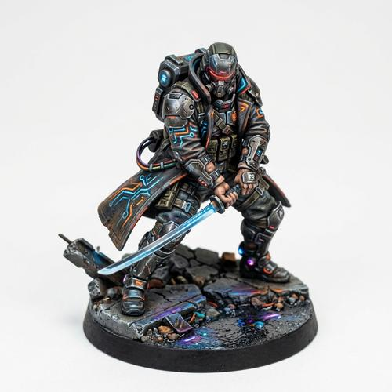

# Collectible Figurines

[← Back to Image Prompts](../README.md)

Photorealistic miniature collectible figurines with a hand-painted resin prototype finish — the kind of premium character figures displayed in glass cases at Comic-Con or sold as limited-edition art toys. Every figure is mounted on a sculpted base, photographed against a clean studio backdrop with directional lighting that emphasizes form, texture, and the subtle sheen of hand-applied paint. The style bridges the gap between action figures and fine-art sculptures.

**Best for:** Character design · Social media posts · Profile pictures · Fan art · Concept art · Product mockups · Gift ideas · Desktop wallpapers



---

## Prompt

Replace the bracketed details with your subject and preferred format.

```text
A highly detailed, photorealistic miniature collectible figurine of [CHARACTER — e.g., a battle-worn Viking warrior] in a high-angle three-quarter isometric view, 1:1 square format. The figure is depicted in a [POSE — e.g., mid-swing with a battle axe], wearing [CLOTHING — e.g., fur-lined leather armor with chain mail visible underneath]. The figurine has a hand-painted, resin prototype finish, showing realistic textures — visible brush strokes, metallic dry-brushing on weapons, matte skin tones. It is mounted on a small, sculpted [BASE — e.g., rocky terrain with scattered autumn leaves]. The scene is set against a seamless, movie-quality matte white studio backdrop with soft, directional studio lighting that emphasizes form and texture. 4K resolution.
```

## With a Reference Image

Attach your image and use this prompt to preserve its defining features while applying the style.

```text
Using the attached photo as reference, create a highly detailed photorealistic miniature collectible figurine of this person in a high-angle three-quarter isometric view. Preserve their appearance, clothing, and pose. The figurine should have a hand-painted resin prototype finish — visible brush strokes, matte skin tones, realistic fabric textures. Mount on a small sculpted base matching their context. Seamless matte white studio backdrop. Soft directional lighting. 4K resolution.
```

---

## 💡 Tips & Best Practices

- **"Hand-painted resin prototype finish"**: This is the key phrase that separates collectible figurines from generic 3D renders. It produces visible brush strokes, dry-brushing on metallic parts, and matte/satin surface variation.
- **The base sells the collectible aesthetic**: Always include a sculpted base or display stand. A figure without a base looks like a floating 3D model rather than a physical collectible.
- **Describe recognizable characters**: Pair a character's name with their distinguishing clothing, hairstyle, colors, and accessories for a more faithful figurine.
- **Three-quarter isometric view**: This high-angle view shows the figure's full form and lets you appreciate the base detail. Front-on views flatten the collectible quality.
- **Common pitfalls**: "Action figure" tends to produce smooth injection-molded plastic. "Statue" can produce marble or bronze. Always specify "resin prototype" for the hand-painted, limited-edition look.
- **Pairs well with:** [Lego Photography](lego-photography.md) (different miniature collectible aesthetic), [3D Isometric Resin Sculptures](3d-isometric-resin-sculptures.md) (same resin finish, different structure)
