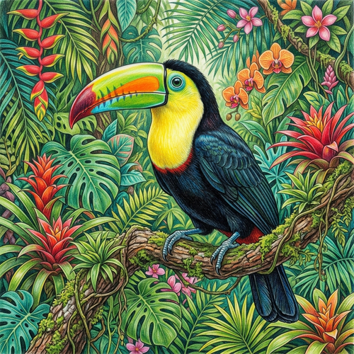

# Colored Pencil

[← Back to Image Prompts](../README.md)

Vibrant, highly detailed illustrations built through careful layering of colored pencils. This medium offers incredible precision and richness, allowing for luminous color mixing and fine textural details. The style often features a slightly waxy finish and the subtle texture of the underlying drawing paper.

**Best for:** Botanical/wildlife illustration · Fantasy concepts · Children's books · Vibrant portraits · Intricate designs



> **Sample prompt used to generate the above image (Nano Banana 2):**
> ```text
> A vibrant, highly detailed colored pencil illustration of a tropical toucan perched on a jungle branch, with rich layers of color, fine pencil strokes, and vivid botanical surroundings.
> ```

---

## Prompt Variations

### 🔵 Nano Banana 2 _(Featured)_

**Variation 1 — Detailed Wildlife** _(Illustration)_ — Highly detailed colored pencil illustration of [ANIMAL], vibrant layered colors, fine visible pencil strokes, realistic rendering, drawing paper texture.

**Variation 2 — Fantasy Portrait** _(Character Art)_ — Beautiful colored pencil portrait of [SUBJECT], luminous layered shading, intricate details, vivid color palette, soft pencil texture.

**Variation 3 — Botanical Study** _(Scientific Illustration)_ — Precise colored pencil drawing of [PLANT/FLOWER], scientific illustration style, rich color saturation, fine linework, clean white background.

**Variation 4 — Whimsical Scene** _(Storybook)_ — Whimsical colored pencil illustration of [SCENE], soft but vibrant colors, detailed cross-hatching, storybook aesthetic, warm lighting.

### ChatGPT / Midjourney / Stable Diffusion — Standard templates with "colored pencil illustration, highly detailed, vibrant layered colors, fine pencil strokes, drawing paper texture" core keywords.

---

## 🔄 Image-to-Image Transformations

**Nano Banana 2** _(Featured)_
```text
Using the attached photo, transform it into a vibrant colored pencil illustration. Keep the colors rich and saturated, but replace the photographic smoothness with fine, layered colored pencil strokes. Add a slight waxy texture and ensure the grain of the drawing paper is subtly visible beneath the colors.
```
> 💡 **Follow-up refinements:**
> - "Make the colors more vibrant and saturated"
> - "Show more individual pencil strokes"

---

## 💡 Tips & Best Practices
- **"Layered colors"**: This tells the AI to create the rich, luminous look of blended colored pencils rather than flat digital color.
- **"Fine pencil strokes"**: Ensures the texture looks hand-drawn rather than painted.
- **Avoid "sketch"**: Calling it a "sketch" often makes the AI produce unfinished or messy work; use "illustration" or "drawing" for polished colored pencil art.
- **Pairs well with:** [Pencil Sketch](pencil-sketch.md), [Yarn Amigurumi](yarn-amigurumi.md) (for cute concepts)
