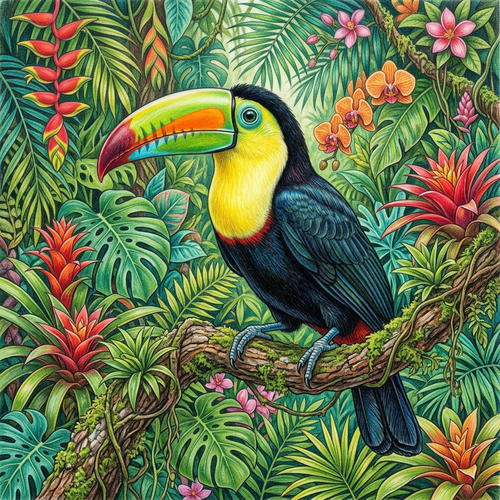

# Colored Pencil

[← Back to Image Prompts](../README.md)

Vibrant, highly detailed illustrations built through careful layering of colored pencils. This medium offers incredible precision and richness, allowing for luminous color mixing and fine textural details. The style often features a slightly waxy finish and the subtle texture of the underlying drawing paper.

**Best for:** Botanical/wildlife illustration · Fantasy concepts · Children's books · Vibrant portraits · Intricate designs



> **Sample prompt used to generate the above image (Nano Banana 2):**
> ```text
> A vibrant, highly detailed colored pencil illustration of a tropical toucan perched on a jungle branch, with rich layers of color, fine pencil strokes, and vivid botanical surroundings.
> ```

---

## Prompt Variations

### 🔵 Nano Banana 2 _(Featured)_

**Variation 1 — Detailed Wildlife** _(Illustration)_
```text
Highly detailed colored pencil illustration of [ANIMAL], vibrant layered colors, fine visible pencil strokes, realistic rendering, drawing paper texture.
```

**Variation 2 — Fantasy Portrait** _(Character Art)_
```text
Beautiful colored pencil portrait of [SUBJECT], luminous layered shading, intricate details, vivid color palette, soft pencil texture.
```

**Variation 3 — Botanical Study** _(Scientific Illustration)_
```text
Precise colored pencil drawing of [PLANT/FLOWER], scientific illustration style, rich color saturation, fine linework, clean white background.
```

**Variation 4 — Whimsical Scene** _(Storybook)_
```text
Whimsical colored pencil illustration of [SCENE], soft but vibrant colors, detailed cross-hatching, storybook aesthetic, warm lighting.
```

### ChatGPT

**Variation 1 — Detailed Wildlife** _(Illustration)_
```text
Create a highly detailed colored pencil illustration of [ANIMAL] with vibrant layered colors built up through fine, visible pencil strokes. Realistic rendering with a slightly waxy finish, and the grain of the drawing paper subtly visible beneath the colors. 3:2 landscape format.
```

**Variation 2 — Botanical Study** _(Scientific Illustration)_
```text
Create a precise colored pencil drawing of [PLANT/FLOWER] in a scientific illustration style — rich color saturation, fine linework, careful layered shading, on a clean white background. 2:3 vertical format.
```

**Variation 3 — Whimsical Scene** _(Storybook)_
```text
Create a whimsical colored pencil illustration of [SCENE] with soft but vibrant colors, detailed cross-hatching, warm lighting, and a cozy storybook aesthetic. 3:2 landscape format.
```

### Midjourney

**Variation 1 — Detailed Wildlife** _(Illustration)_
```text
highly detailed colored pencil illustration of [ANIMAL], vibrant layered colors, fine visible pencil strokes, realistic rendering, drawing paper texture --ar 3:2 --s 250
```

**Variation 2 — Fantasy Portrait** _(Character Art)_
```text
colored pencil portrait of [SUBJECT], luminous layered shading, intricate details, vivid color palette, soft waxy pencil texture, paper grain --ar 2:3 --s 300
```

**Variation 3 — Botanical Study** _(Scientific Illustration)_
```text
precise colored pencil drawing of [PLANT/FLOWER], scientific illustration style, rich saturation, fine linework, clean white background --ar 4:5 --s 150
```

### Stable Diffusion

**Variation 1 — Detailed Wildlife** _(Illustration)_
- **Prompt:** `colored pencil illustration, [ANIMAL], highly detailed, vibrant layered colors, fine visible pencil strokes, waxy finish, drawing paper texture`
- **Negative Prompt:** `photograph, oil painting, digital art, smooth airbrush, low quality`

**Variation 2 — Botanical Study** _(Scientific Illustration)_
- **Prompt:** `colored pencil botanical drawing, [PLANT/FLOWER], scientific illustration, rich color saturation, fine linework, white background, layered shading`
- **Negative Prompt:** `photograph, watercolor, messy sketch, dark background, blur`

---

## 🔄 Image-to-Image Transformations

**Nano Banana 2** _(Featured)_
```text
Using the attached photo, transform it into a vibrant colored pencil illustration. Keep the colors rich and saturated, but replace the photographic smoothness with fine, layered colored pencil strokes. Add a slight waxy texture and ensure the grain of the drawing paper is subtly visible beneath the colors.
```
> 💡 **Follow-up refinements:**
> - "Make the colors more vibrant and saturated"
> - "Show more individual pencil strokes"

**ChatGPT**
```text
[Upload Photo] "Transform this photo into a vibrant colored pencil illustration — rich saturated colors built from fine layered pencil strokes, a slightly waxy finish, and visible drawing paper grain."
```

**Midjourney**
```text
[IMAGE_URL] colored pencil illustration, vibrant layered colors, fine pencil strokes, waxy finish, drawing paper texture --iw 1.3 --ar 3:2
```

**Stable Diffusion**
- **Pipeline:** Img2Img · Denoising Strength: `0.5–0.65` (keeps detail while adding stroke texture)
- **Prompt:** `colored pencil illustration, vibrant layered colors, fine visible strokes, waxy finish, paper grain texture`
- **Negative Prompt:** `photograph, smooth airbrush, oil painting, blur`

---

## 💡 Tips & Best Practices
- **"Layered colors"**: This tells the AI to create the rich, luminous look of blended colored pencils rather than flat digital color.
- **"Fine pencil strokes"**: Ensures the texture looks hand-drawn rather than painted.
- **Avoid "sketch"**: Calling it a "sketch" often makes the AI produce unfinished or messy work; use "illustration" or "drawing" for polished colored pencil art.
- **Pairs well with:** [Pencil Sketch](pencil-sketch.md), [Yarn Amigurumi](yarn-amigurumi.md) (for cute concepts)
