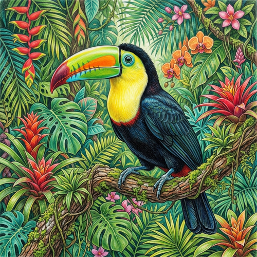

# Colored Pencil

[← Back to Image Prompts](../README.md)

Vibrant, highly detailed illustrations built through careful layering of colored pencils. This medium offers incredible precision and richness, allowing for luminous color mixing and fine textural details. The style often features a slightly waxy finish and the subtle texture of the underlying drawing paper.

**Best for:** Botanical/wildlife illustration · Fantasy concepts · Children's books · Vibrant portraits · Intricate designs



---

## Prompt

Replace the bracketed details with your subject and preferred format.

```text
Highly detailed colored pencil illustration of [SUBJECT — e.g., a tropical toucan perched on a jungle branch], [FORMAT]. Layer vivid [COLORS — e.g., cobalt, emerald, and saffron] in many fine visible pencil strokes; use carefully drawn hatching to model volume and feather or surface texture. Reserve crisp highlights in the paper and let the tooth of the drawing paper remain visible between strokes. Keep the subject sharply observed against a softer, lightly sketched [BACKGROUND — e.g., dense tropical foliage]. Rich color without a smooth digital finish.
```

## With a Reference Image

Attach your image and use this prompt to preserve its defining features while applying the style.

```text
Using the attached photo, transform it into a vibrant colored pencil illustration. Keep the colors rich and saturated, but replace the photographic smoothness with fine, layered colored pencil strokes. Add a slight waxy texture and ensure the grain of the drawing paper is subtly visible beneath the colors.
```

---

## 💡 Tips & Best Practices
- **"Layered colors"**: This tells the AI to create the rich, luminous look of blended colored pencils rather than flat digital color.
- **"Fine pencil strokes"**: Ensures the texture looks hand-drawn rather than painted.
- **Avoid "sketch"**: Calling it a "sketch" often makes the AI produce unfinished or messy work; use "illustration" or "drawing" for polished colored pencil art.
- **Pairs well with:** [Pencil Sketch](pencil-sketch.md), [Yarn Amigurumi](yarn-amigurumi.md) (for cute concepts)
