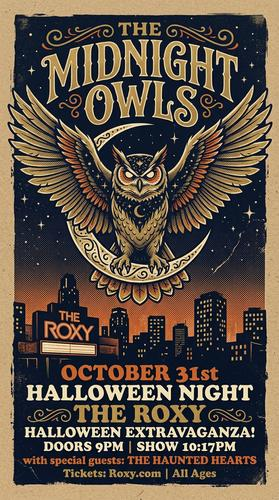

# Concert Poster / Gig Poster

[← Back to Image Prompts](../README.md)

Screen-printed aesthetic with limited 3–4 color palettes, heavy ink texture, hand-drawn typography, and bold graphic compositions. Inspired by silkscreen artists like Shepard Fairey, Aesthetic Apparatus, and the Fillmore poster tradition.



> **Sample prompt used to generate the above image (Nano Banana 2):**
> ```text
> Screen-printed concert poster illustration for a fictional band called "The Midnight Owls" playing at "The Roxy" on October 31st, 11:17 vertical format. A giant spectral owl with spread wings perches atop a crescent moon over a city skyline silhouette. Limited 4-color screen print — midnight navy, burnt orange, cream, and metallic gold on kraft paper stock. Visible screen-print texture: halftone dots in gradients, slight ink bleed at edges, and paper fiber visible through transparent ink layers. Bold hand-drawn serif typography with the band name arching over the owl. Inspired by the Fillmore poster tradition.
> ```

**ChatGPT**
```text
Create a screen-printed concert poster illustration for [BAND/EVENT NAME] playing at [VENUE] on [DATE]. Feature [SUBJECT/IMAGERY] as the central graphic element. Limit the palette to exactly 4 colors — [COLOR 1], [COLOR 2], [COLOR 3], and [COLOR 4] — printed on kraft paper stock. Include visible screen-print texture: halftone dots in gradient areas, slight ink bleed at edges, and paper fiber visible through transparent ink layers. Bold hand-drawn typography with the band name as the dominant text element. Overall composition should feel like a collectible silkscreen print.
```

**Midjourney**
```text
Screen-printed concert poster for [BAND/EVENT NAME] at [VENUE], [SUBJECT/IMAGERY] as central element, limited 4-color screen print — [COLORS] on kraft paper, halftone dots, ink bleed edges, hand-drawn typography, Fillmore poster tradition --ar 11:17
```

**Stable Diffusion**
- **Prompt:** `Screen-printed gig poster, [BAND/EVENT NAME], [SUBJECT/IMAGERY], limited 4-color palette [COLORS] on kraft paper, halftone dot gradients, ink bleed, bold hand-drawn typography, silkscreen texture, concert poster art`
- **Negative Prompt:** `photograph, digital, smooth gradients, clean edges, modern design`

**Nano Banana 2**
```text
Screen-printed concert poster illustration for [BAND/EVENT NAME] playing at [VENUE] on [DATE], 11:17 vertical format. [SUBJECT/IMAGERY] as the central graphic element. Limited 4-color screen print — [COLOR 1], [COLOR 2], [COLOR 3], and [COLOR 4] on kraft paper stock. Visible screen-print texture: halftone dots in gradient areas, slight ink bleed at edges, paper fiber visible through transparent ink layers. Bold hand-drawn typography with the band name as the dominant text. Fillmore poster tradition aesthetic.
```
