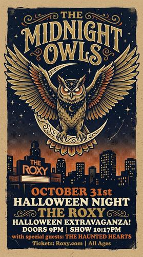

# Concert Poster / Gig Poster

[← Back to Image Prompts](../README.md)

Screen-printed aesthetic with limited 3–4 color palettes, heavy ink texture, hand-drawn typography, and bold graphic compositions. Inspired by silkscreen artists like Shepard Fairey, Aesthetic Apparatus, and the Fillmore poster tradition. These posters are designed to be collectible art — each one a unique graphic statement layered with halftone dots, ink bleed, and the tactile warmth of paper stock showing through transparent ink layers.

**Best for:** Event posters · Social media announcements · Print art · Band merchandise · Festival branding · Wall art



---

## Prompt

Replace the bracketed details with your subject and preferred format.

```text
Screen-printed concert poster for [BAND NAME] playing at [VENUE] on [DATE], 9:16 vertical format. [CENTRAL IMAGERY — e.g., a massive kraken rising from the sea, tentacles wrapping around a lighthouse]. Limited [N]-color screen print — [COLORS — e.g., deep teal, rust red, cream, and black] on [PAPER — e.g., cream cotton paper]. Visible screen-print texture: halftone dots in gradients, slight ink bleed at edges, paper fiber visible through transparent ink layers. Bold hand-drawn [TYPOGRAPHY STYLE — e.g., Art Nouveau serif] lettering with the band name as the dominant element. [SUPPORT ACTS / DETAILS] in smaller type at the bottom.
```

## With a Reference Image

Attach your image and use this prompt to preserve its defining features while applying the style.

```text
Using the attached photo as reference, transform it into a screen-printed concert poster for [BAND/EVENT]. Reduce the color palette to [N] colors — [COLORS] — on [PAPER]. Apply screen-print texture: halftone dots in gradient areas, ink bleed at edges, paper fiber visible through transparent ink. Simplify the composition to a bold, graphic statement. Add hand-drawn typography reading "[BAND NAME]" at the top and "[VENUE] · [DATE]" at the bottom.
```

---

## 💡 Tips & Best Practices

- **Limit the palette strictly**: "Limited 4-color screen print" is more effective than naming colors alone. Real screen printing is limited by physical ink layers.
- **Paper stock matters**: "Kraft paper," "cream cotton," "newsprint" — the paper shows through transparent ink areas and dramatically affects the look.
- **Halftone is the texture**: "Halftone dots in gradient areas" creates the physical printing feel. Without this, it looks like a flat digital illustration.
- **Typography IS the design**: Concert posters live and die by their lettering. Specify the style: "hand-drawn psychedelic," "bold condensed sans-serif," "Art Nouveau display."
- **Common pitfalls**: "Poster" alone is too generic. Always specify "screen-printed" and name the ink count. Don't use photographic language — this is graphic illustration.
- **Pairs well with:** [Vinyl Album Cover](vinyl-album-cover.md) (same music art tradition, square vs. vertical), [Soviet Constructivist](soviet-constructivist.md) (similar bold graphics, limited palette)
