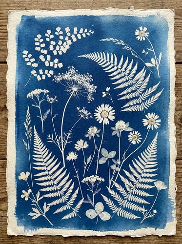

# Cyanotype / Sun Print

[← Back to Image Prompts](../README.md)

Photographic prints in Prussian blue and white, with botanical subjects pressed onto sensitized paper. The distinctive two-tone aesthetic of Anna Atkins' pioneering photographic process from the 1840s — one of the earliest forms of photography.



> **Sample prompt used to generate the above image (Nano Banana 2):**
> ```text
> Cyanotype sun print of a collection of pressed wildflowers and ferns arranged on a
> sheet of handmade paper, 4:5 vertical format. The botanical specimens appear as detailed
> white silhouettes against a rich Prussian blue background — every leaf vein, petal edge,
> and stem is captured in precise white negative detail. Fern fronds arc gracefully across
> the composition with smaller flowers (Queen Anne's lace, daisies, and clover) scattered
> between them. The print has the characteristic uneven exposure of a hand-coated sun print
> — slightly darker at the center, lighter at the edges. Visible handmade paper fiber
> texture. Subtle blue-to-white tonal gradient in the background from uneven UV exposure.
> ```

**ChatGPT**
```text
Create a cyanotype sun print of [SUBJECT] arranged on handmade paper. The subjects appear as detailed white silhouettes against a rich Prussian blue background — every fine detail captured in precise white negative form. The print should have the characteristic uneven exposure of a hand-coated sun print — slightly darker at the center, lighter at the edges. Visible handmade paper fiber texture throughout. Only two tones: Prussian blue and white. The composition should feel like an archival scientific specimen pressed with care. Inspired by Anna Atkins' botanical cyanotypes.
```

**Midjourney**
```text
Cyanotype sun print of [SUBJECT], detailed white silhouettes on rich Prussian blue background, precise negative detail, uneven hand-coated exposure, handmade paper fiber texture, two-tone blue and white, Anna Atkins botanical style --ar 4:5
```

**Stable Diffusion**
- **Prompt:** `Cyanotype sun print, [SUBJECT], white silhouettes on Prussian blue, precise negative detail, uneven exposure, handmade paper texture, two-tone, Anna Atkins style, archival botanical aesthetic`
- **Negative Prompt:** `color, photograph, modern, digital, 3d, smooth paper`

**Nano Banana 2**
```text
Cyanotype sun print of [SUBJECT] on handmade paper, 4:5 vertical format. Subjects appear as detailed white silhouettes against a rich Prussian blue background — every fine detail captured in precise white negative form. Characteristic uneven exposure of a hand-coated sun print — darker at center, lighter at edges. Visible handmade paper fiber texture. Only two tones: Prussian blue and white. Archival scientific specimen aesthetic inspired by Anna Atkins' pioneering botanical cyanotypes.
```
