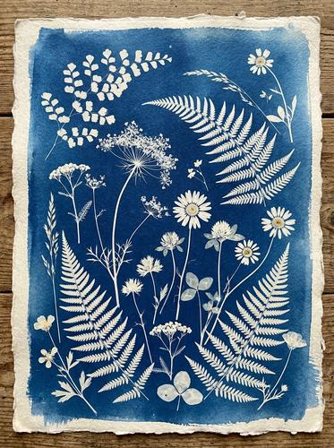

# Cyanotype / Sun Print

[← Back to Image Prompts](../README.md)

The oldest photographic printing process — Prussian blue prints made by exposing iron-salt treated paper to UV light with objects or negatives placed on top. Unexposed areas remain white, exposed areas turn deep Prussian blue, creating a striking two-tone monochromatic image. The process produces visible brush strokes at the paper edges where the chemistry was hand-applied, and the blue has a unique luminous depth that no digital filter can truly replicate.

**Best for:** Art prints · Social media posts · Botanical art · Home décor · Greeting cards · Desktop wallpapers



> **Sample prompt used to generate the above image (Nano Banana 2):**
> ```text
> Cyanotype sun print of a botanical specimen — fern fronds arranged on chemistry-coated paper, creating a white silhouette against deep Prussian blue, 3:4 vertical format. The fern's individual pinnae (leaflets) are clearly defined as crisp white shapes. The background is rich, deep Prussian blue with subtle tonal variation. Visible hand-applied chemistry edges — the blue fades to raw white paper at the borders with visible brush strokes. The print shows the slight texture of watercolor paper. Authentic Anna Atkins / historical photogram aesthetic.
> ```

---

## Prompt Variations

### 🔵 Nano Banana 2 _(Featured)_

**Variation 1 — Botanical Photogram** _(Art Print)_
```text
Cyanotype of [PLANT/BOTANICAL], white silhouette on Prussian blue, crisp leaf/petal detail, brush-stroked edges, watercolor paper texture, Anna Atkins aesthetic, [FORMAT].
```

**Variation 2 — Object Arrangement** _(Conceptual Art)_
```text
Cyanotype photogram of [OBJECTS — e.g., keys, watches, tools, feathers] arranged on paper, white silhouettes on blue, hand-applied edges, [FORMAT].
```

**Variation 3 — Portrait / Figure** _(Portrait)_
```text
Cyanotype-style portrait of [SUBJECT], deep blue tones, white highlights, brush-stroked chemistry edges, watercolor paper, [FORMAT].
```

**Variation 4 — Landscape** _(Art Print)_
```text
Cyanotype landscape of [SCENE], deep Prussian blue tonal range, white highlights, chemistry-edge borders, paper texture, [FORMAT].
```

**Variation 5 — Toned / Multi-Tone** _(Experimental)_
```text
Tea-toned or bleached cyanotype of [SUBJECT], split toning — warm sepia in the highlights, Prussian blue in the shadows, alchemy aesthetic, [FORMAT].
```

### ChatGPT

**Variation 1 — Botanical Photogram** _(Art Print)_
```text
Create a cyanotype sun print of [PLANT/BOTANICAL] — a crisp white silhouette against deep Prussian blue, every leaflet and petal clearly defined. Hand-applied chemistry edges where the blue fades to raw white paper with visible brush strokes. Watercolor paper texture. Anna Atkins historical photogram aesthetic. 2:3 vertical format.
```

**Variation 2 — Object Arrangement** _(Social Media)_
```text
Create a cyanotype photogram of [OBJECTS — e.g., keys, feathers, and a pocket watch] arranged on chemistry-coated paper — white silhouettes on rich Prussian blue, brush-stroked hand-applied edges, subtle paper texture. 1:1 square format.
```

**Variation 3 — Landscape** _(Home Décor)_
```text
Create a cyanotype-style landscape of [SCENE] — a deep Prussian blue tonal range with white highlights, monochromatic two-tone rendering, chemistry-edge borders fading to raw paper, watercolor paper texture. 3:2 landscape format.
```

### Midjourney

**Variation 1 — Botanical Photogram** _(Art Print)_
```text
cyanotype sun print of [PLANT/BOTANICAL], white silhouette on deep Prussian blue, crisp botanical detail, hand-applied chemistry edges, brush strokes, watercolor paper, Anna Atkins photogram --ar 3:4 --s 150
```

**Variation 2 — Object Arrangement** _(Social Media)_
```text
cyanotype photogram of [OBJECTS], white silhouettes on Prussian blue, hand-coated paper edges, brush marks, historical sun print aesthetic --ar 1:1 --s 150
```

**Variation 3 — Portrait** _(Art Print)_
```text
cyanotype portrait of [SUBJECT], deep Prussian blue tones, white highlights, brush-stroked chemistry edges, watercolor paper texture --ar 3:4 --s 200
```

### Stable Diffusion

**Variation 1 — Botanical Photogram** _(Art Print)_
- **Prompt:** `cyanotype sun print, [PLANT/BOTANICAL], white silhouette on deep Prussian blue, photogram, hand-applied chemistry edges, brush strokes, watercolor paper texture`
- **Negative Prompt:** `color, sepia, photograph, digital filter, sharp studio lighting`

**Variation 2 — Landscape** _(Home Décor)_
- **Prompt:** `cyanotype landscape, [SCENE], monochromatic Prussian blue and white, two-tone print, chemistry edge borders, paper texture, historical alt-process photography`
- **Negative Prompt:** `full color, modern photo, oversharpened, low quality`

---

## 🔄 Image-to-Image Transformations

**Nano Banana 2** _(Featured)_
```text
Using the attached photo, recreate it as a cyanotype sun print. Convert to two-tone — deep Prussian blue for shadows and midtones, white for highlights. Add hand-applied chemistry edges with visible brush strokes fading to raw paper. Watercolor paper texture. Anna Atkins / historical photogram aesthetic.
```

**ChatGPT**
```text
[Upload Photo] "Recreate this photo as a cyanotype sun print — strictly two-tone deep Prussian blue and white, with hand-applied chemistry edges, visible brush strokes fading to raw paper, and watercolor paper texture."
```

**Midjourney**
```text
[IMAGE_URL] cyanotype sun print, deep Prussian blue and white two-tone, hand-applied chemistry edges, brush strokes, watercolor paper texture --iw 1.2 --ar 3:4
```

**Stable Diffusion**
- **Pipeline:** Img2Img · Denoising Strength: `0.5–0.65` (tone remap while preserving composition)
- **Prompt:** `cyanotype print, Prussian blue and white two-tone, photogram aesthetic, chemistry edges, brush strokes, watercolor paper`
- **Negative Prompt:** `full color, sepia, photograph, digital sharpness`

---

## 💡 Tips & Best Practices
- **Prussian blue is the only color**: Cyanotype is strictly monochromatic Prussian blue + white. No other colors.
- **Brush-stroked edges**: "Hand-applied chemistry edges" where the blue fades to raw paper with visible brush marks authenticates the process.
- **Anna Atkins reference**: The first photographer to use cyanotype for botanical specimens. Her name anchors the aesthetic.
- **Pairs well with:** [Daguerreotype / Tintype](daguerreotype-tintype.md) (same era alt-process photography), [Botanical Illustration](botanical-illustration.md) (botanical subjects)
