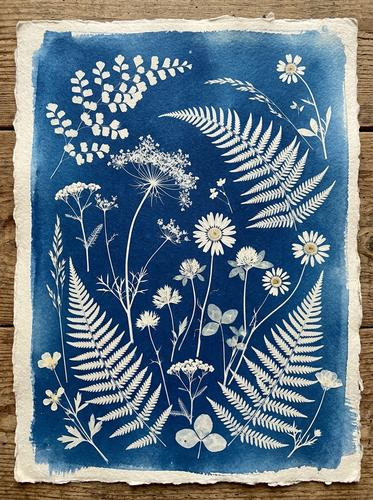

# Cyanotype / Sun Print

[← Back to Image Prompts](../README.md)

The oldest photographic printing process — Prussian blue prints made by exposing iron-salt treated paper to UV light with objects or negatives placed on top. Unexposed areas remain white, exposed areas turn deep Prussian blue, creating a striking two-tone monochromatic image. The process produces visible brush strokes at the paper edges where the chemistry was hand-applied, and the blue has a unique luminous depth that no digital filter can truly replicate.

**Best for:** Art prints · Social media posts · Botanical art · Home décor · Greeting cards · Desktop wallpapers



---

## Prompt

Replace the bracketed details with your subject and preferred format.

```text
Cyanotype sun print of [BOTANICAL SUBJECT — e.g., overlapping fern fronds] arranged directly on sensitized paper, [FORMAT]. Render the specimen as a crisp white photogram against deep Prussian blue, preserving the fine gaps between leaflets and the translucent blue at thinner edges. Show hand-brushed chemistry fading into the raw white paper at the margins, subtle uneven exposure, and textured watercolor paper grain. Keep the composition spare and botanical, like a carefully prepared historical specimen print.
```

## With a Reference Image

Attach your image and use this prompt to preserve its defining features while applying the style.

```text
Using the attached photo, recreate it as a cyanotype sun print. Convert to two-tone — deep Prussian blue for shadows and midtones, white for highlights. Add hand-applied chemistry edges with visible brush strokes fading to raw paper. Watercolor paper texture. Anna Atkins / historical photogram aesthetic.
```

---

## 💡 Tips & Best Practices
- **Prussian blue is the only color**: Cyanotype is strictly monochromatic Prussian blue + white. No other colors.
- **Brush-stroked edges**: "Hand-applied chemistry edges" where the blue fades to raw paper with visible brush marks authenticates the process.
- **Anna Atkins reference**: The first photographer to use cyanotype for botanical specimens. Her name anchors the aesthetic.
- **Pairs well with:** [Daguerreotype / Tintype](daguerreotype-tintype.md) (same era alt-process photography), [Botanical Illustration](botanical-illustration.md) (botanical subjects)
