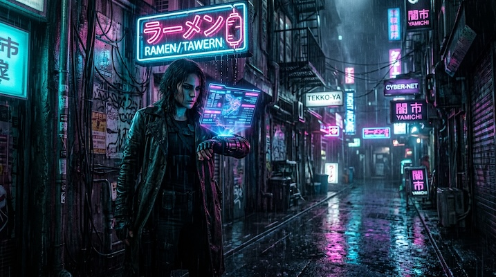

# Cyberpunk Noir

[← Back to Image Prompts](../README.md)

Neon-soaked, rain-drenched dystopian cityscapes with high contrast, glowing signage, and wet street reflections. A fusion of Blade Runner aesthetics and film noir.



> **Sample prompt used to generate the above image (Nano Banana 2):**
> ```text
> Cinematic cyberpunk noir photograph of a trenchcoated detective standing under a broken neon sign, checking a holographic display projected from her wrist device, 16:9 landscape format. Narrow alleyway in a dystopian Tokyo-inspired city at night. Heavy rain falling through dense fog, each raindrop catching the glow of the neon signs in magenta, cyan, and electric blue. Wet asphalt reflecting all the light sources in long vertical streaks. Low dramatic camera angle, high contrast. Her face half-lit in cyan, half in shadow.
> ```

**ChatGPT**
```text
Create a cinematic photograph of [SUBJECT] in a dystopian cyberpunk [ENVIRONMENT] at night. Heavy rain falls through dense fog, with each raindrop catching the glow of neon signs in magenta, cyan, and electric blue. The wet asphalt reflects the neon lights in long streaks. Shoot from a low, dramatic angle. High contrast between the pitch-black shadows and the saturated neon highlights. The mood is isolating and tense — a solitary figure in a vast, indifferent city.
```

**Midjourney**
```text
Cinematic cyberpunk noir photograph of [SUBJECT] in a dystopian [ENVIRONMENT] at night, heavy rain, dense fog, glowing neon signs in magenta and cyan, wet asphalt reflections, low dramatic camera angle, high contrast, Blade Runner aesthetic --ar 16:9 --s 200
```

**Stable Diffusion**
- **Prompt:** `Cyberpunk noir, cinematic photograph of [SUBJECT] in dystopian [ENVIRONMENT], night, heavy rain, neon signs in magenta and cyan, wet asphalt reflections, dense fog, low angle, high contrast, 8k`
- **Negative Prompt:** `daytime, bright, sunny, cartoon, anime`

**Nano Banana 2**
```text
Cinematic cyberpunk noir photograph of [SUBJECT] in a dystopian [ENVIRONMENT] at night, 16:9 landscape format. Heavy rain falling through dense fog, each raindrop catching the glow of neon signs in magenta, cyan, and electric blue. Wet asphalt reflecting the neon lights in long streaks. Low dramatic camera angle, high contrast between pitch-black shadows and saturated neon highlights. Blade Runner aesthetic — isolating and tense.
```

> 🔄 **Image-to-Image Variations:**
> * **ChatGPT:** *[Upload Photo]* "Transform the environment in this photo into a dystopian cyberpunk city at night. Add heavy rain, glowing neon signage in magenta and cyan, and wet asphalt reflections. Preserve the subject but cast them in dramatic high-contrast neon lighting."
> * **Midjourney:** `[IMAGE_URL] Cyberpunk noir style, dystopian city at night, heavy rain, glowing neon signs, wet asphalt reflections, high contrast, Blade Runner aesthetic --iw 1.5 --ar 16:9`
