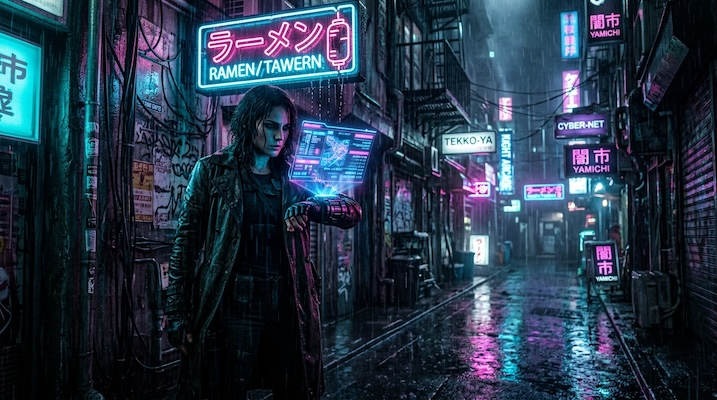

# Cyberpunk Noir

[← Back to Image Prompts](../README.md)

Rain-soaked neon-lit cityscapes, cybernetic augmentations, and the noir-meets-technology aesthetic of *Blade Runner*, *Ghost in the Shell*, and *Cyberpunk 2077*. The style fuses film noir's moody chiaroscuro with the hypersaturated neon glow of a dystopian megacity. Every surface reflects wet neon light. Every shadow hides a story. The palette is dominated by deep blacks punctuated by vivid neon — cyan, magenta, amber — reflecting off rain-slicked pavement.

**Best for:** Desktop wallpapers · Social media posts · Character designs · Art prints · Game concept art · YouTube thumbnails · Book covers



---

## Prompt

Replace the bracketed details with your subject and preferred format.

```text
Cinematic photograph of a cyberpunk [SCENE — e.g., night market with crowded food stalls, holographic menu displays, and steam from cooking woks] in a rain-soaked megacity alley, 16:9 landscape format. Neon signs in multiple languages illuminate the wet surfaces — reflections of cyan, magenta, and amber streak across the pavement. Atmospheric haze and steam catching the neon light. Deep shadows with hard neon edge-lights. Blade Runner / Ghost in the Shell aesthetic. A lone [FIGURE] navigates the crowd. Cinematic wide-angle composition.
```

## With a Reference Image

Attach your image and use this prompt to preserve its defining features while applying the style.

```text
Using the attached photo as reference, transform the scene into a cyberpunk noir aesthetic. Make it nighttime — replace natural lighting with neon signage in [COLORS]. Add rain — wet reflections on every surface. Replace the sky with a smoggy megacity skyline. Add holographic advertisements and neon signs. Deepen all shadows to noir-level darkness with hard neon edge-lights. Add atmospheric haze catching the neon glow. Blade Runner / Ghost in the Shell aesthetic.
```

---

## 💡 Tips & Best Practices

- **Rain + neon + reflection = cyberpunk**: These three elements together are the complete visual formula. Rain makes every surface a mirror for neon.
- **Name the reference**: "Blade Runner" for rain-noir-detective. "Ghost in the Shell" for tech-noir-surveillance. "Cyberpunk 2077" for game-aesthetic-action. Each calibrates differently.
- **Deep shadows are noir**: "Deep noir shadows with hard neon edge-lights" — without the shadow depth, it's just a neon city.
- **Atmospheric haze**: "Steam" and "haze catching the neon light" adds volumetric depth that makes the scene feel lived-in.
- **Common pitfalls**: "Futuristic city" is too vague — it produces clean sci-fi, not gritty cyberpunk. Always include "rain-soaked" and "neon" and "shadows."
- **Pairs well with:** [Holographic UI / Sci-Fi](holographic-ui-sci-fi.md) (similar tech aesthetic, focused on interfaces), [Glitch Art](glitch-art.md) (shares digital corruption themes)
